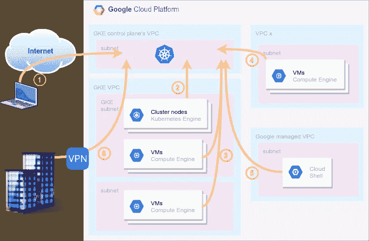

# 我的 GKE 大师在哪里？

> 原文：<https://medium.com/google-cloud/where-is-my-gke-master-13303895f595?source=collection_archive---------0----------------------->


马克西米利安·魏斯贝克尔在 [Unsplash](https://unsplash.com?utm_source=medium&utm_medium=referral) 上的照片

Google Kubernetes 引擎(GKE)集群可以以不同的方式配置，这使得访问控制平面(您的 Kubernetes 主服务器或 API 服务器)成为一项重要的任务。你会发现不仅主人在哪里，你也在哪里。我将探讨不同的场景和配置，以帮助您决定您的访问模型并对您的设置进行故障排除。

# 情节

您需要使用像 *kubectl* 这样的工具来访问 Kubernetes API 并管理您的集群工作负载，而您的 GKE 集群是如何配置的会带来访问限制。首先，让我们来看看你可能想要访问 GKE 大师的不同地方。下图显示了它们。



图一。从不同的环境访问 GKE 母版

1.  **互联网**:这代表从(非 GCP)公共 IP 访问主机，例如您家中的笔记本电脑，尽管它也可能是您通过互联网使用的公司机器。
2.  **集群节点**:这些是访问主节点的工作节点，通常是运行在每个节点上的 [kubelet](https://kubernetes.io/docs/concepts/overview/components/#kubelet) 代理。
3.  **集群 VPC 中的虚拟机**:同一个集群的 VPC 网络中的其他虚拟机，例如管理主机到达私有 API 端点。该选项有更多的子场景，在某些情况下可能相关，例如，如果我们考虑虚拟机所在的子网或区域。这些我以后会深入探讨。
4.  **另一个 VPC** 中的虚拟机:与上一点类似，但位于与集群不同的 VPC 中。这些 VPC 相互之间没有连接。
5.  **云外壳**:这是 Google Cloud 的在线外壳环境，你可以通过浏览器访问，预装了 gcloud 和 kubectl 等工具。
6.  **内部**:公司通常通过 [VPN 或互连](https://cloud.google.com/hybrid-connectivity)链路将其私有 IP 空间连接到 GCP VPCs。这种情况可能是管理集群的公司机器或 CI/CD 工具。

现在让我们解释一下 GKE 的不同配置，以及如何从这些地方访问或不访问。

# 公共集群

默认情况下，GKE 集群是使用主节点和工作节点的公共 IP 创建的。创建一个集群并检索 Kubernetes 凭证以获得访问权限:

```
$ gcloud container clusters create test-cluster
$ gcloud container clusters get-credentials test-cluster
```

运行 kubectl 命令来验证您是否拥有访问权限:

```
$ kubectl get nodes -o name
node/gke-test-cluster-default-pool-f89318a3-5bg5
node/gke-test-cluster-default-pool-f89318a3-nfsp
node/gke-test-cluster-default-pool-f89318a3-rwb1
```

您还可以检查主服务器正在监听的公共 API 端点:

```
$ kubectl cluster-info
Kubernetes master is running at [https://104.155.43.13](https://104.155.43.13)
...
```

假设您拥有必要的凭证，您将可以从大多数环境中进行访问，因为 API 端点是公共的:

1.  Internet:️️ ️✅
    你可能已经知道了，因为你可能在你的笔记本电脑上运行这个测试。
2.  集群节点:️✅️
    当然，集群节点有公共 IP，它们需要访问主节点。
3.  集群 VPC 中的虚拟机:✅
    任何拥有公共 IP 的虚拟机都可以访问集群。
4.  另一个 VPC 中的虚拟机:✅
    同上，这里的 VPC 没有什么不同。
5.  云壳:✅
    云壳只是一个拥有公共 IP 的托管虚拟机。
6.  内部:❌️
    这是唯一无法访问集群的情况。请记住，在这里，我们考虑的是只能以私人方式访问 GCP 的公司机器，具有公共 IP 的公司机器将是选项 1(互联网)。

公共集群有助于管理。只要您有凭证，就可以通过 TLS 公开访问主 API，并且您可以使用 GCP 防火墙规则强化工作节点。

# 公共集群+授权网络

您可能希望将对主 API 的访问限制为一组已知的 IP 地址，以限制潜在的攻击或访问，例如在凭证被盗的情况下。使用 GKE 的*授权网络*功能和您想要的 CIDR 范围(例如，您的 ISP 提供的 IP)更新您的集群:

```
$ gcloud container clusters update test-cluster --enable-master-authorized-networks --master-authorized-networks cidr1,cidr2...
```

> 考虑到这一点可以阻止来自谷歌以外的 **IPs 只有**。来自谷歌云的 IP 将继续拥有访问权限。

我们来总结一下。只有授权的 IP 范围才能访问的❓ ️means 符号:

1.  Internet:️️ ❓️
2.  集群节点:✅️
3.  集群 VPC 中的虚拟机:️✅️
4.  另一个 VPC 中的虚拟机:️✅
5.  云壳:️✅️
6.  内部:❌️

在公共集群中使用授权网络并不能真正增加安全性，因为潜在的攻击者总是可以在 GCP 启动一台虚拟机，从那里获得访问权限。

# 私有集群

在私有集群中，工作节点只能获得内部 IP 地址。然而，控制平面具有私有端点**和公共端点**。创建私有集群时，可以禁用对公共端点的访问，我们将在后面看到这一点。

```
$ gcloud container clusters create priv-cluster --enable-ip-alias --enable-private-nodes --master-ipv4-cidr 172.16.0.0/28 --no-enable-master-authorized-networks
$ gcloud container clusters get-credentials priv-cluster [--internal-ip]
```

对私有端点的访问是通过内部负载平衡器(ILB)进行的。这意味着，如果您想从不同的 GCP 地区到达部署控制平面的位置，您需要启用*全局访问*:

```
$ gcloud container clusters update priv-cluster --enable-master-global-access
```

有了公共和私有端点，您可以从任何地方进行访问，但有一些注意事项:

1.  Internet:️️ ️✅
2.  集群节点:️✅️
    它们将使用私有端点。
3.  集群 VPC 中的虚拟机:
    ◾Public 端点:✅️
    ◾Private 端点:
    🔸与集群位于同一区域的️vms:✅
    🔸不同地区的️vms:️️️❌️
    🔸️VMs 在不同地区，全球访问:✅️
4.  另一个 VPC 中的虚拟机:✅
5.  云壳:✅
6.  内部:
    类似于备选方案 3:
    🔸与集群位于同一区域的️vpn:✅
    🔸不同地区的️vpn:️️️❌️
    🔸️VPN 在不同地区，全球访问:✅

私有集群增加了从内部进行管理的灵活性，默认情况下，节点和单元与互联网隔离。您可以使用云 NAT 为您的专用节点提供互联网访问。

# 私有集群+授权网络

与公共集群一样，您可以将 GKE 的*授权网络*功能用于私有集群，以限制对主 API 的访问。但是行为有点不同:

```
$ gcloud container clusters create priv-cluster --enable-ip-alias --enable-private-nodes --master-ipv4-cidr 172.16.0.0/28 --enable-master-authorized-networks --master-authorized-networks cidr1,cidr2...
```

> 对于公共集群，只有来自谷歌外部的 IP 可以被屏蔽，而对于私有集群，除了集群的子网之外的一切**都可以被授权网络屏蔽。**

1.  Internet:️️️ ❓️
2.  集群节点:️✅️
3.  集群 VPC 中的虚拟机:
    ◾Public 端点:❓️
    ◾Private 端点:
    🔸与集群位于同一区域的️vms&子网:✅
    🔸同地区的️vms&不同子网:❓
    🔸不同地区的️vms:️️️❌️
    🔸️VMs 在不同地区，全球访问:❓
4.  另一个 VPC 中的虚拟机:❓
5.  云壳:❓
6.  内部部署:
    🔸与集群位于同一区域的️vpn:❓
    🔸不同地区的️vpn:️️️❌️
    🔸️VPN 在不同地区，全球访问:❓

借助专用集群和授权网络，您可以使用访问控制列表获得对集群的更多访问控制并提高安全性。

# 私有集群+私有端点

如前所述，可以禁用对公共端点的访问。在这种情况下，需要授权网络功能:

```
$ gcloud container clusters create priv-cluster --enable-ip-alias --enable-private-nodes --enable-private-endpoint --master-ipv4-cidr 172.16.0.0/28 --enable-master-authorized-networks --master-authorized-networks cidr1,cidr2...
```

1.  Internet:️️️ ❌️️
2.  集群节点:️✅️
3.  集群 VPC 中的虚拟机:
    ◾Public 端点:❌️️
    ◾Private 端点:
    🔸与集群位于同一区域的️vms&子网:✅
    🔸同地区的️vms&不同子网:❓
    🔸不同地区的️vms:️️️❌️
    🔸️VMs 在不同地区，全球访问:❓
4.  另一个 VPC 中的虚拟机:❌️
5.  云壳:❌️
6.  内部:
    🔸与集群位于同一区域的️vpn:❓
    🔸不同地区的️vpn:️️️❌️
    🔸️VPN 在不同地区，全球访问:❓

如果您不需要或不想避免对群集的任何公共访问，请禁用公共端点。这种设置可能更安全，但不太灵活。

# VPC 对等设置

控制平面的 VPC 网络位于谷歌管理的一个项目中。该 VPC 通过 [VPC 网络对等](https://cloud.google.com/vpc/docs/vpc-peering)连接到您集群的 VPC。VPC 网络对等是不可传递的，如果网络 b 与网络 a 和网络 c 对等，但它们不直接连接，则网络 a 不能通过对等与网络 c 通信。

这种情况经常发生在使用 VPC 对等的星型架构中。假设网络 a 是一个 VPC 中心，提供网络服务，如连接到内部的 VPN 连接，网络 b 是一个分支 VPC，运行类似 GKE 的服务，网络 c 是控制平面的 VPC 网络。从网络集线器或连接到它的任何其他网络，如内部网络，不可能直接到达 GKE 私有端点。

在这些情况下，您可以在 GKE VPC 部署一个*跳转主机*来允许对 Kubernetes API 的访问，但这是另一篇文章的内容。

# 故障排除点

在结束本文之前，下面是一些与 GKE 集群及其控制平面相关的常见问题和提示:

*   GKE 与 OAuth 集成在一起，所以请确保您的用户或服务帐户拥有适当的 IAM 角色(如 Kubernetes 引擎开发人员)和访问范围。
*   如果您想从部署的不同区域访问私有端点，请确保启用*主全局访问*。
*   如果通过 VPN 连接到 GKE 专用端点，将自定义路由导出到控制平面的 VPC，以便主设备的返回流量可以到达源设备。
*   如果您的虚拟机只有私有 IP，您可能需要[私有谷歌访问](https://cloud.google.com/vpc/docs/private-access-options) (PGA)来访问谷歌云 API(例如，从[工件注册表](https://cloud.google.com/artifact-registry)访问容器映像)。除共享 VPC 集群外，PGA 在私有集群中默认处于启用状态。

我希望这些信息将阐明如何配置您的 GKE 集群。感谢阅读！