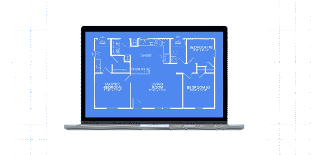
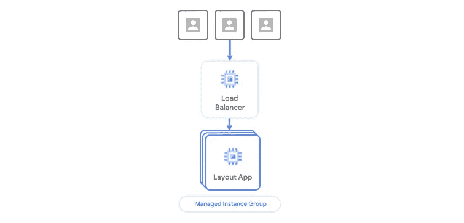
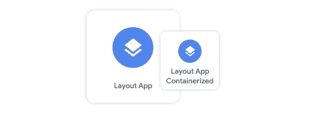
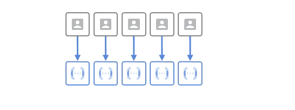
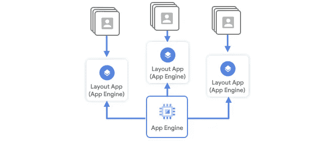
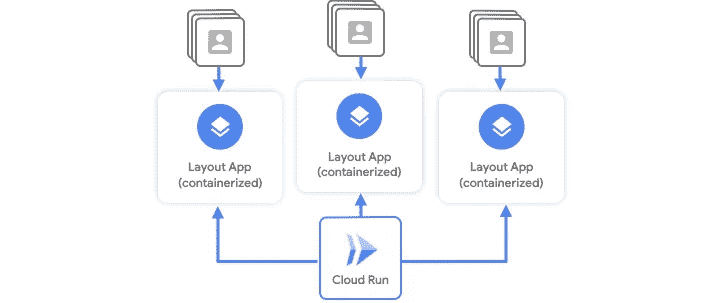

# 在哪里扩展您的工作负载

> 原文：<https://medium.com/google-cloud/where-to-scale-your-workloads-6420150bf825?source=collection_archive---------1----------------------->

## 规模季节

“规模季节”是一个博客和视频系列，旨在帮助企业和开发人员在设计模式中构建规模和弹性。在这一系列文章中，我们计划向您介绍一些创建具有弹性和可伸缩性的应用程序的模式和实践，这是许多现代架构实践的两个基本目标。

在第 1 季中，我们将介绍基础架构自动化和高可用性:

1.  [可扩展和弹性应用的模式](/google-cloud/scale-and-resilience-arent-just-buzzwords-ce748360e80)
2.  [基础设施为代码](/google-cloud/why-should-you-treat-infrastructure-like-software-3865ed0e4b03)
3.  [不变的基础设施](/google-cloud/sometimes-change-is-bad-immutable-infrastructure-624a8e3482d6)
4.  [在哪里扩展您的工作负载](/@swongful/where-to-scale-your-workloads-6420150bf825)(本文)
5.  [全球自动扩展 web 服务](/@swongful/globally-autoscaling-web-services-4b650cc6fc49)
6.  [高可用性(自动修复&自动更新)](/@swongful/give-your-vms-a-steady-pulse-with-autohealing-and-autoupdates-ae2c0828ecc9)

在本文中，我将带您了解扩展工作负载的计算选项。

# 看看这个视频

# 回顾

在上一篇文章[中，我们学习了不可变的基础设施。这是创建可扩展环境的关键操作最佳实践，不会让您面临配置漂移的风险。如果您正在推出对操作系统、应用程序等的更改。，您希望确保您的更改被跟踪，通过 CICD 管道推出，并将确定地应用到新鲜的、不可变的实例。现在，Critter Junction 面临着一个新的困境:决定在谷歌云上运行他们的新游戏应用程序。虽然每个应用都有自己的基础设施和扩展要求，但 GCP 提供了多种计算选项。但是如何平衡性能、灵活性、成本效率和语言支持呢？](/google-cloud/sometimes-change-is-bad-immutable-infrastructure-624a8e3482d6)

# 布局应用程序

随着比以往更多的用户，以及他们新的不可变的基础设施，Critter Junction 是一个推出新应用程序的好地方。他们想推出一个配套游戏，使用相同的数据库，但让你使用库存建立和共享房屋布局，代号为布局应用程序。

随着新应用的推出，规模和不可预测性总是一个巨大的挑战。你可能永远不知道在发布日会有多少玩家出现。他们需要在 Google Cloud 上找到一个能够自动处理任何负载量的解决方案。该团队已经知道他们希望布局应用程序独立于他们的 web 服务器进行扩展，但是他们有很多选择。

一种解决方案是在一组单独的虚拟机上运行布局应用程序。使用谷歌的[全球负载平衡器](https://cloud.google.com/load-balancing/docs/https)，你可以将流量发送到后端[管理的实例组](https://cloud.google.com/compute/docs/instance-groups/adding-an-instance-group-to-a-load-balancer) (MIGs)。这些可以根据 CPU 利用率等指标自动扩展多台相同的机器，因此它们可以轻松处理更多跨区域的流量。

## 集装箱化

但事实证明，布局应用不需要通过访问操作系统来运行[。该团队希望他们的应用程序是轻量级的，可以跨环境移植，所以他们决定将其容器化。容器基本上是用于运行应用程序的隔离包。这是构建云原生应用的一个很好的方式，但是你仍然需要服务它。](https://cloud.google.com/containers)

服务容器的两种选择是运行容器优化操作系统的托管实例组[或](https://cloud.google.com/container-optimized-os/docs) [Google Kubernetes 引擎](https://cloud.google.com/kubernetes-engine)。这两种解决方案都会随着需求的增加而自动扩展，根据需要添加新的机器，并在需求较低时删除它们。这可以提高高峰时段的可用性，同时保持成本可控。

两者都可以运行他们的应用程序，满足他们不可预测的扩展需求，但团队希望从基础架构中进一步抽象。他们决定不需要预先配置，而是希望能够缩减到零资源。

> 虽然 MIGs 必须至少有一个实例，但是您可以为 GKE 指定最少零个节点(一个空闲节点池可以完全缩减)。但是，群集中必须至少有一个节点始终可用，才能运行系统单元。

## 无服务器

该是团队研究无服务器技术的时候了。这些技术几乎完全抽象了基础设施和编排。与之前的选项不同，这些选项处理自动资源扩展，几乎不需要配置或服务器供应。无服务器模式有助于运行您的应用程序，因此您可以专注于您的代码。Google Cloud 有三个主要的无服务器运行选项。

## 云函数

首先，[云函数](https://cloud.google.com/functions)非常适合代码片段和小型、单一用途的应用程序。随着需求的增加，函数通过创建新的实例来扩展，每个函数处理一个请求。您可以缩小到零，并限制实例的最大数量，以获得充分的灵活性。它非常适合将不同的云服务粘合在一起，如基于时间表调用 API 或发送通知——但对于运行布局应用程序来说，它太简单了。

## 应用引擎

所以他们把目光投向了[应用引擎](https://cloud.google.com/appengine?utm_source=google&utm_medium=cpc&utm_campaign=na-US-all-en-dr-bkws-all-all-trial-p-dr-1009135&utm_content=text-ad-none-any-DEV_c-CRE_122585960767-ADGP_Hybrid+%7C+AW+SEM+%7C+SKWS+%7C+US+%7C+en+%7C+Multi+~+App+Engine-KWID_43700017651054481-aud-382823310150:kwd-7742176743&utm_term=KW_app%20engine-ST_app+engine&gclid=CjwKCAjw4MP5BRBtEiwASfwALwj4SB6iypy5MsmftWA-KytJW95gtF1zQynaM-OYVpcVBNjm1c4N5BoCJvMQAvD_BwE)，它提供了以无服务器方式运行容器和定制网络应用的能力，当流量波动时自动创建和关闭实例。您可以根据应用程序的需求配置自动缩放的设置。例如，扩展可以基于 CPU 利用率、吞吐量利用率或最大并发请求数。

这可以毫无问题地运行他们的容器化应用程序，但该团队希望确保他们可以在未来的多个云中运行他们的应用程序，并且不想重新架构。

## 云运行

最后，还有[云运行](https://cloud.google.com/run)，它建立在一个名为 [Knative](https://cloud.google.com/knative/?utm_source=google&utm_medium=cpc&utm_campaign=na-US-all-en-dr-skws-all-all-trial-p-dr-1009135&utm_content=text-ad-none-any-DEV_c-CRE_286783897104-ADGP_Hybrid+%7C+AW+SEM+%7C+SKWS+%7C+US+%7C+en+%7C+PHR+~+Compute+~+Knative+~+Knative-KWID_43700035076139226-kwd-475950412943&utm_term=KW_knative-ST_Knative&gclid=CjwKCAjw4MP5BRBtEiwASfwALwT9ODzNSrWOYimuGf6akIIJzydqsDXKwckd2_zWXHIxonmVHNPErxoCBPgQAvD_BwE) 的项目上。Knative 是一个基于 Kubernetes 的平台，用于构建、部署和管理现代无服务器工作负载。有了 Cloud Run，Kubernetes 的管理在幕后进行。每个部署都会自动扩展到处理所有传入请求所需的实例数，并且可以从零扩展到您指定的最大实例数。因为应用程序团队预计会出现流量高峰，所以 Cloud Run 允许他们保留大量空闲实例，以最大限度地减少冷启动。如果他们希望以后移植到多个云，他们可以通过利用 Knative 来使用同一个应用程序。

考虑到他们对容器可移植性、快速扩展和最小基础设施开销的需求，该团队决定采用云运行，并且能够以超出他们想象的速度启动！虽然我介绍的每个计算选项都具有内置的自动扩展功能，但您可以决定这些解决方案中的哪一个最适合您的应用程序要求，让您能够选择和扩展。

请继续关注我们下一篇关于自动伸缩 web 服务的文章。记住，永远要做架构设计。

# 后续步骤和参考:

*   在[谷歌云平台媒体](https://medium.com/google-cloud)上关注这个博客系列。
*   参考:[谷歌云上的应用托管](https://goo.gle/3jVEtqj)。
*   跟随[一季的尺度视频系列](http://bit.ly/seasonofscale)，订阅谷歌云平台 YouTube 频道。
*   想要更多的故事？给我在[中](/@swongful)，和[推特](http://twitter.com/swongful)上喊一声。
*   与我们一起享受这个迷你系列的旅程，并了解更多关于谷歌云解决方案的信息！