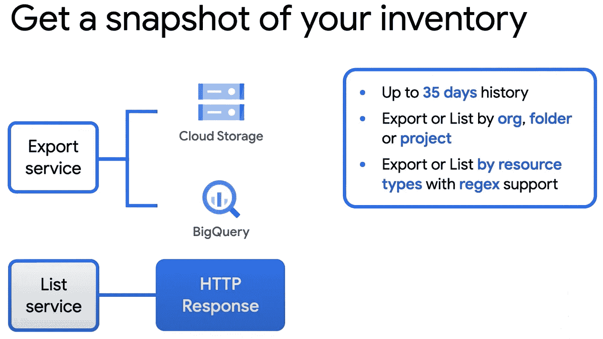

# 我在 GCP 的资料呢？

> 原文：<https://medium.com/google-cloud/wheres-my-stuff-on-gcp-4a58badda6cc?source=collection_archive---------0----------------------->

因为在云中创建的每个资源都要花费美元，所以跟踪您帐户中的资源是一个常见的问题。我记得在 AWS 工作时，由于大多数服务的区域性，这尤其具有挑战性。我不仅必须发出正确的命令，还必须遍历所有不同的区域。通常，最好的方法是简单地看看你的账单，然后从那里开始追踪。



云资产清单概述

2018 年，GCP 发布了一项名为*云资产清单*的功能。它允许你在全球范围内搜索你所有的资源。这也是我认为 GCP 比其他云提供商更注重易用性和开发人员生产力的另一个原因(也就是我说的是你们 AWS 和 Azure)。

> 下面是一个使用 gcloud CLI 跟踪我的一些存储桶的示例:

```
$ gcloud asset search-all-resources --asset-types='storage.googleapis.com/Bucket' --limit 2
---
assetType: storage.googleapis.com/Bucket
createTime: '2022-02-16T18:03:23Z'
displayName: gcf-v2-sources-659824402950-us-central1
location: us-central1
name: //storage.googleapis.com/gcf-v2-sources-659824402950-us-central1
parentAssetType: cloudresourcemanager.googleapis.com/Project
parentFullResourceName: //cloudresourcemanager.googleapis.com/projects/nicks-playground-3141
project: projects/659824402950
updateTime: '2022-02-16T18:03:23Z'
---
assetType: storage.googleapis.com/Bucket
createTime: '2022-02-14T19:16:55Z'
displayName: artifacts.nicks-playground-3141.appspot.com
location: us
name: //storage.googleapis.com/artifacts.nicks-playground-3141.appspot.com
parentAssetType: cloudresourcemanager.googleapis.com/Project
parentFullResourceName: //cloudresourcemanager.googleapis.com/projects/nicks-playground-3141
project: projects/659824402950
updateTime: '2022-02-14T19:16:55Z'
```

你也可以只寻找**的一切。**然而，对于一个大型项目来说，输出可能会很大，这就是为什么我们建议[将结果导出](https://cloud.google.com/asset-inventory/docs/export-asset-metadata)到一个存储桶中，或者大查询中，以便于搜索。

> 不过，这很容易做到:

```
$ gcloud asset search-all-resources
```

查看关于云资产清单的[文档](https://cloud.google.com/asset-inventory/docs/overview)，或者我在文章中使用的 *gcloud* [命令](https://cloud.google.com/sdk/gcloud/reference/asset/search-all-resources)。这里有一个[视频](https://www.youtube.com/watch?v=c0LVkrTLmVY)比这个简要概述更详细地介绍了该产品，包括如何使用控制台直观地查看您的资源所在的位置。

祝你好运跟踪和删除旧的，不必要的资源！