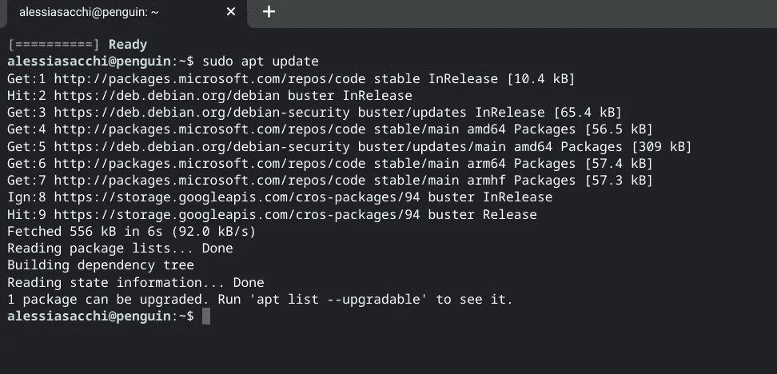
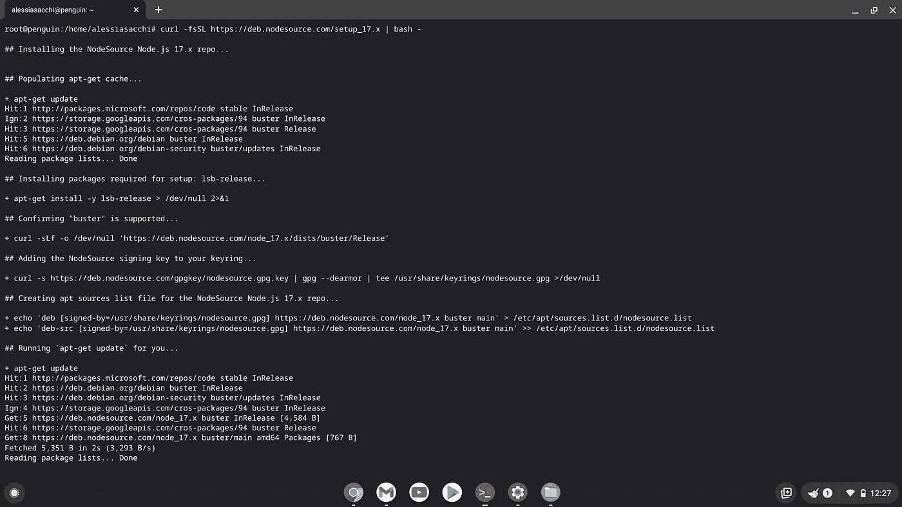
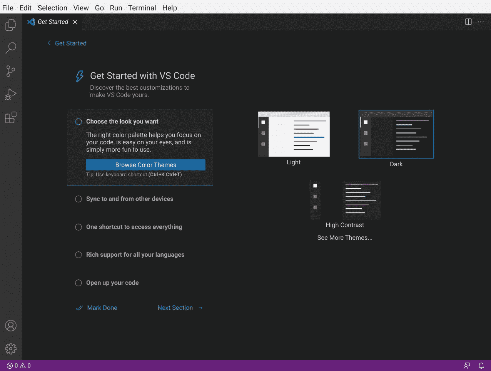
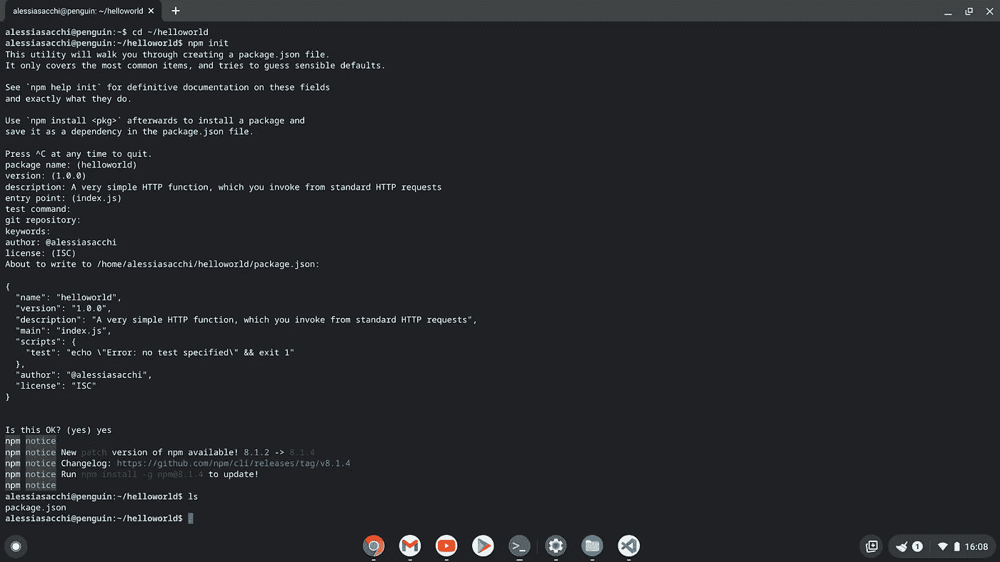
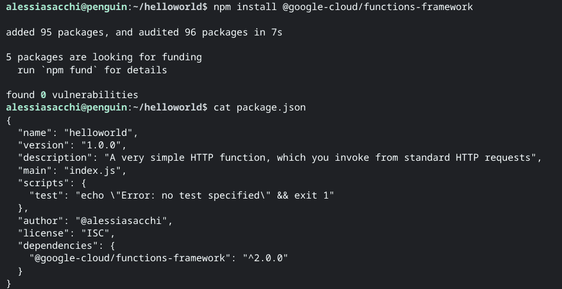
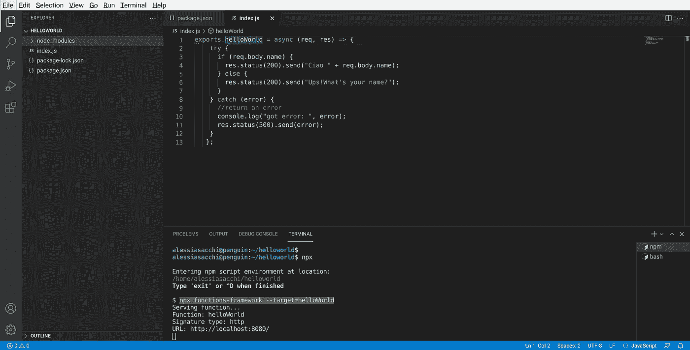
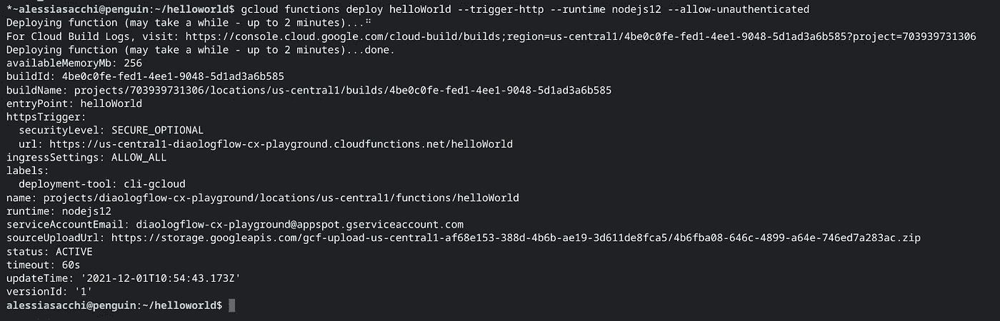

# 谁说不能在 Chromebook 上编码了？具有云功能的本地开发。

> 原文：<https://medium.com/google-cloud/who-said-you-cant-code-on-a-chromebook-local-development-with-cloud-functions-4e68dca1240b?source=collection_archive---------1----------------------->

当我 1 月份加入谷歌时，我可以在 Chrome、gLinux、macOS 和 gWindows 四个主要平台的几个选项中选择我的笔记本电脑。我喜欢在 5 秒钟内启动笔记本电脑的想法(我的三星手机需要更长时间才能开机)，但我不能否认我对编码持怀疑态度。事实是，人们很容易忽视 Chromebooks，尽管它们使用的操作系统规模不如 Windows 10 或 macOS，但随着时间的推移，该平台已经成熟为一种轻量级但功能仍然很好的平台。

这篇博文描述了在 Chromebook 上设置 Linux，并使用 Node.js 运行时、Visual Studio 代码和 Google Cloud Functions Framework for node . js 编写简单的 HTTP Cloud 函数的过程，让我们开始吧！


奥斯卡·伊尔迪兹在 [Unsplash](https://unsplash.com/s/photos/coding?utm_source=unsplash&utm_medium=referral&utm_content=creditCopyText) 上拍摄的照片

# 在 Chromebook 上设置 Linux、Node 和 Visual Studio

首先，如果你想在 Chromebook 上开发软件，你需要安装 Linux。你可以在 Chromebook 上安装 Linux 命令行工具、代码编辑器和 ide(集成开发环境)。这些可以用来写代码，创建应用等等。[如果你的设备安装了 Linux](https://sites.google.com/a/chromium.org/dev/chromium-os/chrome-os-systems-supporting-linux) ，它将默认关闭。您可以随时从设置中打开它。在 Chromebook 的右下角，选择时间。然后选择设置> **高级** > **开发者。**在“Linux 开发环境”旁边，选择打开并按照屏幕上的说明进行操作。Debian 10 (Buster)环境的设置可能需要 10 分钟或更长时间。您可以运行 Linux 命令，使用 APT 包管理器安装更多的工具，并定制您的 shell。首先要做的一件事是更新 APT⁠库索引并安装。APT 是 Debian 的命令行包管理器，保持它的最新将确保你总是在它的库中安装最新版本的工具:



运行“apt-获取更新”

提示！访问 Linux 容器中的文件的一个简单方法是制作一个副本。为此，请打开文件应用程序，拖动您想要访问的任何目录或文件，并将其放入“Linux 文件”中。

既然 Linux 已经设置好了，要安装 Node.js，我们需要确保我们正在以 root 用户身份运行安装程序命令(在撰写本文时，Node 的当前版本是 17.1.0)。

```
sudo /bin/bash
curl -fsSL https://deb.nodesource.com/setup_17.x | bash -
sudo apt-get install -y nodejs
```



在终端中安装 NodeSource Node.js 17.x repo

如果由于 Node 的任何现有冲突版本而遇到错误，请通过运行以下命令清理您的环境:

```
sudo apt remove — purge nodejs node npm
sudo apt clean
sudo apt autoclean
sudo apt install -f
sudo apt autoremove
```

既然已经设置了 Crostini Linux 容器并安装了 Node，我们将继续学习 Visual Studio 代码。这是什么？这是一个轻量级但功能强大的源代码编辑器，运行在桌面上，可用于 Windows、macOS 和 Linux。它内置了对 JavaScript、TypeScript 和 Node.js 的支持，并为其他语言(如 C++、C#、Java、Python、PHP、Go)和运行时(如。NET 和 Unity)。

虽然你总是可以通过`sudo apt install`在终端中安装应用和工具，但 Chrome OS 上的 Linux 支持双击安装文件应用中的`.deb`文件(Debian 软件包)，允许你像习惯一样下载和安装应用。例如，Visual Studio 代码提供了一个`[.deb](https://code.visualstudio.com/download)` [⁠](https://code.visualstudio.com/download) 包，你可以尝试一下。下载后，打开文件应用程序，右键单击并选择“安装 Linux(测试版)”。您将看到一个提示，其中包含有关您要安装的应用程序的信息，以及安装应用程序的选项。从现在开始，一旦 Linux 安装程序完成，你就可以像 Chromebook 上的任何其他应用程序一样，从应用程序抽屉中启动 Visual Studio 代码。您也可以从终端简单地输入*代码*来启动它。



Chrome 操作系统上的 Visual Studio 代码

# 在本地创建并测试 HTTP 云功能

[Google Cloud Functions](https://cloud.google.com/functions) 是一个事件驱动的无服务器计算平台。云功能允许您编写代码，而无需担心资源调配或扩展以处理不断变化的需求。因为在云函数上测试代码本身需要等待已部署的代码和日志条目变得可用，所以在开发机器上运行和测试您的函数可以显著加快测试过程(进而加快开发过程)。

在我们在 Visual Studio 中创建和测试云函数之前，作为本地开发环境设置的一部分，我们还需要做最后一步:为 Node.js 安装[函数框架。Google Cloud Functions 团队已经创建了一个开源的 FaaS (Function as a Service)框架，用于编写可移植的 Node.js 函数，这些函数可以在许多不同的环境中运行，包括 Google Cloud Functions、您的本地开发机器、Cloud Run 以及基于 GKE 和 Knative 的环境中的 Cloud Run。](https://codelabs.developers.google.com/codelabs/local-development-with-cloud-functions#2)

所以，让我们通过在终端中运行`npm init`来创建一个新的 Node.js 应用程序。接受默认值时，确保使用`index.js`作为应用程序的入口点。

```
mkdir ~/helloworld
cd ~/helloworld
npm init 
```



使用 npm init 创建一个简单的 HTTP 云函数

然后安装 Node.js 的函数框架(`npm install @google-cloud/functions-framework`)。打开你的 *package.json* 。验证您是否看到作为依赖项列出的函数框架，如下例所示。



安装功能框架

我们现在准备在 Visual Studio 代码中编辑云函数。单击 IDE 中的资源管理器图标，打开刚刚创建的文件夹。现在在`helloworld`目录下创建一个`index.js`文件，并添加一些 hello world 代码:-)。若要使用 Visual Studio 中的集成终端测试函数，请打开一个终端窗口并运行以下命令:

```
npx functions-framework --target=helloWorld
```



这个命令启动一个本地服务器，当服务器接收到一个 HTTP 请求时，它准备调用`helloWorld`函数。为了测试这个函数，创建第二个终端窗口，并运行下面的命令，向服务于`helloWorld`函数的本地服务器发送一个名称负载。

```
curl -X POST http://localhost:8080 -H "Content-Type:application/json"  -d '{"name":"Alessia"}'
```

既然您已经在本地机器上创建并测试了云功能，那么您就可以将它部署到 Google Cloud 了。但是在此之前，我们需要确保当我们部署到 Google Cloud 时，所有的 *node_modules* 都将被排除在部署之外。为此，我们需要在顶层目录中添加一个名为`.gcloudignore`的文件。此`.gcloudignore`防止上传`node_modules/`目录和任何以`~`结尾的文件:

```
/node_modules/
*~
```

# 将云功能从本地机器部署到 Google Cloud

既然我们已经为云功能打包了应用程序，下一步就是将它部署到 Google Cloud。为此，我们需要[在本地安装云 SDK](https://cloud.google.com/sdk/docs/quickstart#installing_the_latest_version) ，并使用`[gcloud init](https://cloud.google.com/sdk/gcloud/reference/init)`命令执行几个常见的云 SDK 设置任务。这些包括授权 Cloud SDK 工具使用您的用户帐户凭据访问 Google Cloud，并设置默认配置(确保设置项目 ID 而不是项目编号)。

一旦您的 Google Cloud SDK 配置完毕，可以在任何终端窗口中使用，请运行以下命令:

```
gcloud functions deploy helloWorld --trigger-http --runtime nodejs12 --allow-unauthenticated
```

部署完成后，您将在输出中看到以下内容:



我们完了！感谢您阅读这篇博文，在这篇博文中，我们探讨了如何在 Chromebook 上使用 Visual Studio 代码，通过 Node.js 的云函数来简化本地开发。