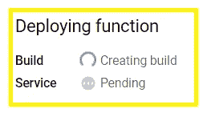

# 为什么选择云函数第二代？

> 原文：<https://medium.com/google-cloud/why-cloud-function-2nd-generation-51a6f80e030?source=collection_archive---------2----------------------->

在最近的 Google Cloud Next 活动中，GCP 强调了第二代云功能。你一定在想，即使 Cloud Run 已经推出，我们为什么还要讨论第二代？**因为云功能—2 代在后台使用云运行！**

下面我们来深入探讨一下云功能二代。二代有什么新的？众所周知，有两个版本可供选择:

1.  第一代:第一个版本
2.  第二代:基于云运行和 Eventarc 构建的新版本

# 第二代产品的主要增强功能:

## *更长的请求时间:

第二代为 HTTP 触发功能提供了 60 分钟的更长请求超时，几乎是第一代的 6 倍。

## *更大的实例大小:

下一个重要的增强是大的实例大小。现在，云功能可以拥有高达 16 GiB 的 RAM(预览版为 32 GiB ),带有 4 个虚拟 CPU。以前，它最多只能有 8 GiB RAM 和 2 个虚拟 CPU。

## *并发性:

另一个关键的增强是并发性。在早期的第一个版本中，云函数的一个实例只能有一个请求。然而，在第二代中，我们可以处理每个函数实例多达 1000 个并发请求。

## *多种功能修订和流量分流:

第二代云函数构建在云运行之上。因此，它支持多种功能修订和流量分流等功能。第一代产品不直接支持这两种功能。

## *事件类型:

由于第二代由 Eventarc 支持，它支持 90 多个事件。我们过去只能获得第一代的 7 种事件类型。

登录你的谷歌云控制台，搜索云功能。点击“创建云功能”。如果所需的 API 不在下一个弹出窗口中，请启用它。

给出函数名，并在环境中选择第二代。在 EventTarc 中，您可以探索 90 多个触发选项。对于演示，让我们只保留默认的 HTTPS，如下所示，然后单击下一步:

在运行时，您可以选择任何语言，现在，我们将继续使用 Node.js 16 和现有代码。只需点击部署。

正如我们现在看到的，构建已经开始。这个构建由云运行完成。因此，一个容器映像将在后台构建，包含我们的代码。

然后，相同的容器映像将被部署到云运行，如图所示。

过一会儿，我们将看到云功能准备就绪。

让我们转到最后一个测试选项卡，在 Cloud Shell 中运行该命令。我们将得到以下结果:

现在，让我们通过单击顶部的编辑按钮并单击下一步来编辑代码。如下所示编辑您的代码并部署它:

云功能会重新构建。现在，再次以同样的方式测试，我们将会看到我们的新代码变化是否被反映出来。因此，当我们更改云功能代码时，它也在更新云运行服务。

现在通过在搜索栏中搜索它来进入云运行。我们应该可以在那里看到我们的云函数名称。

单击函数名并转到修订选项卡。我们将看到同一个函数的两个版本。

现在，有趣的是，我们可以配置发送到每个云功能的流量。我们可以点击功能前面的 3 个点，然后选择“管理流量”，如下所示。

现在，我们可以配置我们想要发送 50%的流量给第一个版本，50%给另一个版本，如下所示。这在第一代中是不可能的。这是第二代云函数才有可能实现的。

现在，我们已经看到，在所有第二代云功能的背后，都有云运行版本。所有通常与云运行相关的功能现在也可以与云功能一起使用。

希望你喜欢。

如果您有任何相关的疑问，请随时联系我。如果可以的话，我很乐意帮助你。保持联系:)

## 如果你喜欢这篇文章，请为它鼓掌。我真的很感激。

## 推特:【https://twitter.com/SakshiKhandlwl
T4 LinkedIn:[www.linkedin.com/in/sakshikhandelwal276](http://www.linkedin.com/in/sakshikhandelwal276)

编码快乐！