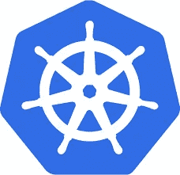
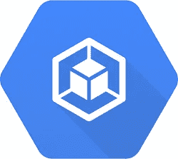
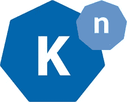
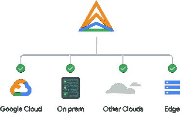

# 为什么选择谷歌云？第 3 部分:开源产品

> 原文：<https://medium.com/google-cloud/why-google-cloud-ba38a6d43151?source=collection_archive---------6----------------------->

欢迎来到我的“为什么是谷歌云”系列的第三篇博客，在这里我将讨论我支持谷歌云的原因。该系列的前两篇博客关注安全性和可持续性。如果你错过了，你可以在这里阅读:

*   [为什么选择谷歌云？第 1 部分:安全性](https://www.cloudbabble.co.uk/2022-11-03-whygooglecloudsecurity/)
*   [为什么选择谷歌云？第二部分:可持续性](https://www.cloudbabble.co.uk/2022-11-12-whygooglecloudsustainability/)。

这篇博客主要关注 Google 对开源软件 Kubernetes 的支持和贡献，以及开源软件如何帮助组织避免厂商锁定，让多云变得不那么复杂。

在专攻 Google Cloud 之前，我作为架构师的职业生涯更多的是基于传统基础架构的角色，主要围绕安全私有云，通常基于大型企业和多租户平台的 vSphere。我也花了很多年时间使用 Windows Server 和微软产品，所以除了 RHEL 和一些数据库产品，我很少接触开源产品！

让我们快进到我现在作为谷歌云架构师的角色，这个角色已经转变了 360 度。在评估应用程序向 Google Cloud 迁移时，我首先考虑的一个问题是应用程序是否受益于专有授权软件，或者它是否能够受益于现代化和向开源产品的迁移，从而节省成本或提供进一步创新的机会。越来越多的组织倾向于采用开源生态系统。到 2026 年【ResearchAndMarkets.com ，全球开源服务产业有望达到 500 亿美元。

我最近担任首席架构师，为一家领先的全球金融服务机构将应用程序迁移到 GCP，其中许多应用程序的数据库运行在传统的 Oracle 数据库云服务器平台上。虽然由于各种原因，并非所有数据库都可以迁移，但有相当多的数据库被设计为针对其目标架构迁移到 Google Cloud SQL 上的 PostgreSQL。那些数据库看起来合适的应用程序将使用 migVisor 进行评估。migVisor 将为数据库生成一个报告，详细说明迁移到云 SQL 的复杂性，并突出显示功能/脚本等可能面临的任何挑战。这可能不被支持。Ora2PG 将用于执行迁移…在数据库迁移的道路上走得太远之前，我最好停下来回到这篇文章的目的…为什么是 Google Cloud？

谷歌对广泛的开源项目的持续和历史性的支持和贡献，以及它在内部开发应用程序代码并将其发布到开源社区供大众消费和进一步创新的历史，是我提倡谷歌云的第二个原因。

# 库伯内特斯

应用程序现代化和容器化从 Google 的创新中受益匪浅，Kubernetes 就是通过这一过程诞生的。谷歌开发了 containerisation orchestration 工具，他们在 2014 年以开源形式发布该工具之前，已经使用该工具运行自己的容器工作负载多年。从那时起，它已经成为事实上的集装箱化编排平台，每个超大规模提供自己的托管服务。2021 年，CNCF 年度调查显示，96%的组织正在使用或评估 Kubernetes！

*Kubernetes 容器编排和管理平台*

Kubernetes 并不是谷歌发布的唯一项目。谷歌的产品还有很多，包括作为机器学习平台的 Tensorflow、帮助简化微服务的安全性和可观察性的服务网格产品 Istio、作为网络浏览器的 chromium 以及作为操作系统的 Android。事实上，谷歌有如此多的开源项目，他们专门为他们维护了一个网站:[谷歌开源](https://opensource.google/)。

*谷歌发布开源共享创新*

谷歌云提供了两种模式的托管 Kubernetes 平台——谷歌 Kubernetes 引擎(GKE)标准模式和 GKE 自动驾驶模式。虽然两者都提供了一个完全管理的控制平面，通过 GKE 自动驾驶仪，谷歌还完全管理 Kubernetes 集群和基础设施，包括节点自动缩放。不需要自己进行配置或监控。Autopilot 根据集群、工作负载和安全配置的 GKE 最佳实践来配置集群。有了 Autopilot，您只需为消耗的 pod 资源付费，避免了与系统组件和未使用的节点容量等相关的开销。但是，如果在节点池配置方面需要更大的灵活性，GKE 标准模式使您能够管理集群的底层基础架构、节点规格、数量等。

*Google Kubernetes 引擎是 Google Cloud 完全托管的 Kubernetes 产品，可在标准或自动驾驶模式下使用*

尽管向 CNCF 捐赠了 Kubernetes，但谷歌仍在继续创新，定期贡献和更新该项目。Google 是 Kubernetes 项目的第一大贡献者(通常至少是第二大贡献者的两倍！).

# 锁定和激活

组织迁移到公共云的一个主要担忧是供应商锁定的风险。他们担心从一个云平台迁移到另一个平台有多困难，如果过于复杂和昂贵，他们的应用程序可能会“锁定”在某个特定平台上，需要大量的财务、时间或技术投资才能在以后迁移。通过选择开源产品，组织可以消除(或减少)对供应商锁定的担忧。为了帮助解决这一问题，谷歌创建了 Knative 项目，该项目已经得到了包括 IBM、RedHat、VMware 和 SAP 在内的各种公司的支持，但最终确保组织可以在他们想要的任何地方运行无服务器工作负载，无论是在完全托管的 GKE 集群、无服务器云运行、针对 Anthos 的云运行、本地 Kubernetes，还是在另一个超大规模平台或 OpenShift 平台上。

Knative 是一个开源的企业级解决方案，用于构建无服务器和事件驱动的应用程序。

虽然 Knative 无服务器组件需要安装在 GKE 集群之上，但对于 Google Cloud Run，Knative 是内置的。Knative 是一个运行无服务器的平台无关的解决方案。有了 Knatives 开放 API 和运行时环境，从无服务器容器的角度来看，对供应商锁定的担忧得到了缓解。

如果没有 Knative，开发人员必须经历一个陡峭的学习曲线才能成为 Kubernetes 的专家，配置 GKE 集群设置，配置自动缩放，为部署定义各种 YAML 文件等等。有了 Knative，开发人员在 Kubernetes 中不再需要这种水平的专业知识。Knative Serving 和 Eventing 组件协同工作，处理这种复杂性，并使开发人员能够以无服务器的方式使用 Kubernetes，更多地关注他们的代码，而不是 Kubernetes 的基础设施、资源和清单文件。

Knative 在今年 3 月早些时候被 CNCF 接受，并处于孵化项目成熟度级别-毕业和孵化项目都被认为是稳定的，并用于生产环境中。更多关于 Knative 的信息请点击这里 [Knative](https://knative.dev/docs/) 。

# 无服务器与完全托管

Google Cloud 提供一系列开源产品作为完全托管的服务，由 Google 及其合作伙伴生态系统提供支持。这包括基于 Cloud SQL for MySQL 的数据库产品、PostgreSQL、作为托管 Apache Beam 产品的 Dataflow、作为完全托管 Apache Hadoop 产品的 Dataproc、作为完全托管 Apache Airflow 产品的 Cloud Composer、MongoAtlas 数据库产品等。这些服务中有些是无服务器的，有些则被归类为完全托管服务。无服务器产品消除了对用于运行您的服务的机器的任何控制和配置——有了无服务器，您只需专注于您的代码，Google 会负责集群、HA、DR 设置等的所有配置。此外，您通常只需为您使用的资源付费。

完全托管的服务提供更多控制——对于完全托管，您通常定义运行服务的机器，服务是否高度可用、自动缩放等。然而，这些机器是完全受管理的-您不需要安装、配置或维护它们，这是作为产品的一部分完成的。

# 多云朵

通过选择在开源软件上运行您的应用，组织可以更轻松地拥抱多云。根据 Gartner 的调查，超过 80%的组织正在使用两家或更多的公共云提供商。虽然多云策略不可避免地会增加公共云架构和治理的复杂性，但企业选择多云策略的原因有很多，包括:

*   避免供应商锁定——开发人员可以通过使用开源软件在多个云上部署他们的代码。
*   灾难恢复-一些组织希望使用第二个云提供商来实现灾难恢复。同样，组织可能会认为多云提供了更高的弹性和可用性。对于有法规要求或主权要求限制环境部署区域的组织来说，尤其如此。多云架构可以在组织必须工作的限制范围内提供更多的区域。
*   同类最佳的功能-一些组织可能会选择使用一家公共云提供商提供的特定服务，用于他们视为领导者的领域，例如，选择 Google Cloud 用于数据和人工智能，并使用另一家 CSP 提供的其他服务。
*   偶然的多云-一些组织可能会发现不同的业务领域已经在使用多家公共云提供商的服务。其他公司可能会在合并和收购后继承多云架构。

# 安索斯

不管是什么原因，定义一个策略来管理和治理这些多云环境是关键。组织需要确保他们有办法获得资源的集中可见性和管理，无论它们部署在哪里——GCP、内部、边缘或其他公共云中。Anthos 旨在解决这一问题——它提供了跨所有平台的单一窗口，提供基础设施管理、容器管理、服务管理、策略执行和可观察性。总体而言，这简化了组织在管理和维护跨多云环境的集装箱化工作负载时所面临的挑战。无需定义和配置每个公共云 Kubernetes 集群、容器、服务、策略执行、监控、日志记录、SLO、故障排除工具和应用程序维护，所有这些都可以在 Anthos 中一次性完成，并跨您的 Kubernetes 集群部署，无论它们是运行在 GKE、内部还是另一个公共云中。

*Anthos 多云管理*

# 有保证的开源

2020 年的太阳风攻击凸显了供应链攻击的风险。对于开源软件，存在软件可能包含隐藏漏洞或恶意代码的风险。为了帮助减轻这种威胁，谷歌推出了一款名为 Assured 开源软件(Assured OSS)的新产品。Assured OSS 提供了对经过 Google 管理和审查的开源软件包的访问。这使得客户能够部署谷歌自己使用的相同的 OSS 软件包，这些软件包已经被定期扫描、分析和测试漏洞。这些包是按照可验证的 SLSA 标准构建的，由 Google 签名，并从 Google secured Artifact Registry 分发。

# 结论

有了开源，组织可以帮助避免供应商锁定，降低成本(也许对一些企业操作系统来说没那么重要！)，受益于更快的开发、创新和错误修复。谷歌在创新、开发、发布开放源码软件、为开放源码软件项目做出贡献以及创造一系列全面管理的开放源码软件产品方面的丰富历史是我“为什么选择谷歌云”的第三个原因。有了像 Kubernetes 这样的创新产品作为 Google Kubernetes 引擎标准和自动驾驶模式的一部分，或者在 Cloud Run 上运行的 Knative serverless 部署，Google Cloud 是运行您的容器化工作负载的完美平台。同样，对于拥有混合或多云架构的组织，Google Cloud 的 Anthos 产品简化了内部和公共云中多个 Kubernetes 集群的管理。

感谢你花时间阅读这篇博客。欢迎随时分享，[订阅](https://www.cloudbabble.co.uk/subscribe)关注未来帖子，关注我 [LinkedIn](https://linkedin.com/in/jamiethompson85) ，并在下方反应/评论！

如果你希望我在未来的帖子中涉及 Google Cloud 产品、概念或认证的任何特定领域，请联系我。

*原载于 2022 年 11 月 21 日*[*【https://www.cloudbabble.co.uk】*](https://www.cloudbabble.co.uk/2022-11-21-whygooglecloudoss/)*。*