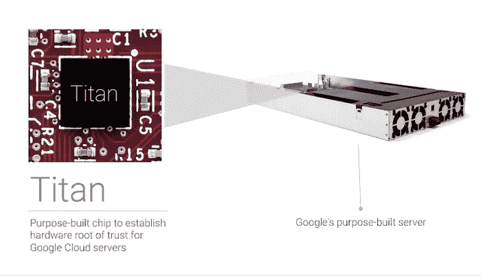
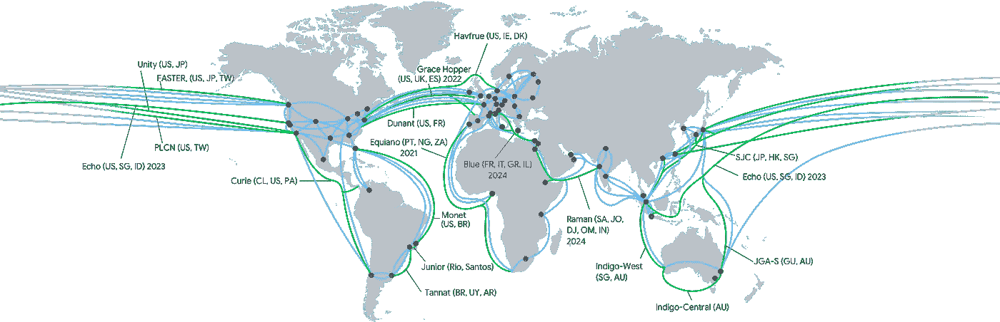
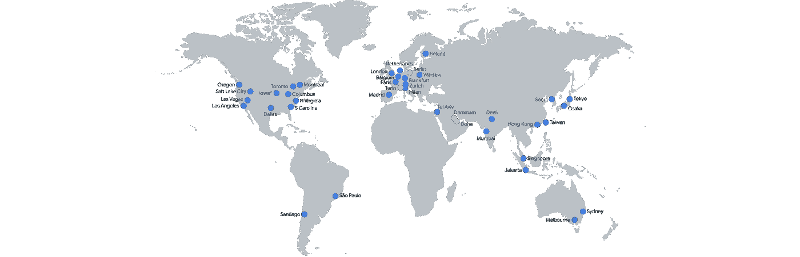
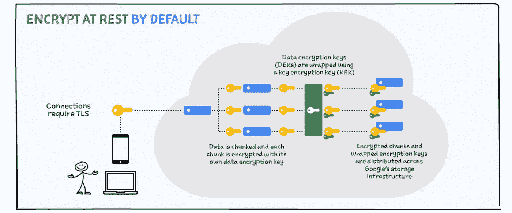
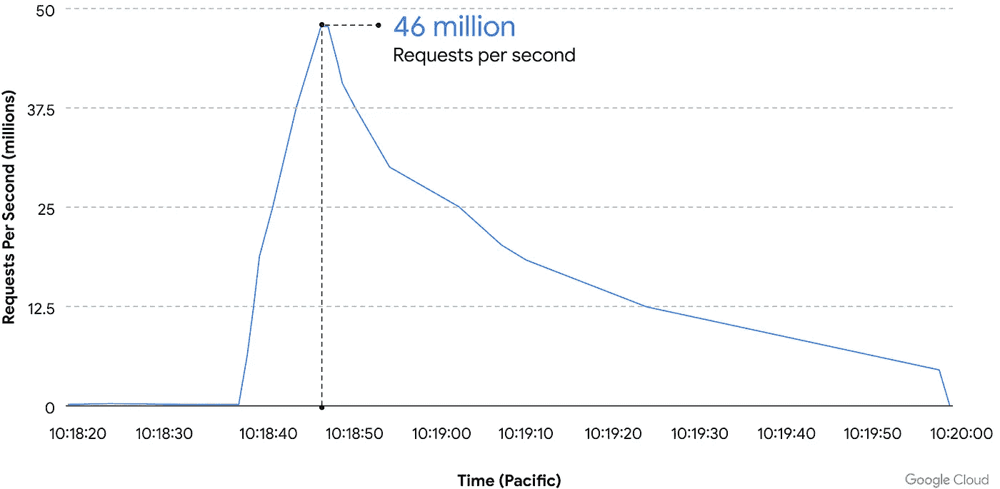

# 为什么选择谷歌云？第 1 部分:安全性

> 原文：<https://medium.com/google-cloud/why-google-cloud-ea63c2537a7f?source=collection_archive---------4----------------------->

在当今世界，网络攻击的威胁、数量和复杂性不断增加，在将您的数据和应用迁移到公共云时，您需要确保您可以信任您的服务提供商为您的数据和系统提供足够的安全性和强大的保护。谷歌云的一大优点是他们的安全方法。谷歌设计了谷歌云，将保护客户数据放在首位。事实上，谷歌云提供的许多产品和服务都是谷歌内部开发的产品和服务，多年来用于保护和运行自己的数据和应用程序，全球数十亿用户使用这些产品和服务进行谷歌搜索、Gmail、YouTube 等。有了 Google Cloud，安全性从一开始就融入了平台，而不是事后才添加的东西。

由于谷歌的规模、产品范围和对安全的持续投资，设计合理的谷歌云架构可以提供比许多内部部署方法更好的安全性。在这篇博客中，我强调了 Google Cloud 及其基础设施的一些核心安全特性，这些特性有助于保护您的数据和应用程序。

谷歌将深度防御提升到了一个新的水平，从设计全球数据中心的物理安全，到定制自己的服务器和硬件安全芯片。Titan 安全芯片用于硬件层的身份验证，充当硬件信任根。所有服务器均可安全启动，并为基板管理控制器、BIOS、引导加载程序、内核和基本操作系统映像提供加密签名。我不记得确切的位置(我相信在前 5 名之内)，但是有一个有趣的事实，Google 是全球最大的服务器制造商之一，尽管没有销售一台服务器，这显示了他们基础设施的规模！

*谷歌云泰坦安全芯片*

然后是谷歌的全球网络——世界上最大的私有网络，使客户能够在全球范围内私有地路由流量，而不必穿越公共互联网。该网络允许单个 VPC 跨越多个区域，并且可以提供超过 1Pbps 的总二分带宽！

*谷歌云网络存在点*

在 Google 的私有网络中路由流量可以减少延迟，从而加快响应速度，并避免通过互联网将流量路由到另一个地区的额外复杂性和挑战。谷歌的网络目前跨越了 35 个地区的数据中心(另外还有 12 个计划即将推出！).

*谷歌云全球网络地区*

默认情况下，Google 中存储的所有数据都在存储层使用 AES256 加密进行加密。Google 管理默认加密密钥，但也通过信封加密和云密钥管理服务方便客户自己管理加密密钥。对于需要更多控制的客户，他们可以选择使用客户自己提供的加密密钥。

Google Cloud 还提供硬件安全模块来保护您的密钥，并提供云外部密钥管理器来与 Thales、Fortanix、Futurex 和 Virtru 等供应商集成。客户还可以在 Google Cloud 中部署自己的证书颁发机构，提供证书颁发机构服务，进一步保护 Google Cloud 中的应用程序。

用户和 Google 前端之间的所有流量都使用 TLS 来保护。如果通信被截获，这种传输中的加密可以保护您的数据，方法是在传输之前加密数据，验证端点，并解密和验证数据在到达时未被修改。

*谷歌云默认静态加密*

谷歌还开发了应用层传输安全(ALTS)协议，用于保护谷歌基础设施内的 RPC 通信。这类似于 mutual TLS (mTLS ),但经过优化以满足谷歌数据中心环境的需求。

机密计算提供使用中的加密保护-内存中的数据通过在处理过程中对数据进行加密来防止泄露。机密计算使客户能够在使用中实现加密，而无需更改任何应用程序代码或牺牲性能。

稍后，我将在一个深度技术博客中介绍更多关于加密和证书服务的内容。

谷歌前端(GFE)通过云盔甲保护去往谷歌云服务的流量免受互联网的影响。在流量到达客户的 VPC 网络之前，它必须通过 GFE 路由(除非客户已经使用公共 IP/不使用谷歌云负载均衡器将服务直接暴露于互联网)。这里，GFE 确保所有 TLS 连接都使用正确的证书终止，并遵循最佳实践，例如支持完美的前向保密，以及保护客户免受 DDoS 攻击。当流量路由通过 GFE 的负载平衡器时，传入的流量信息被发送到中央 DoS 服务。当 DoS 服务检测到攻击时，它可以配置负载平衡器来抑制或丢弃攻击流量。谷歌基础设施的规模意味着它可以在影响客户应用程序之前吸收几乎任何规模的 DoS 攻击。

2022 年 6 月，谷歌抵御了世界上已知最大的第 7 层 HTTPS DDoS 攻击，峰值为每秒 4600 万次请求。谷歌的 DDoS 检测速度非常快，它在谷歌的边缘阻止了攻击，避免了对客户的影响。通过在其云装甲安全策略中配置自适应保护，客户收到了威胁警报，云装甲提出了一个规则，可以部署该规则以在攻击升级并有机会影响应用程序之前快速阻止流量。

*谷歌云 DDoS 攻击峰值达到 4600 万 RPS*

关于这次攻击的更多信息可以在谷歌的博客上找到:[谷歌云如何以 4600 万 rps 阻止最大的第 7 层 DDoS 攻击](https://cloud.google.com/blog/products/identity-security/how-google-cloud-blocked-largest-layer-7-ddos-attack-at-46-million-rps)。

谷歌有各种网络安全团队，每个团队都有自己的角色和职责，从检测和响应，到专门攻击谷歌基础设施以测试防御的红队，就像真正的攻击者一样，到专门研究零日漏洞的零计划团队。

Google 的安全团队参与了 Google 和更广泛的社区的各种安全研究，包括各种开源项目。Project Zero 团队发现的威胁包括 Spectre 漏洞利用、Meltdown 漏洞利用、POODLE SSL 3.0 漏洞利用和密码套件漏洞。

好消息是，这些保护谷歌自身基础设施的网络安全团队，也是保护谷歌云上所有组织的团队。

在这篇博文中，我重点介绍了谷歌云的一些核心的、基础的安全特性，这是我的“为什么是谷歌云”博客系列的一部分。安全性是我提出“为什么选择谷歌云”的几个原因之一——我将在接下来的博客中强调我的其他原因。

还有无数的其他谷歌云产品和服务可以提供进一步的保护，包括身份和访问管理、谷歌云资源层级、VPC 网络、VPC 服务控制、谷歌云运营，即构成登陆区的元素。然后还有其他产品，如安全命令中心，谷歌与 BeyondCorp Enterprise 的零信任实施，Chronicle，Virus Total，Secret Manager，Identity Aware Proxy，数据丢失保护 API，容器分析，二进制授权，有保证的开源软件…不胜枚举。我将在后续的博客中更详细地关注其中的一些产品。

如果你已经做到了这一步，感谢你花时间阅读 Cloud Babble 的第一篇博客！我希望你喜欢它。请随意分享，[订阅](https://www.cloudbabble.co.uk/subscribe)以获得未来帖子的提醒，在 [LinkedIn](https://linkedin.com/in/jamiethompson85) 上关注我，并在下面做出反应/评论！

如果你希望我在未来的帖子中涉及 Google Cloud 产品、概念或认证的任何特定领域，请联系我。

*原载于 2022 年 11 月 3 日 https://www.cloudbabble.co.uk***。**