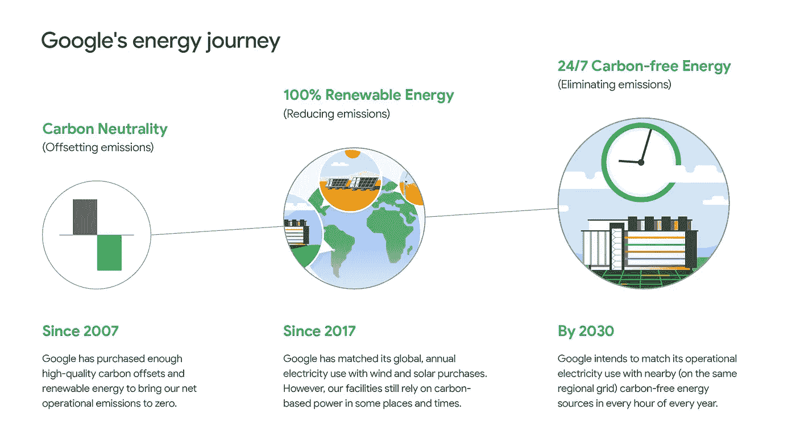
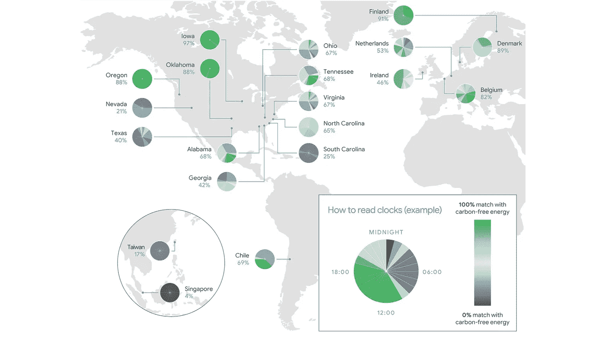
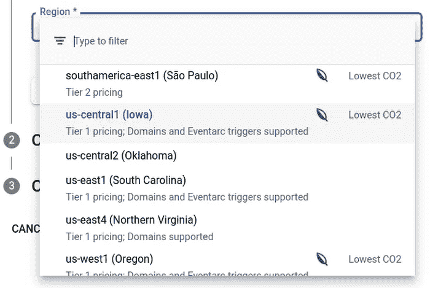

# 为什么选择谷歌云？第 2 部分:可持续性

> 原文：<https://medium.com/google-cloud/why-google-cloud-part-2-sustainability-41fa3e09e291?source=collection_archive---------1----------------------->

你好，欢迎来到我的博客系列“为什么是谷歌云？”这是我系列的第二篇博客，关注可持续性。如果你错过了第一篇关于安全的博客，可以在这里阅读[为什么谷歌云第一部分:安全](https://www.cloudbabble.co.uk/2022-11-03-whygooglecloudsecurity)。

这十年对于让世界走上可持续未来的道路至关重要。为了实现 2015 年巴黎协定的目标，并将全球变暖控制在工业化前水平的 1.5 摄氏度以内，全球经济需要到 2030 年将排放量减半，到 2050 年实现净零。联合国气候变化的一份新报告显示，各国正在使全球温室气体排放曲线向下弯曲，但强调这些努力仍不足以在本世纪末将全球气温上升限制在 1.5 摄氏度以内。

根据该报告，巴黎协定下 193 个缔约方的综合气候承诺可能会使世界在本世纪末变暖约 2.5 摄氏度。

在这篇博客中，我强调了谷歌迄今为止在实现净零排放方面取得的成功，以及谷歌云中可以帮助组织减少碳足迹的功能，这是向公共云迁移的一部分。谷歌长期以来一直是可持续发展的领导者。他们努力实现碳排放为零，并创造技术来帮助其他人减少他们的碳足迹。

# 自 2007 年起碳中和

谷歌是第一家在 2007 年实现碳中和的大公司。碳中性的组织通过碳抵消项目补偿其碳排放，即他们已经采取措施，通过吸收二氧化碳的“碳汇”等方法，消除与供应链活动中排放的二氧化碳等量的二氧化碳。

# 2017 年匹配可再生能源的能源使用

10 年后的 2017 年，谷歌成为第一家将能源使用与 100%可再生能源相匹配的主要公司，并连续 5 年持续这样做。

# 57.5 亿美元的可持续发展债券 2020

2020 年，谷歌发行了 57.5 亿美元的可持续发展债券——这是历史上任何公司发行的最大一笔可持续发展债券。可持续发展，或绿色债券的发行，其收益用于资助或再融资绿色和社会项目。

2020 年，谷歌还补偿了他们遗留的碳足迹，使谷歌成为第一个在其整个运营历史中实现碳中和的大公司！从 1998 年谷歌成立到 2007 年实现碳中和，所有的碳排放都被消除了。谷歌的终生净碳足迹现在为零。

# 2030 年目标

谷歌还设定了到 2030 年要实现的宏伟目标，包括:

*   全球所有数据中心和校园全天候使用无碳能源。
*   在所有运营和价值链中实现净零排放。
*   通过投资谷歌的关键制造区域，实现 50 亿瓦的新无碳能源。
*   帮助 500 多个城市和地方政府每年减少总计 10 亿吨的碳排放。

***谷歌的能源之旅*** [图片来源:谷歌](https://sustainability.google/progress/energy/)

# 高效的数据中心

*   平均而言，谷歌数据中心的能效是典型企业数据中心的两倍。
*   与 5 年前相比，谷歌现在用同样多的电能产生了大约 6 倍的计算能力。
*   2020 年，谷歌的年均 PUE 为 1.10，而行业平均水平为 1.59，这意味着谷歌数据中心使用的日常能源少了约六分之一。
*   通过应用机器学习，谷歌已经能够将数据中心所需的冷却能源减少 40%。

# 温室气体(GHG)

# 浪费

*   全球数据中心运营产生的 78%的废物都是从垃圾填埋场转移过来的。
*   23%用于服务器升级的组件是翻新库存。
*   2020 年，820 万个组件被擦干净并重新出售到二级市场，供其他组织重新使用。

当测量碳排放时，迁移到谷歌云的组织将受益于上述所有内容。因此，简单地将应用程序迁移到 Google Cloud 可以显著减少工作负载的碳排放。然而，在迁移到 Google Cloud 的过程中，组织可以采取各种措施来进一步降低工作负载的碳足迹。

谷歌云公布了所有地区的无碳能源百分比(CFE%)指标。此指标显示一个地区每小时获得无碳能源供应的频率。这些值已发布:

***谷歌云碳自由能百分比(CFE%)全球地图*** [图片来源:谷歌](https://sustainability.google/progress/energy/)

或者，在谷歌云控制台中，一个区域旁边的绿叶图标和“低 CO2”表示该区域的 CFE%至少为 75%(目前有 8 个区域的 CFE%大于 75%)。与在 CFE%较低的区域部署基础设施相比，选择 CFE%评级较高的 Google 云区域有助于进一步减少碳排放。

***谷歌云碳自由能百分比(CFE%)*** [图片来源:谷歌](https://cloud.google.com/blog/topics/sustainability/pick-the-google-cloud-region-with-the-lowest-co2)

# 最大限度减少碳排放的 9 条建议

以下是我推荐的九种方法，作为迁移/部署到谷歌云的一部分，以最大限度地减少与您的工作负载相关的碳排放。

1.  将应用程序工作负载部署到 CFE 评级较高的地区，以减少其碳排放量。
2.  在 CFE 等级最高的地区运行批处理作业，以减少其碳足迹。批处理作业具有按计划运行的优势，因此可以计划在碳排放最低的区域运行，最大限度地减少碳排放。
3.  制定组织政策，限制用户将基础设施部署到 CFE%评级较低的地区。这可确保所有工作负载都部署到您定义的碳排放最低的区域，防止那些可能不太关注可持续发展的用户意外部署到 CFE%值较低的区域。这也减少了短期部署到默认区域的“测试”或“临时”基础架构。
4.  在更新应用程序时，目标应该是可以根据需求增减工作负载的无服务器产品。
5.  设计可以扩展到零的架构，而不是让空闲实例全天候运行，以最大限度地减少碳排放！
6.  即使是简单的主机迁移，在部署到 Google Cloud 之前，也要花时间在合适规模的虚拟机实例上。优化虚拟机规模，使其不消耗超过所需的资源，可以降低整体能源需求和相关的碳排放。
7.  定期审查来自 Google Cloud 的正确规模建议，以确保您在工作负载的整个生命周期中运行在最佳硬件配置上。随着应用程序经历其生命周期的不同阶段，使用情况的峰值变化可能会随着时间的推移而变化，这意味着可以通过定期审查来实现进一步的优化。
8.  定期审查和淘汰未使用的项目和资源。闲置资源在消耗电力，增加碳排放，招致不必要的费用！
9.  审查应用程序代码，以确定任何提高其效率的机会。设计高效的应用程序代码可以降低功耗和工作负载的碳排放量。

由于数据驻留限制、应用延迟和性能要求或冗余要求，在 CFE%最多的区域运行所有工作负载可能并不总是可行的。但是，通过采用首先部署到最高额定 CFE%区域的策略，那些可以部署到这些区域的工作负载将受益于较低的碳排放。虽然就个人而言，上述情况对实现《巴黎协定》的目标影响很小，但如果我们共同做出这些日常生活中建议的小改变，那么我们将开始看到我们向 1.5 摄氏度的目标迈进。

# 未利用的资源

2021 年，谷歌分析了谷歌云上所有客户的聚合数据，以确定可以清理或删除的闲置项目。该分析发现，闲置项目消耗了超过 600，000 千克二氧化碳当量。清理这些闲置项目的效果相当于种植近 10，000 棵树！

为了帮助组织整理未使用的项目，谷歌的 AIOps 创建了 Active Assist，它使用数据、智能和机器学习来识别未使用的项目，并提醒组织帮助实现可持续发展目标，并减少未使用工作负载的碳足迹。这带来了减少不必要成本的额外好处！

# 投资创新者应对气候变化

除了谷歌自己的工具和程序，谷歌还投资于旨在创建可扩展、高影响力气候解决方案的有前途的倡议。谷歌的慈善机构 Google.org 正在为世界各地的创新项目提供催化资金，包括:

*   气候创新的影响挑战，这是一个 3000 万美元的基金，用于支持使用数据和技术加速气候行动的突破性项目。被选中的组织将获得高达 500 万美元的资金，以扩大其活动规模，同时获得谷歌的技术专长和产品，以帮助他们最大限度地发挥影响力。
*   AI for the Global Goals，一个 2500 万美元的基金，用于支持开发新的人工智能驱动的方法，以加快联合国可持续发展目标(SDGs)的进展。
*   向环境倡议理事会----地方政府促进可持续发展组织提供 1000 万美元的赠款，用于资助十个推进可持续城市发展的非营利项目。
*   环境正义数据基金(Environmental Justice Data Fund)是由向风基金(Windward Fund)管理的 900 万美元基金，为美国的环境正义组织提供灵活的资金，以收集数据和建立数据分析能力，使社区能够向美国联邦政府申请基础设施资金。

# 帮助每个人做出可持续的选择

除了减少自身的碳排放，投资创新以帮助应对气候变化，以及帮助其他组织减少碳足迹，谷歌还向每个人提供各种解决方案，以帮助公众通过以下方式做出自己明智的可持续发展选择:

*   支持更可持续的交通:谷歌地图现在提供环保路线，使用户能够快速到达目的地，同时通过利用谷歌的人工智能工具和见解，最大限度地减少燃料或电池消耗。据估计，这已经减少了超过 50 万公吨的碳排放(相当于让 100，000 辆燃油汽车不再上路！
*   实现更可持续的旅行选择:搜索航班的用户现在可以看到几乎所有航班的碳排放估计值，就在价格和持续时间旁边。低排放航班被贴上绿色标签，用户可以根据碳影响对结果进行排序。
*   酒店:当我们的用户搜索旅行住宿时，他们现在可以看到关于酒店可持续发展努力的信息。
*   Nest 自动调温器:谷歌的 Nest 自动调温器已经证明可以为人们的住宅供暖节能 10-12%。这些节约的综合影响是显著的:截至 2022 年 10 月，Nest 恒温器已帮助客户累计节约超过 1050 亿千瓦时的能源——比葡萄牙 2020 年的用电量高出一倍多。

谷歌有着令人印象深刻的可持续发展记录，他们一生的净碳足迹为零，继续投资于创新以应对全球气候变化，并通过运营业内最清洁的全球云来帮助组织减少碳排放！借助无碳能源百分比指标和 Active Assist 无人值守项目检测器，组织可以通过在低碳能源区域配置资源和停用未使用的资源来减少其应用程序工作负载的碳足迹。正是这些特性和可持续发展的资质使可持续发展成为我“为什么选择谷歌云”的原因之一

感谢你花时间阅读这篇博客。请随意分享，[订阅](https://www.cloudbabble.co.uk/subscribe)以获得未来帖子的提醒，在 [LinkedIn](https://linkedin.com/in/jamiethompson85) 上关注我，并在下面做出反应/评论！

如果你希望我在未来的帖子中涉及 Google Cloud 产品、概念或认证的任何特定领域，请联系我。

*原载于 2022 年 11 月 12 日***。**