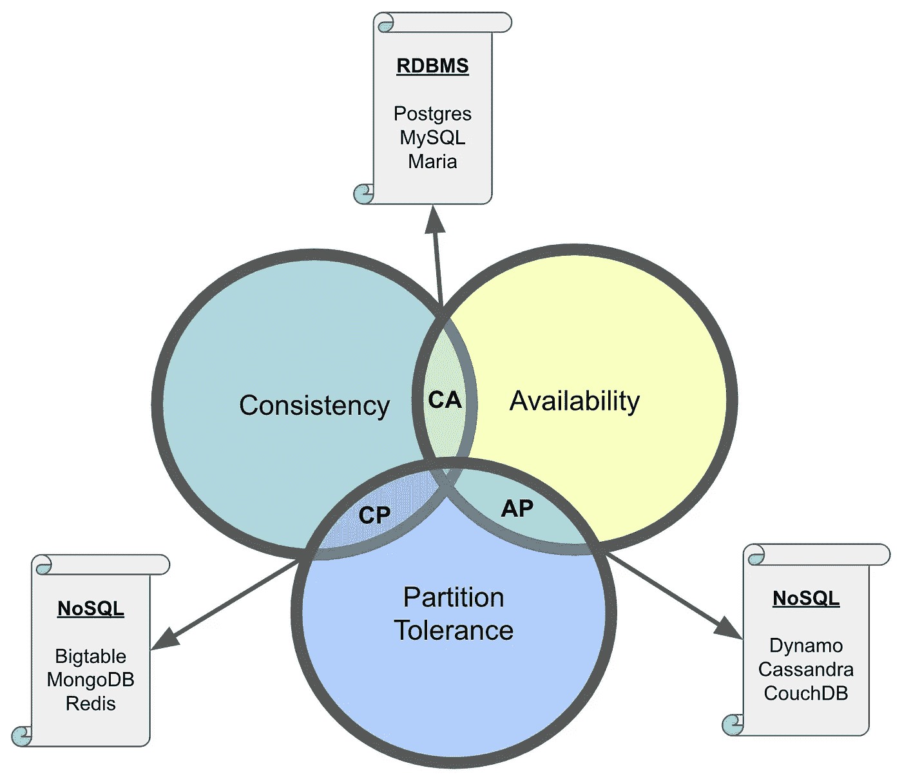
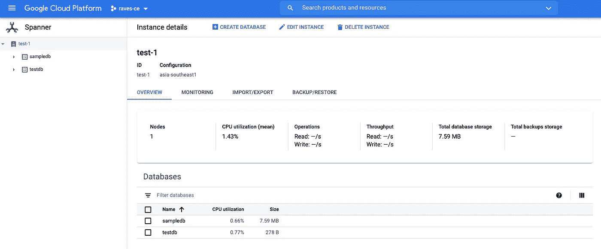
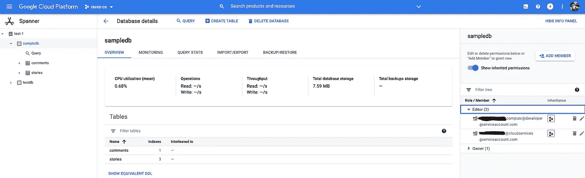
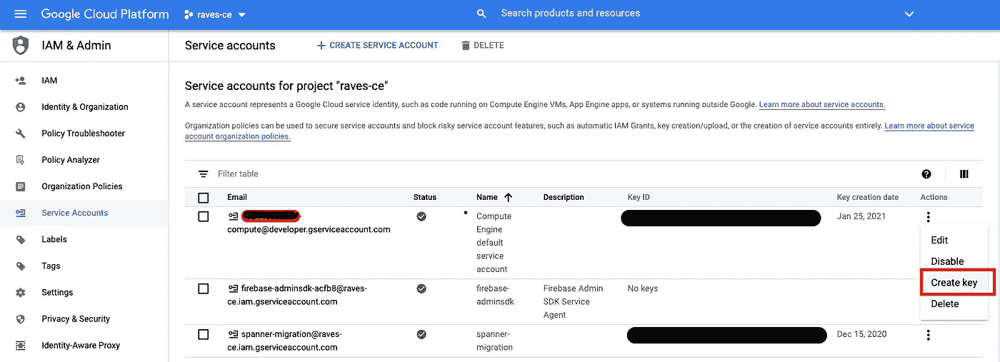

# 为什么要使用 Google Cloud Spanner，以及如何通过零到最小的应用程序代码更改来访问它。

> 原文：<https://medium.com/google-cloud/why-google-cloud-spanner-and-ways-you-can-access-it-with-zero-to-minimal-app-code-change-aef72c700013?source=collection_archive---------0----------------------->

# ***为什么要用谷歌云扳手？***

许多组织开始时规模很小，采用简单的体系结构，包括选择传统的 RDBMS 引擎，但是随着他们的产品越来越受欢迎，他们在选择数据库引擎时面临的主要挑战是:

1.  通过分布式扩展确保可靠的性能。
2.  对系统故障有弹性的应用数据。
3.  通过限制延迟来改善用户体验。
4.  高可用性 SLA。

关系数据库引擎缺乏线性扩展的能力，也无法满足数百万/数十亿并发用户对应用程序的可靠性能访问，并且总是受限于 CAP 定理，也称为 Brewer 定理。CAP 定理是这样一个概念:分布式数据库系统只能有三个保证中的两个:一致性、可用性或分区容差保证。



因此，大多数组织只剩下两种选择，主要是 RDBMS 或 NoSQL 数据库结构。但是，过渡到 NoSQL 平台不仅需要在一致性或可用性级别做出妥协，还需要应用程序开发人员在应用层转换和修改数据，从而导致更多工程工作和架构复杂性的增加，影响新应用程序模块版本的上市时间，这可能会严重削弱他们在市场中的竞争力。

这就是 Google Cloud Spanner 的用武之地，它是唯一的企业级、全球分布式关系数据库服务，提供高度一致的事务，并横向扩展到数千个节点，实现快速应用程序开发，解决性能和规模挑战。因此，结合了关系和非关系数据库结构的优点。

> **谷歌云扳手破帽了吗？**
> 
> **简而言之:**不，这是谷歌的工程壮举，他们能够借助其跨谷歌数据中心的超快速全球专用冗余网络，将网络分区容忍度‘P’的可能性降至最低。

# **那么，访问它有多容易呢？**

Google Cloud Spanner 具有关系语义:模式和增强的数据类型。它支持使用标准 ANSI 2011 SQL 的查询，因此，它只是标准 SQL，而不是定制的类似 SQL 的查询语言。将云扳手数据库与您的应用程序集成有多种方式:

## [用云扳手休眠 ORM](https://cloud.google.com/spanner/docs/use-hibernate)

云扳手兼容 [Hibernate ORM 5.4](https://hibernate.org/orm/) 使用[云扳手方言](https://github.com/GoogleCloudPlatform/google-cloud-spanner-hibernate)。因此，使用标准 Hibernate 和 Java 持久性注释为最常见的条目类型和关系生成 SQL、DML 和 DDL 语句。因此，利用 hibernate ORM 的应用程序可以很容易地过渡到 Cloud Spanner，只需零到最小的代码更改，因为 hibernate 的代码是独立于数据库的，当您更改 oracle、mysql 等数据库时，不需要更改 **hql** 查询。敬云扳手。

> hibernate 使用 **hql (hibernate 查询语言)**，类似于 sql，但是 hibernate 的 hql 提供了对**多态查询**的全面支持。

## [从 PostgreSQL 过渡到云扳手](https://github.com/cloudspannerecosystem/pgadapter)

Google 工程师已经编写了一个代理，将 Postgres wire 协议转换为 Cloud Spanner 等价物。通过运行这个代理，任何 Postgres 客户机只需将其出站端口指向这个代理的入站端口，就可以无缝地运行。在此，我将带您了解它的基本设置和配置过程:

*   从 GitHub 下载/克隆 [PGAdapter 代理](https://github.com/cloudspannerecosystem/pgadapter.git)。

```
 $ git clone [https://github.com/cloudspannerecosystem/pgadapter.git](https://github.com/cloudspannerecosystem/pgadapter.git)
```

*   确保安装了 Maven，这样您就可以构建**Google Cloud Spanner PostgreSQL Adaptor。**

```
**$** brew install maven
**pgadapter$** mvn package[**INFO**] Replacing original artifact with shaded artifact.[**INFO**] Replacing /Users/ravishgarg/pgadapter/target/google-cloud-spanner-pgadapter-2.0.0-SNAPSHOT.jar with /Users/ravishgarg/pgadapter/target/google-cloud-spanner-pgadapter-2.0.0-SNAPSHOT-shaded.jar[**INFO**] Replacing original source artifact with shaded source artifact.[**INFO**] Replacing /Users/ravishgarg/pgadapter/target/google-cloud-spanner-pgadapter-2.0.0-SNAPSHOT-sources.jar with /Users/ravishgarg/pgadapter/target/google-cloud-spanner-pgadapter-2.0.0-SNAPSHOT-shaded-sources.jar[**INFO**] **-----------------------------------------------------------**[**INFO**] **BUILD SUCCESS**[**INFO**] **-----------------------------------------------------------**
```

*   设置您的谷歌云扳手实例和数据库。



云扳手实例**“测试-1”**



**“sampledb”**可访问谷歌服务账户的数据库

*   为 Google 服务帐户创建并下载证书密钥，该帐户已被授权访问我们的 Cloud Spanner“sampledb”数据库。



下载服务帐户的凭据

*   PostgreSQL 适配器既可以作为独立进程启动，也可以作为进程内服务器启动。因此，启动代理作为独立的进程，并与云扳手数据库连接。这里:
    **-p**<project name>
    **-I**<instance id>
    **-d**<databasename>
    **-c**<凭证路径>
    **-s** <代理的入站端口。默认 5432。>

```
**pgadapter$** cd target**target$** java -jar google-cloud-spanner-pgadapter-2.0.0-SNAPSHOT.jar -p  raves-ce -i test-1 -d sampledb -c /Users/ravishgarg/Downloads/credentials.json -s 5434Specified command metadata file metadata/command_metadata.json not found! Ignoring commands metadata file.Jan 25, 2021 12:58:38 PM com.google.cloud.spanner.pgadapter.ProxyServer startServer**INFO:** Server is starting on port 5434
```

*   特此编写一个基本的 Python 代码，导入“google-cloud-spanner”和“psycopg 2”PostgreSQL 数据库适配器，提供 Python DB API 2.0 的完整实现，并且仍然能够查询 Google Cloud Spanner 数据库。

```
import psycopg2
from google.cloud import spannerconn = psycopg2.connect(
       host = "127.0.0.1",
       database = "sampledb",
       port = 5434
       )cur = conn.cursor()
cur.execute("Select id, author from stories limit 5")rows = cur.fetchall()
for r in rows:
    print("ID: {}".format(r[0]))
    print("Author Name: {} \n".format(r[1]))conn.commit()
cur.close()
conn.close()**<< OUTPUT >>**
*ID:400163
Author Name:zsection**ID:6863703
Author Name:zt**ID:8085837
Author Name:zt**ID:6455532
Author Name:zupancik**ID:6471689
Author Name:zupancik*
```

## [云扳手客户端库](https://cloud.google.com/spanner/docs/reference/libraries)

此外，Google 提供了对客户端库(基于 gRPC)的广泛支持:C#、Go、Java、node.js、PHP、Python 和 Ruby。

# 总结

Google Cloud Spanner 不仅仅是一个非常强大的关系数据库引擎，而且操作起来非常简单，只需要零到最小的应用程序重构。此外，Spanner 已经在 Google 经过了实战检验，因此，Spanner 是您下一个项目的绝佳选择的理由(双关语)也更加充分了。