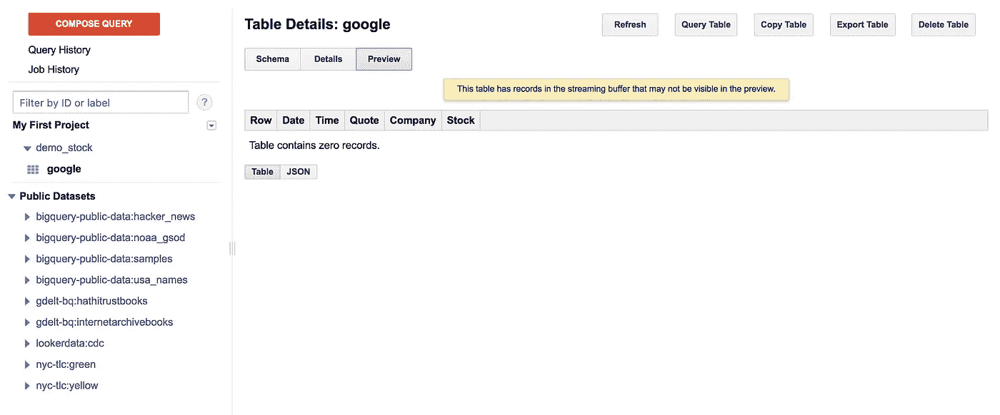

# 为什么要 Google PubSub？—通过 PubSub 向 BigQuery 传输财务数据

> 原文：<https://medium.com/google-cloud/why-google-pubsub-streaming-financial-data-thru-pubsub-to-bigquery-de9bcd02ff46?source=collection_archive---------2----------------------->


在现代云架构中，构建和部署应用程序比以往容易得多。此外，应用程序被构建成更小、更独立的构件，更易于开发和维护。然而，除了现代云提供的优势，在现代云中构建和部署应用程序需要考虑的一个重要问题是应用程序的弹性。

弹性的一个方面，可伸缩性已经在许多云产品中得到考虑；例如，在谷歌云中运行更多的计算引擎可以帮助重新分配进入应用程序的大量流量。然而，弹性的另一个重要方面是应用程序之间的交互，这意味着应用程序相互依赖的程度。一个简单的例子是，计算引擎将数据发送到与处理用户信息的 API 交互的数据库。它们都严重依赖彼此来使应用程序工作。然而，如果前一句中描述的一个单独的组件不再起作用，整个系统就不能工作，因为它们需要一个又一个组件来使系统起作用。为了帮助实现这方面的弹性，Google Cloud PubSub 是一个完美的选择！


发布订阅流程图

在谷歌云平台中，PubSub 是一个消息队列服务，允许你在独立的应用程序之间发送和接收消息。PubSub 在不使应用程序严重依赖彼此方面起着关键作用；PubSub 将应用程序解耦，这意味着应用程序独立执行其任务，但仍然作为部署在云中的系统的一部分一起工作。与前面的场景一样，PubSub 不是让应用程序直接相互交互，而是位于数据库和应用程序引擎或其他地方的 API 之间，数据库通过 PubSub 发布消息，而订阅者 API 通过相同的方式接收消息。在这种方式下，即使订阅者发生故障，PubSub 也会保存消息，直到它重新联机，并在它重新联机时发送它们，这意味着它们是解耦的。


通过这个处理 PubSub 和 BigQuery 的独立项目，我想分享我使用 PubSub 和 BigQuery 的关键概念和步骤。此外，为了进行演示，我创建了一个简单的 Python 函数，它将 google 股票价格作为数据流发送到 PubSub 和 BigQuery。所有的作品都可以在这里找到，

```
 [https://github.com/mchon89/Google_PubSub_BigQuery](https://github.com/mchon89/Google_PubSub_BigQuery)
```


1.  转到谷歌云控制台，启用 API。
2.  打开您的 Google Cloud Shell 并复制存储库。

```
git clone [https://github.com/mchon89/Google_PubSub_BigQuery](https://github.com/mchon89/Google_PubSub_BigQuery)
```

3.这是最重要的一步。不要忘记！输入以下命令:

```
gcloud auth application-default login
```

键入“Y”并转到提供的链接。确保在允许 Google Cloud 控制台访问帐户后复制并粘贴提供的密钥。如果 Google Cloud Shell 由于缺乏活动而断开连接，您必须再次经历这个过程。

4.转到 BigQuery 控制台，创建一个名为“demo_stock”的数据集和一个名为“google”的表。这些名称可以更改，但请确保您也更改了 python 脚本中的名称。输入以下命令:

```
python pubsub_to_bigquery.py --price='put any number here'
```

— price 是 GOOGL 股票的初始价格。例如，价格=25。

5.现在，假的谷歌股票价格被生成并发送给 BigQuery。现在转到 BigQuery 控制台。



作为预览，由于流缓冲区的原因，您不会看到任何数据流入 BigQuery。但是，当运行查询时，您将看到数据。所以，不要担心！

6.可以在 BigQuery 上运行一个简单的查询，例如

```
SELECT * FROM demo_stock.google ORDER BY STOCK DESC;
```

希望你开始掌握 Google PubSub 的概念；对我来说，理解这个概念和 PubSub 的功能需要一段时间。想了解更多信息，你可以随时访问 https://cloud.google.com/pubsub/docs/。感谢阅读，并随时留下评论。

> “我们从失败中学到的最多，而不是从成功中学到的”