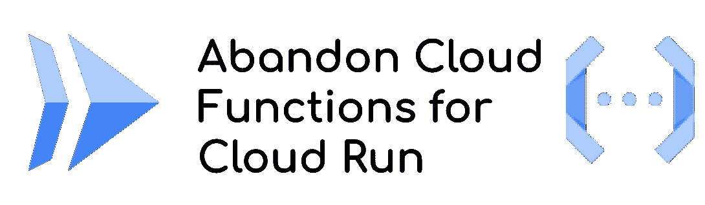

# 为什么我最终从云功能转向云运行

> 原文：<https://medium.com/google-cloud/why-i-definitively-switched-from-cloud-functions-to-cloud-run-635d03f1eb4d?source=collection_archive---------0----------------------->



无服务器工具对任何开发人员来说都非常容易使用，你可以轻松地构建应用程序并将其从 0 扩展到全球范围的解决方案。
在这个过程中，项目管理、部署、自动化和所有工业化主题必须高效，以保持优势并继续平稳发展**。**

**在 Google Cloud 上，云功能是(was？)最流行的服务之一是**在 HTTP 模式或后台模式下部署一段简单的代码**(响应事件，如 PubSub 消息或云存储事件)。**

**然而，**2019 年**推出的 Cloud Run 和产品中非常快速且非常**好的功能添加**让我重新考虑云功能的使用，慢慢地，**让我放弃了它**。**

> *****说到这里，我为什么抛弃了云功能。*****

# **产品差异**

**我已经在我的第一篇文章中谈到了这个话题。这是**主要面向成本的**，但是云功能也有一些优势。**

**今天，云功能不再有优势**

## **事件管理**

**Eventarc 的引入完全消除了事件管理的差异:现在可以像以前一样处理相同的事件，甚至更多，因为 Eventarc 支持 70 多个其他谷歌云产品。**

## **降低成本的 CPU 片**

**最近引入的 [**部分 vCPU 分配**](https://cloud.google.com/run/docs/configuring/cpu#cpu-memory) 允许为您的云运行实例设置少于 1 个 vCPU。如果你的代码主要是等待 API 调用的响应并执行一些处理，那么这个特性就特别有趣。**

**云功能允许拥有部分 CPU，现在云运行也是一样，但是也有能力**独立于 CPU 能力**改变内存配置。
*更多可能的组合！***

# **云运行杀手功能**

**经过几个月的时间，Cloud Run 获得了越来越多的功能，现在已经超过了云功能的容量。这里有一些最重要的**

## **无服务器容器平台**

**容器很受欢迎，是打包应用程序的一种现代方式。但是这里真正的优势是能够让开发者能够**配置和定义他们自己的运行时环境****

**语言、二进制、多进程、(…)现在都是可能的，并且在支持的语言或包含的依赖项方面不再有限制。**开发者有了真正的自由**！**

**自由对于开发来说是真的，对于可移植性也是真的。因为**容器是打包**应用程序的通用方式，所以你可以在任何地方运行它们！*在您的计算机上，在虚拟机上，在 Kubernetes 上，…* **移植性是固有的！****

## **回滚和流量分流**

**由于 CI/CD 渠道和 DevOps 思维，发布经常发生，而且越来越快。 **Bug、问题、版本验证**也越来越快。**

**云运行提供 [**流量分流**](https://cloud.google.com/run/docs/rollouts-rollbacks-traffic-migration) 轻松将一定比例的流量调度到不同版本。**

*   **回滚时的前一个**
*   **50–50 用于蓝/绿部署**
*   **逐渐向新的金丝雀释放**

## **最小实例和冷启动度量**

**无服务器对你的口袋和地球都有好处。如果您不再使用**服务**，则这些服务的价值将降至 0。没有服务器运行，不用付费，不会白白浪费电力。**

**结果是**一个新实例启动时等待的时间**。这叫冷启动。根据您的容器配置，这可能需要几毫秒或几秒钟(例如这里的[和](/google-cloud/serverless-performance-comparison-does-the-language-matter-c72a7191c799))。Cloud Run now **跟踪指标**以帮助您了解冷启动持续时间以及对您服务的影响。**

**为了**防止冷启动**，您还可以将 [**最小实例设置为云运行**](https://cloud.google.com/run/docs/configuring/min-instances) 并保持一个或多个实例热运行。当然，您将为它们付费，但是您的服务已经开始并准备好服务请求！**

## **云运行作业**

**[云跑最新的牛逼补充是**乔布斯**](https://cloud.google.com/run/docs/create-jobs) **。**像 Cloud Run 一样，它能够在无服务器模式下运行容器，但是，这一次，不再需要公开一个**HTTP web 服务器**。**

**云运行作业**并行运行容器，并在它们的作业结束**时停止(或者在出错时重试)。**

# **超越简单的产品比较**

**在上面的原始特性列表比较中，正如我在引言中所讨论的，**从开发到部署的项目生命周期**对于任何应用程序都是重要的。**

## **测试能力**

**在[那篇文章](/google-cloud/cloud-run-and-cloud-function-what-i-use-and-why-12bb5d3798e1)中，我已经**展示了云运行的可测试性优势**:简单地在本地运行你的 web 服务器，或者你的容器。没有仿真器，也没有运行它的功能框架！*这也是* ***可移植性的后果*** *在*之前解释过**

## **地形部署**

**使用 Terraform 来部署我最新的应用程序已经成为我永远放弃云功能的基石！**

**对于云功能，Terraform 模块需要一个 **ZIP 文件，该文件要么位于您的本地磁盘上，要么位于云存储**上。**

> **一个 ZIP 文件！！！**

**这意味着，您必须在您的 CI/CD 中创建它，并将其放在云存储中。**

> **如何创建正确的 ZIP 结构？你如何管理云存储上的版本？如何回滚？**

> **真的吗？？？一个压缩文件？！！！不，不严重！！**

**在高层次上，**容器有着相同的目的**:它是一种打包应用程序代码的方式。
但它是 OCI 结构，有一个**注册表**来存储它们，你可以**签署清单**，你有**协议和平台之间的互操作性**，…**

**使用 Terraform 的云运行非常流畅:你必须部署你的容器。
因为流行的 stander，**很多工具可以为你搭建容器**；Docker 通过 docker 文件或专用库，如 Java 中的 [JIB 或 Golang 中的](https://github.com/GoogleContainerTools/jib) [Ko。只有行业标准，**没有自制/弱解**。](https://github.com/google/ko)**

# **软弱的自白**

**最终的事实是**云功能第二代**。那个 gen 太棒了！您仍然有**语言限制**，但是您**利用了所有的云运行特性**:更长的超时、并发性、CPU/内存可伸缩性、回滚&流量分割……**

> **太好了，为什么，怎么做？**

**仅仅因为云功能**第二代是在云上运行的后端！！**和**运行时特性现在完全相同**。**

**是的，云运行**是一个非常强大和伟大的产品**和云功能没有选择**拥抱它继续生存和发展**！**

# **为什么要继续使用云功能？**

**我个人**无法回答那个问题**。云功能，第一代或第二代，不再有任何优势。恰恰相反，它**限制了你的发展，**因此**限制了你的创新**！**

*   **有限数量的**可能的语言****
*   **有限支持的**事件类型** (Eventarc 仅与第二代兼容)**
*   **没有**运行时配置****
*   **有限的**便携性****
*   **不容易**局部测试****
*   **无**并发**(仅第二代)**

**以及许多其他缺失的功能(总是在 CPU 上，最小实例，提交**使用折扣**，自定义域， **gRPC/HTTP2/WebSocket 支持**，…)**

**谷歌云团队告诉我，这是一种不同的开发者体验。是的，这是真的:**

> **没有要创建的容器，因此不需要学习 Dockerfile 语言**

**但是与所有其他约束和限制相比，**优势非常弱**，而且今天的解决方案的简易性**为您构建了标准/可靠/优化的容器。****

***实际上，谷歌云* ***会自动为你的云功能创建一个容器*** *，这要感谢*[*build packs . io*](https://buildpacks.io/)*，它是谷歌云为此目的创建的，现在开源并属于 CNCF。***

**您还可以通过直接使用命令`gcloud run deploy`来利用云运行 的 [**构建包。最后，真正不同的是**增加了一个网络服务器**。**许多语言中不到 10 行代码**:**](https://cloud.google.com/run/docs/deploying-source-code)**

> **这真的重要吗？**

# **云功能向云运行迁移**

**因为我看不到任何优势，所以我建议您开始**对所有用例使用云运行**，如果您有一些时间，就**迁移到云运行您现有的功能。****

**在这两种情况下，您都必须公开一个 web 服务器。在我的例子中，我使用了`[Flask](https://flask.palletsprojects.com/en/2.1.x/)`，并且在`requirements.txt`文件中添加了它作为依赖项**

***如果您对云运行有并发性问题，请将最大并发性设置为 1。云函数* ***第一代并发设置为 1。*****

## **HTTP 函数迁移**

**云函数响应 HTTP 请求，这是最简单的迁移**

****遗留云功能代码****

**文件`main.py`**

```
def Hello(request):
    return "Hello World"
```

****云运行迁移解决方案****

**把你的`main.py`改名为`functions.py`**

**创建那个`main.py`文件**

```
import os
from flask import Flask,request
**import functions**

app = Flask(__name__)

@app.route('/')
def call_function():
    return **functions.Hello(request)**

# For local execution
if __name__ == "__main__":
    app.run(host='0.0.0.0',port=int(os.environ.get('PORT',8080)))
```

**请注意，您只是将请求对象转发给函数，仅此而已。**

**如果你使用 Python 的 Buildpacks 解决方案而不使用`Dockerfile`(使用命令`gcloud run deploy`)，你必须**指示你的容器**的入口点。为此，你必须像那样加上一个`Procfile`**

```
web: python3 main.py
```

***当然，你可以用参数定制那个入口点，使用* `*Gunicorn*` *或者在启动时做任何你想做的事情。***

## **后台功能迁移**

**对于该示例，我采用了一个由云存储事件触发的云函数，并迁移到云存储上由 Eventarc 事件调用的云运行。**

****遗留云功能代码****

**文件`main.py`**

```
def hellogcs(event, context):
    [print(format('event: {} -> {}', key, event[key])) for key in event]
    [print(format('context: {} -> {}', key, context[key])) for key in context]
```

****云运行迁移解决方案****

**将您的`main.py`重命名为`function.py`**

**创建那个`main.py`文件**

```
import os

from flask import Flask, request

import functions

app = Flask(__name__)

class Object(object):
    pass

@app.route('/', methods=['POST'])
def call_function():
    resource = Object()
    resource.service = str.split(str.replace(request.headers['Ce-Source'], '//', '/'), '/')[0]
    resource.name = str.split(str.replace(request.headers['Ce-Source'], '//', '/'), '/', 1)[1] + request.headers['Ce-Subject']
    resource.type = request.get_json()['kind']

    context = Object()
    context.event_id = request.headers['Ce-Id']
    context.timestamp = request.headers['Ce-Time']
    context.event_type = request.headers['Ce-Type']
    context.resource = resource

    functions.hellogcs(request.get_json(), context)
    return "ok, see logs"

# For local execution
if __name__ == "__main__":
    app.run(host='0.0.0.0', port=int(os.environ.get('PORT', 8080)))
```

***请注意，您必须从* ***HTTP 请求中提取事件数据，并将其拆分为两个变量*** *。* `*Context*` *作为一个对象，代码稍微复杂一点。但是你写一次，你* ***然后*** *就可以把你所有的函数都迁移了！
同样，如果您使用 BuildBacks 解决方案*，您必须使用 `*Procfile*`**

## *****普通 Dockerfile 包装*****

***如果您喜欢使用定制容器而不是使用构建包，那么您可以使用通用的`Dockerfile`。***

```
*FROM python:3.10-slim

ENV *PYTHONUNBUFFERED* True

WORKDIR /app

COPY requirements.txt .

RUN pip3 install --no-cache-dir -r requirements.txt

COPY . .
ENV *PORT* 8080

CMD python3 main.py*
```

***然后用一个简单的命令部署您的代码***

```
*gcloud run deploy*
```

# ***达尔文进化模型***

***我是云功能的大用户，因为它改变了我的开发者的生活。它仍然是一款优秀、可靠且可扩展的产品。我个人并不反对那个产品，**团队花了很多努力来提供最好的无服务器产品之一**。***

***然而，现在有了更好、更强、更简单、更便携的**产品。用起来简直显而易见。越来越多的开发人员熟悉容器，现在使用它们并不需要额外的成本。
使用单一产品，带来其他优势:您必须**在单一产品上培训您的团队**，并且您**不再有在云功能或云运行之间选择**的问题。最后，**流程和最佳实践更少了**(因为只有一种产品)，你**提高了你的整体效率。*******

***就像达尔文进化模型一样，不是弱者消失，而是最适应环境的物种主宰并灭绝了其他物种。***

> ***云功能也会这样吗？***