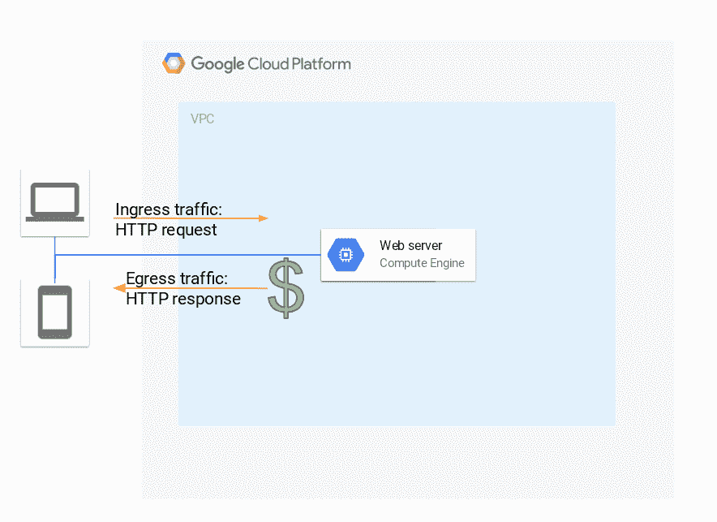
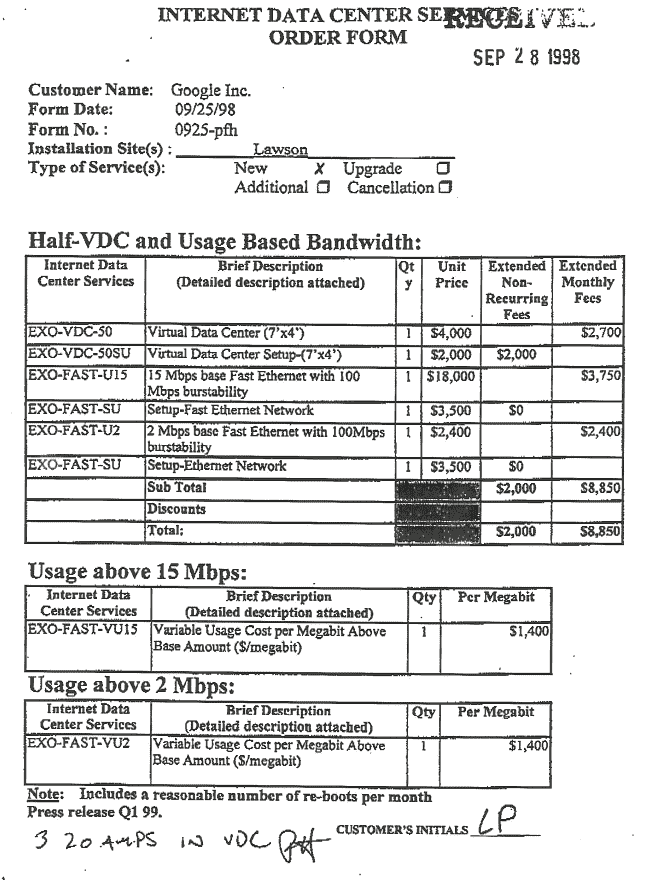

# 为什么进入“云”的流量是免费的

> 原文：<https://medium.com/google-cloud/why-ingress-traffic-to-the-cloud-is-free-79dc217b916?source=collection_archive---------0----------------------->

当查看主要云供应商( [GCP](https://cloud.google.com/compute/pricing#network) 、 [AWS](https://aws.amazon.com/ec2/pricing/on-demand/#Data_Transfer) 、 [Azure](https://azure.microsoft.com/en-us/pricing/details/bandwidth/) )的价格表时，您会注意到出口流量(离开虚拟机实例或其他云产品流向互联网的流量)是按 GB 收费的，而入口流量(来自互联网流向您的云环境的流量)是免费的。

云提供商眼中的流量方向(以及消费者眼中的成本)

人们通常认为这种不平衡的原因是云刺激数据进入他们的环境，因为这是在云中运行其他工作负载的先决条件。然而，更可能的主要原因是另一个原因，这对于许多来自 ISP 环境的网络工程师来说是显而易见的，但对于其他使用公共云的人来说却不是。

为了解释这一点，我想回到近 20 年前的谷歌早期。urs hlz le 曾经在 Google+ 上发布了[谷歌的首个数据中心订单:](https://plus.google.com/+UrsH%C3%B6lzle/posts/UseinB6wvmh)

他还分享了一些网络线路的细节:连接 google.com 服务器的 2Mbps 线路每 Mbit/s 的价格为 1200 美元，而 15 Mbps 的网络爬行线路要便宜得多，总共 3750 美元。为什么会这样？

许多内容提供商、数据中心提供商、托管公司等可能都有同样的问题。曾经和现在都是。虽然当时的 T1/T3 或如今的 10 Gbps 以太网等网络电路(除了主要面向消费者的 ADSL)通常在两个方向上具有相同的带宽，但内容提供商流向用户的流量通常比流入的流量(主要是小请求和少量文件上传)多得多。然而，来自谷歌爬虫的流量大部分是入站的(因为爬虫做小的请求并得到大的响应)。由于大多数互联网服务提供商按使用的双向容量收费(有时是第 95 百分位数第 95 百分位数第 95 百分位数第 95 百分位数第 95 百分位数第 95 百分位数第 95 百分位数第 95 百分位数第 95 百分位数第 95 百分位数第 95 百分位数第 95 百分位数第 95 百分位数第 95 百分位数第 95 百分位数第 95 百分位数第 95 百分位数第 95 百分位数第 95 百分位数第 95 百分位数第 95 百分位数第 95 百分位数第 95 百分位数第 96 位)，基本上进入设施的容量已经在那里了，并且没有被使用，所以以低价提供给实际上，即使免费提供这种服务，对数据中心提供商来说也可能是一笔不错的交易，因为在互联网服务提供商之间的[双边对等](http://drpeering.net/FAQ/What-is-bilateral-peering.php)协议中，大型运营商通常只在他们的流量在特定的[流量比率](http://drpeering.net/white-papers/Peering-Policies/StudyOf28/Traffic-Ratio-Peering-Policy-Clause.html)下达到“平衡”时才会向其他方提供对等服务，例如 2:1，因此，接纳具有大量流入流量的客户实际上会简化他们的对等业务案例。

随着时间的推移，其中一些经济因素发生了一些变化，例如，通常对于互联网传输来说，现在你需要购买完整的 10 Gbit/s 电路，而不是按 Mbit/s 计费，流量比率可能不再普遍。但基本前提是相同的:就像内容提供商和托管公司一样，超大规模云提供商离开网络的流量比进入网络的流量多得多，因此免费提供入口流量不需要巨额投资或补贴，而是源于电路的对称性质和流量的历史计费方式。

因此，我希望这是一堂有趣的历史课，并且你现在相信有一个很好的技术理由来让云提供商的入口流量免费。

**20 岁生日快乐谷歌**！