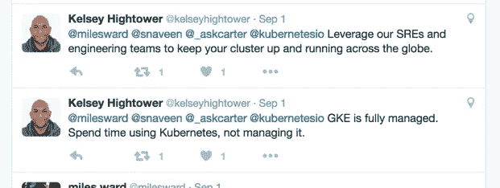

# 为什么在谷歌容器引擎(GKE)上用 Kubernetes (k8s)？

> 原文：<https://medium.com/google-cloud/why-k8s-on-gke-a644d2d611c1?source=collection_archive---------0----------------------->

Kubernetes 可以在任何云、裸机、 [minikube](https://github.com/kubernetes/minikube) 上运行。但是，与 AWS 相比，Kubernetes 在 GKE 有什么优势吗？我知道一些原因，但后来决定在 twitter 上联系专家。我也需要这个从 AWS 转移到 GKE 的 kubernetes。我在找这样的东西，什么也没找到。

> 答案$ **gcloud 容器集群创建 mycluster**

所有这些都适用于我，因为我的全职工作不是管理 kubernetes，我也不是 kubernetes 专家。

1.  kubernetes master —不必担心 kubernetes master 会停机。GKE 保证主节点的正常运行时间。
2.  etcd——不用学 [etcd](https://github.com/coreos/etcd) 。不必知道我们应该为我的群集旋转多少个 etcd？我的 master 和 etcd 应该在同一个节点上吗？我们不必回答这些问题。GKE 保证 etcd 不会倒闭，并负责管理 etcd。
3.  集装箱网络——我应该使用编织、法兰绒吗？它是如何扩展和工作的？不用担心 GKE 的集装箱联网。它是被管理的。[https://cloud.google.com/compute/docs/networking#routing](https://cloud.google.com/compute/docs/networking#routing)
4.  IAM——kubernetes 1.3 可以在 Alpha 中访问 [RBAC](http://kubernetes.io/docs/admin/authorization/) 。但是，我如何向团队中的其他成员提供访问权限呢？我应该与每个开发人员共享证书吗？我如何管理授权/认证？GKE 有内置的认证和授权。[https://cloud . Google . com/container-engine/docs/iam-integration](https://cloud.google.com/container-engine/docs/iam-integration)
5.  自动扩展—在 GKE，自动扩展集群就像 ***gcloud 容器集群一样简单创建名称—ZONE ZONE—num-nodes = 30 \
    —enable—自动扩展—min-nodes = 15—max-nodes = 50***[https://cloud . Google . com/container-engine/docs/clusters/operations # create _ a _ cluster _ with _ auto scaling](https://cloud.google.com/container-engine/docs/clusters/operations#create_a_cluster_with_autoscaling)。如果您的集群必须基于负载增长，这将旋转多达 50 个 Google 计算引擎(GCE)实例。
6.  升级——Kubernetes 几乎每 3-4 个月就有一个版本，你不能就地升级主版本。升级的唯一方法是使用最新版本启动一个新集群，然后将您的 pod 移动到这个新集群。在 GKE，*主机*会自动为您升级，您的责任是升级节点，这也只是一个命令***g cloud container clusters upgrade CLUSTER _ NAME \
    [—CLUSTER-version = X . y . z]***
7.  heap ster——Kubernetes heap ster 内置了对[谷歌云监控](https://cloudplatform.googleblog.com/2015/12/monitoring-Container-Engine-with-Google-Cloud-Monitoring.html)的支持
8.  日志记录——GKE 已经内置了对集群级日志记录到 [Google Cloud Logging](http://blog.kubernetes.io/2015/06/cluster-level-logging-with-kubernetes.html) 的支持，可以导出到 BigQuery。
9.  这是 https://twitter.com/milesward/status/771425568948531200 和其他人关于这个话题的推特对话

我认为这些都是优点，我可能是不正确的或错过了一些东西。请让我知道 http://twitter.com/snaveen