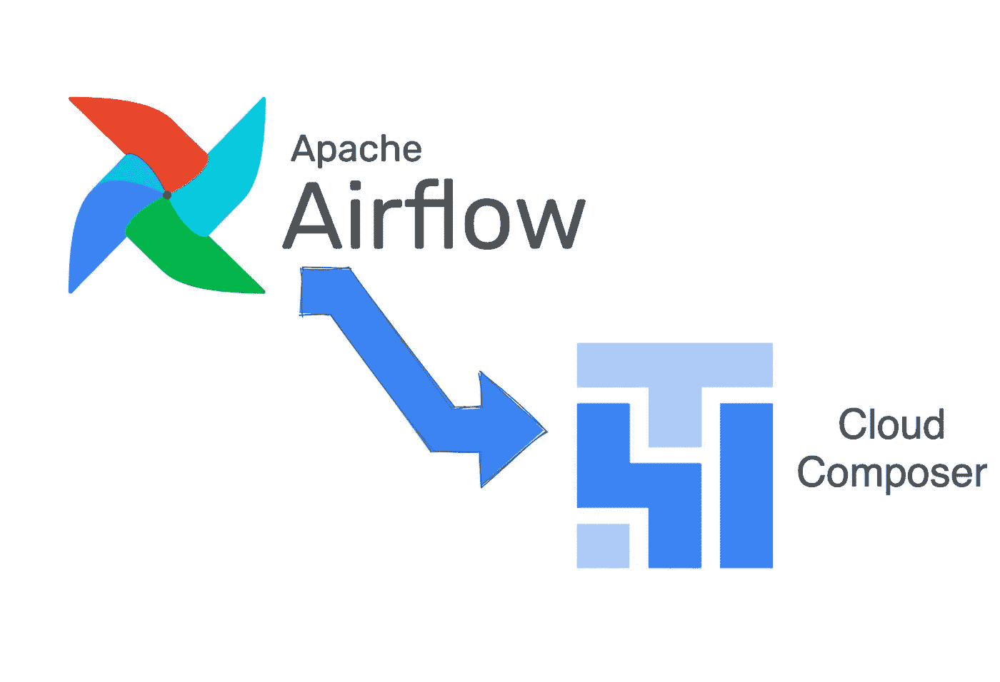

# 为什么您应该从自托管气流迁移到 Google Cloud Composer

> 原文：<https://medium.com/google-cloud/why-should-you-move-from-self-hosted-airflow-to-google-cloud-composer-ee49736fcde?source=collection_archive---------4----------------------->

由 [Devashish Patil](https://medium.com/u/3b9a10f61d50?source=post_page-----ee49736fcde--------------------------------) 设计

# 什么是阿帕奇气流？

Apache Airflow 是一个开源的工作流编排和调度平台。气流是可扩展的，可插拔的，高度可扩展的。它完全是用 Python 开发的，因此可以像语言本身一样通用。

Airflow 有几个组件，如网络服务器、调度器、工作器和数据库。要了解更多关于 Apache Airflow 的信息，请阅读我写的这篇文章:[链接](/codebyte/a-crash-course-on-apache-airflow-conc-31ea9a14917)。

# 什么是 Google Cloud Composer？

Cloud Composer 是 Google 基于 Apache Airflow 构建的完全托管的工作流编排解决方案。它拥有气流所能提供的一切，还有更多好东西。

Cloud composer 在底层使用 Google Kubernetes 引擎。这使得气流能够利用集装箱工作负载和 Kubernetes 的所有优势。

# **您为什么应该考虑迁移到 Cloud Composer？**

有几个原因可以让人们考虑转向气流管理解决方案。让我们一个一个地看。

## 易用性

自托管 Apache Airflow 涉及许多安装和配置步骤。在 Airflow 中有许多参数需要配置，这使得很容易忘记它们。

Google Cloud Composer 是一项完全托管的服务，这意味着您不必担心安装、配置和维护底层基础架构。这可以节省你很多时间和精力。

## 可量测性

气流的每一部分都需要独立调节才能正常工作。对于自托管解决方案，所有这些操作都需要由您或您组织中的专门团队来完成。

Google Cloud Composer 可以根据工作负载需求自动伸缩。当您有不同的需求时，这非常有用。作为用户，您只需关注自己的工作负载。

## 与谷歌云的集成

Google Cloud Composer 与其他 GCP 服务集成得非常好，如 BigQuery、Cloud Functions 和 IAM，用于基于气流角色的访问控制。这使得构建和部署复杂的工作流变得非常容易。

## 费用

在您自己的基础设施上运行 Apache Airflow 可能会非常昂贵，尤其是当您有大量复杂的工作负载时。通过迁移到 Google Cloud Composer，您可以利用 Google 的规模经济优势，并且只为您使用的内容付费。

## 其他需要了解的几件事:

*   由于 Cloud Composer 是基于开源的 Apache Airflow 构建的，因此没有供应商限制，您可以随时将工作负载转移到其他地方。
*   拥有混合云或多云设置很容易
*   如果您已经在考虑从 Apache Airflow 迁移到托管解决方案，Cloud composer 将为您提供轻松提升和转移工作负载的能力，并且不涉及开发人员再培训。

总的来说，如果您希望简化工作负载的管理，减少运营开销并利用完全托管服务的优势，从自托管气流迁移到 Google Cloud Composer 可能是一个不错的解决方案。

希望在评论中听到你的想法。更多此类内容请关注我的媒体。