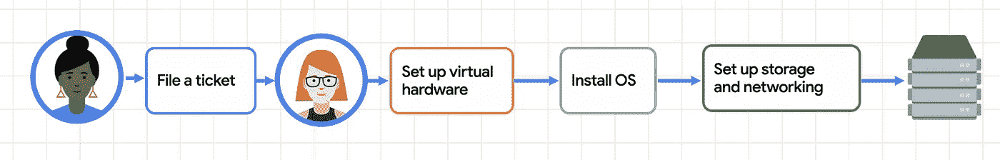
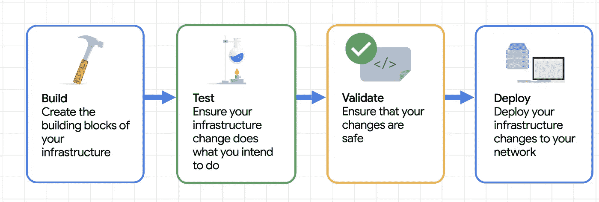
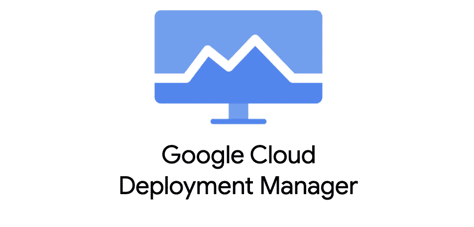
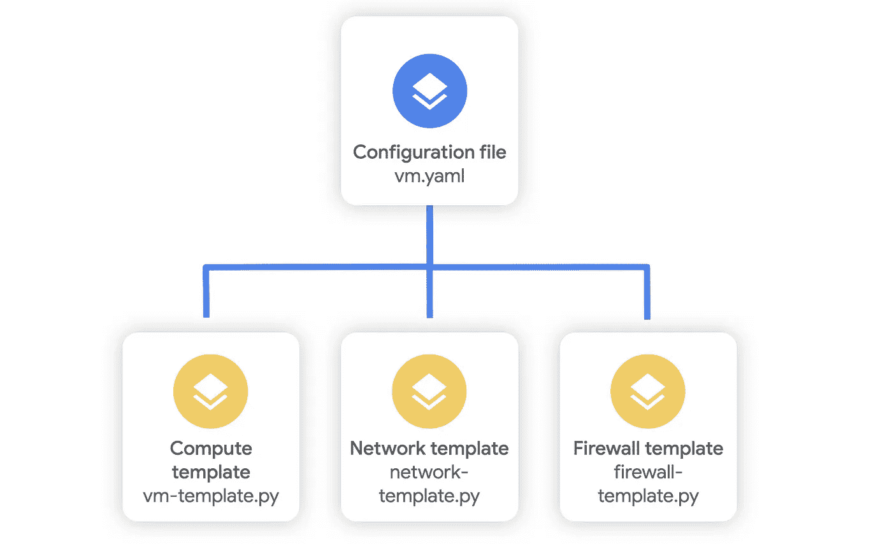
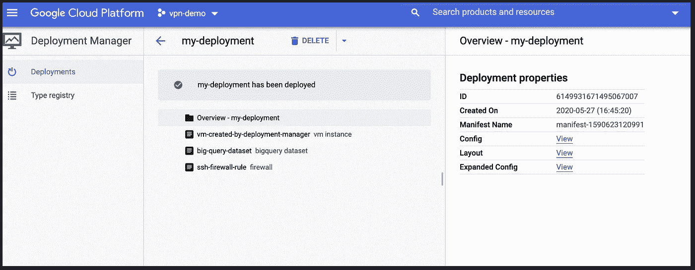

# 为什么您应该像对待软件一样对待基础设施

> 原文：<https://medium.com/google-cloud/why-should-you-treat-infrastructure-like-software-3865ed0e4b03?source=collection_archive---------1----------------------->

## 规模季节


# 介绍

“规模季节”是一个博客和视频系列，旨在帮助企业和开发人员在设计模式中构建规模和弹性。在这一系列文章中，我们计划向您介绍一些创建具有弹性和可伸缩性的应用程序的模式和实践，这是许多现代架构实践的两个基本目标。

在第 1 季中，我们将介绍基础架构自动化和高可用性:

1.  [可扩展和弹性应用的模式](/google-cloud/scale-and-resilience-arent-just-buzzwords-ce748360e80)
2.  [基础设施作为代号](https://medium.com/p/3865ed0e4b03/edit)(本文)
3.  [不变的基础设施](https://medium.com/p/624a8e3482d6/edit)
4.  [在哪里扩展您的工作负载](/@swongful/where-to-scale-your-workloads-6420150bf825)
5.  [全球自动扩展 web 服务](/@swongful/globally-autoscaling-web-services-4b650cc6fc49)
6.  [高可用性(自动修复&自动更新)](/@swongful/give-your-vms-a-steady-pulse-with-autohealing-and-autoupdates-ae2c0828ecc9)

在本文中，我将带您了解代码基础设施背后的基础知识。

# 看看这个视频

# 回顾

在上一篇文章中，我们了解了 Critter Junction，这是一家多人游戏公司，在过去的几个月里广受欢迎。在线玩家可以在一个模拟生物的虚拟世界中相互交流。


他们擅长在本地运行单个机器，但无法自动扩展到多个机器来处理流量高峰和低谷。除此之外，他们还面临着业务和运营方面的限制。因此，我们的团队已经介入，帮助他们定义规模和弹性，以及设计最佳实践的 3 个主题:

> 自动化
> 
> 松耦合
> 
> 和数据驱动的设计

# 调配基础架构的旧方法

虽然 Critter Junction 传统上在内部运行，但他们刚刚开始移植工作负载，并在云中快速部署新服务器。

他们习惯于创建基础架构的传统方法，即提交一张票据。有人会将其登录到管理门户网站，并通过一系列步骤来调配基础架构。



如果您的足迹相对较小，或者您的基础架构变动很小，这是可行的，这通常是 Critter Junction 的私有数据中心的情况。在有限的部署规模下，虚拟机可以存在数月到数年。但是现在有了云弹性，虚拟机可以而且应该活得更短。他们不再有硬件贬值的固定成本。相反，你按秒、分钟或小时付费。这里的挑战是，即使需求激增，也要提供出色的用户体验。

> 对于成本优化和用户体验而言，能够快速增加资源并将其减少是成败的关键。

但是对于 Critter Junction 来说，手动归档票证并尝试大规模复制基础架构非常耗时，并且容易出现人为错误。如果出现高峰，可能需要几个小时甚至几个月才能及时调配基础架构。此外，很难跟踪和审计变更。

# 基础设施作为代码

这就是[基础设施即代码(IaC)](https://cloud.google.com/solutions/infrastructure-as-code) 发挥作用的地方。这是一种像处理应用程序代码一样处理基础设施供应和配置的技术。您可以使用代码自动配置云资源，创建可复制的模板，并将配置文件存储在源代码版本控制中，以便可以发现和审计。



通过 CICD 管道实现基础设施自动化意味着对您配置的任何更改都可以自动进行测试和部署。通过采用 IaC，Critter Junction 能够增强其扩展能力。



[Google Cloud Deployment Manager](https://cloud.google.com/deployment-manager)是一项 IaC 服务，它使用基于 YAML 的声明式配置格式，自动创建和管理 Google Cloud 资源。从开发/测试到生产，您可以使用简单的配置文件构建包含计算、网络、存储、数据库、用户和权限的可重复环境。

对于您计划重用的更复杂的架构，您甚至可以将您的配置分解成[模板](https://cloud.google.com/deployment-manager/docs/step-by-step-guide/create-a-template)，它们是定义一组资源的独立文件。您可以在不同的部署中重复使用模板，这样可以在复杂的部署中保持一致性。



## 看起来怎么样

在本例中，该配置文件指定了来自计算引擎和 BigQuery 的资源，以及提供访问的防火墙规则。

```
resources:- name: vm-created-by-deployment-manager type: compute.v1.instance properties: zone: us-central1-a machineType: zones/us-central1-a/machineTypes/n1-standard-1 disks:

    - deviceName: boot type: PERSISTENT boot: true autoDelete: true initializeParams: sourceImage: projects/debian-cloud/global/images/family/debian-9
    networkInterfaces: - network: global/networks/default- name: big-query-dataset type: bigquery.v2.dataset properties: datasetReference: datasetId: example_id- name: ssh-firewall-rule type: compute.v1.firewall properties: sourceRanges: ["0.0.0.0/0"] allowed: - IPProtocol: TCP ports: ["22"]
```

现在，Critter Junction 可以使用 gcloud SDK 来创建、更新和删除部署。

```
gcloud deployment-manager deployments creategcloud deployment-manager deployments updategcloud deployment-manager deployments delete
```

与此同时，谷歌云控制台以分层视图的形式向他们展示了所有部署的基础设施。



无论他们需要这样做一次、十次还是一千次，这都允许他们对其资源的生命周期进行粒度控制。例如，他们能够降低成本，每天早上运行一个脚本，启动数百台机器，每天晚上使用相同的脚本将其缩减。

# 使用现有工具

因为没有人喜欢对现有的 DevOps 工作流进行激烈的更改，所以您可以使用其他 IAC 工具，如 Terraform、Chef 和 Puppet，从一个位置在 Google 云和本地部署资源。

像 CICD 一样，IaC 是 DevOps 的关键实践之一，允许您在关注产品质量的同时实现开发的敏捷性。通过消除基础架构配置中的手动步骤，Critter Junction 已经能够在大规模的*试运行、QA 和生产环境中实现一致性和部署速度。请继续关注他们的旅程。*

记住，永远要做架构设计。

# 后续步骤和参考:

*   在[谷歌云平台媒体](https://medium.com/google-cloud)上关注这个博客系列。
*   参考:[部署管理器快速入门](https://cloud.google.com/deployment-manager/docs/quickstart)
*   关注[季 Scale 视频系列](http://bit.ly/seasonofscale)，订阅谷歌云平台 YouTube 频道。
*   想要更多的故事？在[媒体](/@swongful)和[推特](http://twitter.com/swongful)上给我喊话。
*   与我们一起享受这个迷你系列的旅程，并了解更多关于谷歌云解决方案的信息。