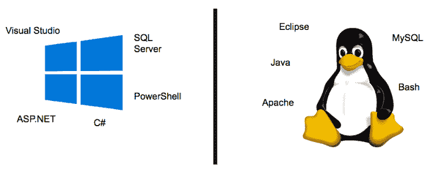
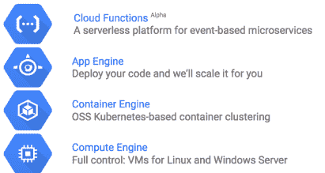
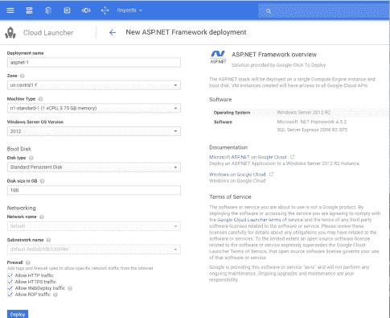
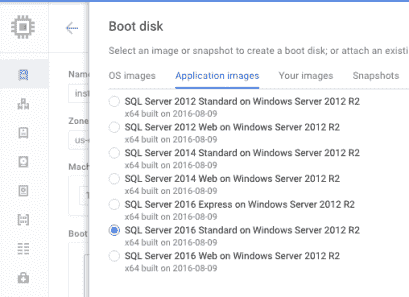
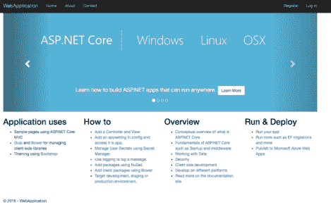
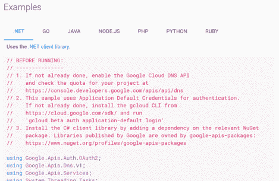
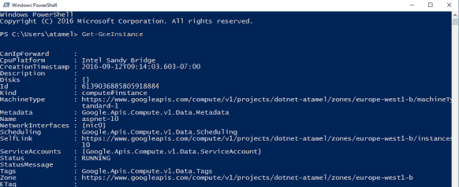

# Windows 和。Google 云平台上的. NET

> 原文：<https://medium.com/google-cloud/windows-and-net-on-google-cloud-platform-4f942c695f2d?source=collection_archive---------2----------------------->

原载于 [SDN 杂志 131 期【2017 年 2 月。](https://www.sdn.nl/MAGAZINE/ID/1261/SDN-Magazine-131)

# 介绍

直到最近，软件世界中还存在两个截然不同的阵营:Windows(又称封闭)世界和 Linux(又称开放)世界。在 Linux 世界中，我们有 bash shell、Java 编程语言、Eclipse IDE、MySQL 数据库和 Apache 的许多其他开源项目。在 Windows 世界中，我们有类似但不同的工具，主要由微软开发，如 C#编程语言、Visual Studio IDE、SQL Server 和 PowerShell。

这两个世界在很少互动的情况下并存了很多年。你必须选择你的立场并坚持下去。如果你不得不改变立场，你必须经历一个缓慢的过程，用相似但完全不同的对手重新调整你现有的工具，这是痛苦的。

在过去的几年里，技术世界经历了一场渐进的革命。2014 年，微软开源了。NET 框架出乎所有人的意料。随后是 2015 年运行在 Windows 上的 OpenSSH。2016 年可能是最令人兴奋的一年，SQL Server 和 PowerShell 运行在 Linux 上，Bash 运行在 Windows 上，最重要的是 ASP.NET 核心，ASP.NET 的新跨平台版本，运行在 Linux，Mac 和 Windows 上。

随着微软向世界开放其技术，我们在谷歌非常忙碌，以确保这一点。NET 在谷歌云平台(GCP)上有一流的支持。2016 年，我们在计算引擎上添加了对将传统 ASP.NET 应用部署到 Windows 服务器的支持。我们引入了 Visual Studio 插件和 PowerShell cmdlets 来管理 GCP 资源。我们让 Microsoft SQL Server 在计算引擎上可用。最后但同样重要的是，我们开始在 App Engine 和运行在 Container Engine 上的 Kubernetes 上支持容器化的 ASP.NET 核心应用。我将在本文后面详细讨论这两个问题。由于我们的工作，谷歌加入了。2016 年 11 月 NET foundation。那是忙碌的一年！

非常令人兴奋的是，Windows 和 Linux 世界走到了一起，并为。NET 开发人员。在文章的其余部分，我想具体谈谈 GCP 为. NET 做了些什么

# 谷歌云平台

GCP 为开发者提供了许多服务和工具来构建谷歌的基础设施。Java、Python、Go、Node.js、Ruby、PHP 当然还有 C#都是一些支持的语言。让我们来看看您在应用程序开发方面有哪些选择。

这个链条的顶端是云功能。这是用于事件驱动的微服务的无服务器平台。它目前支持 Node.js 函数。云功能的美妙之处在于，你只需要担心编写和部署你的功能，谷歌会负责大规模运行该功能。这对于具有有限数量专业微服务的简单应用来说是完美的。

有时候，你需要的不仅仅是一个函数。你需要一个前端和后端与不同服务对话的应用程序。对于这类应用，GCP 提供了应用引擎。App Engine 背后的想法类似于云功能，即你编写自己的应用程序，让谷歌根据需要管理和自动扩展。底层基础架构从您这里抽象出来，这意味着您不必处理开发运维。

如果你已经使用 Docker 切换到容器化的应用程序，并且需要更多的控制你的应用程序的结构和运行，有 Kubernetes 和容器引擎(GKE)。您可以通过一个命令非常容易地让 Kubernetes 集群在 GKE 上运行，并以您喜欢的任何配置部署您的容器。

最后，如果你想要完全控制，GCP 有 Linux 和 Windows 服务器虚拟机(VM)运行在计算引擎上。因为它们是虚拟机，所以您可以完全控制要安装的内容，但是，您也有完全的责任，这意味着您需要手动配置自动扩展、修补软件等。

GCP 提供了许多方法来支持你的应用程序开发。让我们看看 GCP 是如何具体支持的。网络应用。

# Windows Server、SQL Server、计算引擎上的传统 ASP.NET

如果你有一个在 Windows 上运行的传统 ASP.NET 应用，你可以很容易地把它移植到 GCP 的计算引擎上。

首先，您需要一台安装了 ASP.NET 框架的 Windows 服务器。值得庆幸的是，GCP 有 Cloud Launcher，这使得探索、启动和管理生产级解决方案变得非常容易。只需点击几下鼠标，即可在计算引擎虚拟机中安装带有 ASP.NET 框架的 Windows 服务器。

如果您的应用程序使用 SQL Server，您可以在计算引擎虚拟机上安装预配置的 SQL Server 映像，并且可以使用 Visual Studio 将您的 ASP.NET 应用程序发布到您的计算引擎虚拟机。

# ASP。App 引擎和容器引擎上的 NET Core

ASP。NET Core 是 ASP.NET 的下一代多平台版本。它是传统 ASP.NET 框架的精简版本，可以在 Linux、Mac 和 Windows 上运行。

App Engine 作为谷歌的 PaaS 产品已经存在一段时间了，但它并不支持。NET 开发人员，直到 ASP.NET 核心出现。现在可以将 ASP.NET 核心应用程序封装到 Docker 容器中，并将该容器部署到应用程序引擎中运行。App Engine 的主要优势是它抽象出了基础设施，因此开发人员只需部署他们的应用程序，该应用程序的日常运行和扩展由 Google 完成。

如果您希望对如何构造和部署容器进行更细粒度的控制，您可以在容器引擎(GKE)上创建一个 Kubernetes 集群。GKE 使得创建集群变得简单，而 Kubernetes 通过提供一个高级 API 来自动部署、扩展和运行生产中的容器，使得运行容器变得更加容易。

# 。Google 云服务的. NET 库

一旦你的应用程序在谷歌云中运行，许多服务就会通过 native 自动提供给你的应用程序。NET 客户端库。

您可以集成一些服务，如用于二进制存储的云存储、用于消息传递的发布/订阅、用于快速查询的 BigQuery、用于检测图像的视觉 API 以及许多其他机器学习 API，如自然语言处理 API、语音 API 和翻译 API。

通过在谷歌云上运行，随着新服务的增加，你将自动获得这些新功能，这就是云的魅力。

# Visual Studio 的云工具

GCP 有一个 Visual Studio 插件，可以直接从 Visual Studio 管理云资源。它可以从 Visual Studio Gallery 中获得，并且可以直接安装在 Visual Studio 中。它提供了一些 ASP.NET MVC 和 Web API 模板来处理 GCP 项目。它还有一个谷歌云浏览器，你可以在那里查看和管理计算引擎和云 SQL 实例，以及云存储资源。

# PowerShell 的云工具

PowerShell 是一个命令行 Shell 和相关的脚本语言，构建于。NET 框架。它是 Windows 世界中使用的默认任务自动化和配置管理工具。

PowerShell 云工具是一个 cmdlets 集合，用于访问和操作 Google 云资源，如 Google 计算引擎、Google 云存储、Google 云 SQL 和 Google 云 DNS，以及更多内容！

# 结论

我们正在经历一些激动人心的时刻。随着 Windows 生态系统的开放和 ASP.NET 核心的多平台故事，有很多新的机会。网络世界。在谷歌，我们认真支持 Windows 和。谷歌云平台上的. NET 工作负载。毫无疑问，这是成为. NET 开发者的大好时机！

# 链接

[https://cloud.google.com](https://cloud.google.com/)

https://cloud.google.com/dotnet

【https://cloud.google.com/windows 

[https://codelabs.developers.google.com/windows](https://codelabs.developers.google.com/windows)

*原载于 2017 年 3 月 20 日*[*【meteatamel.wordpress.com】*](https://meteatamel.wordpress.com/2017/03/20/windows-and-net-on-google-cloud-platform/)*。*