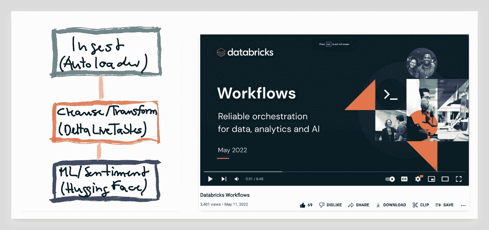

# 数据湖库的工作流

> 原文：<https://medium.com/google-cloud/workflows-for-the-data-lakehouse-fc8c71d350e?source=collection_archive---------1----------------------->

# GCP 上的数据块工作流

[Databricks Workflows](https://www.databricks.com/product/workflows) ，与 Databricks Lakehouse 平台深度集成的[全托管编排服务](https://databricks.com/glossary/orchestration)现已在 GCP 上线！工作流使数据工程师、数据科学家和分析师能够构建可靠的数据、分析和 ML 工作流，而无需管理复杂的基础设施。

到目前为止，外部工具将任务编排与底层数据处理平台分开，这限制了可观察性并增加了最终用户的整体复杂性。现在，每个用户都能够为他们的业务计划提供及时、准确和可行的见解。

lakehouse 使企业更容易开展雄心勃勃的数据和 ML 计划！

如果您有兴趣并想了解更多，这里有一个我制作的简短演示:

***关注我这里关于媒介的更多 GCP、AWS、数据和 AI 内容。如果你喜欢这篇文章，请为它鼓掌。如果您喜欢更多基于云的数据科学、数据工程和 AI/ML，请随时关注我的***[***Twitter***](https://twitter.com/frankmunz)***(或***[***LinkedIn***](https://www.linkedin.com/in/frankmunz/)***)。***