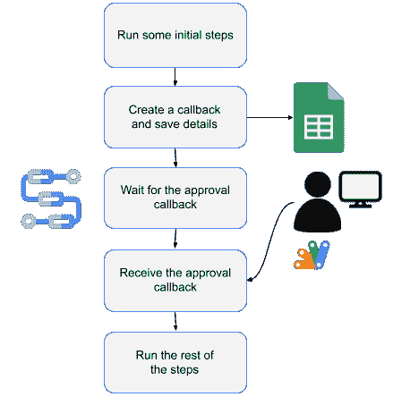
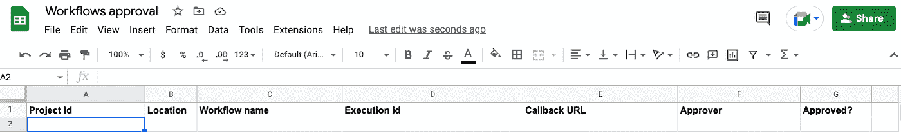
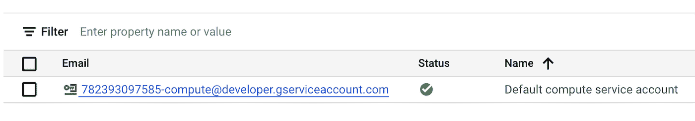
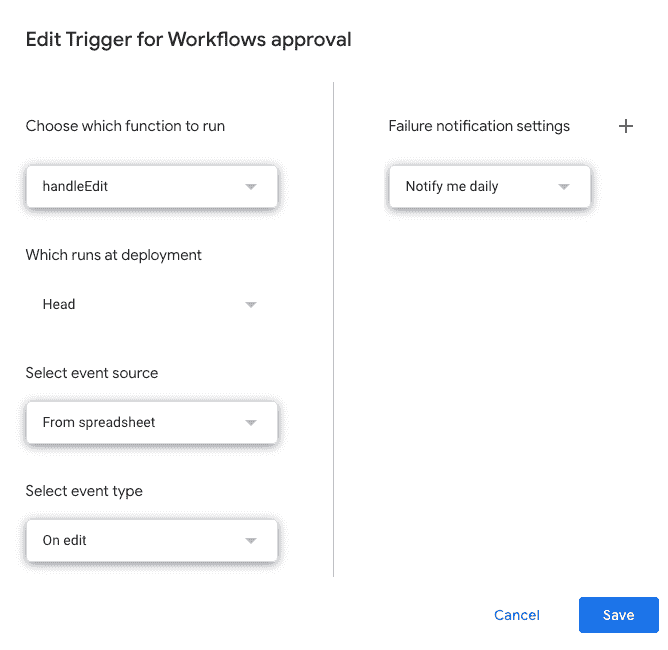
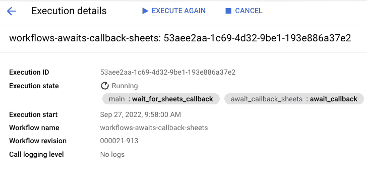
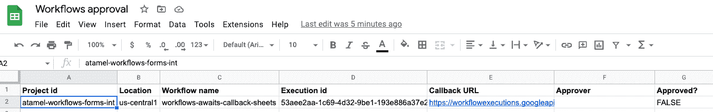
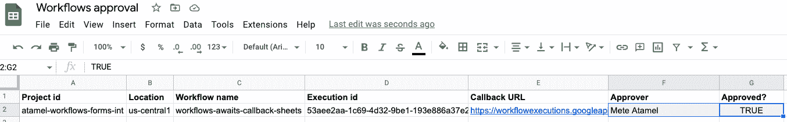
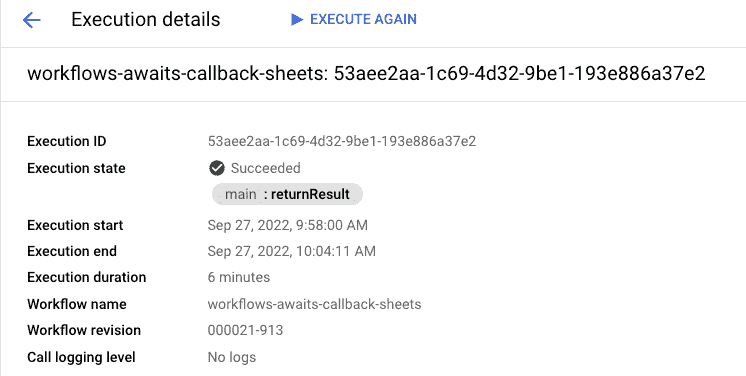

# 暂停并等待 Google Sheets 人工批准的工作流

> 原文：<https://medium.com/google-cloud/workflows-that-pause-and-wait-for-human-approvals-from-google-sheets-53673ced2a81?source=collection_archive---------0----------------------->

我已经写了一系列的文章来展示谷歌工作空间(T2)和谷歌云(T4)的整合。

在我的第一篇文章[中，我展示了一个 IT 自动化用例，其中一个 Google Sheets 电子表格触发了一个工作流，在 Google Cloud 中创建虚拟机。在第二篇](https://atamel.dev/posts/2022/09-09_trigger_workflows_from_sheets/)[文章](https://atamel.dev/posts/2022/09-26_writing_google_sheets_from_workflows/)中，我展示了如何使用工作流向 Google Sheets 电子表格提供来自 BigQuery 的数据。

在这个系列的第三篇也是最后一篇文章中，我将展示如何设计一个暂停并等待来自 Google Sheets 的人工批准的工作流。

# 用例

通过工作流[回调](https://cloud.google.com/workflows/docs/creating-callback-endpoints)，工作流可以创建一个 HTTP 端点并暂停执行，直到它接收到对该端点的 HTTP 回调。这对于创建中间型工作流非常有用。然而，在人类能够发送该批准之前，可能需要相当多的设置。工作流必须创建回调 URL，然后工作流必须以某种方式通知前端该 URL 是什么，最后前端必须使用户能够批准并发送回调。

**是否有更简单的方法让用户能够发送这些批准回调？**当然有！你可以使用 Google Sheets 作为审批前端。

想法是这样的:

1.  工作流运行一些初始步骤。
2.  该工作流创建一个回调，将回调信息保存到 Google Sheets 电子表格中，并开始等待人们对其剩余步骤的批准。
3.  一个人通过 Google Sheets 电子表格发送他/她的批准。
4.  工作流接收批准并运行其余步骤。



让我们更详细地看一下每个步骤。

# 创建一个谷歌工作表电子表格

首先，创建一个 Google Sheet 电子表格来捕获回调批准请求。电子表格可以包含您认为批准请求所必需的任何信息。

下面是一个电子表格示例:



`Approved`列将用于启动对工作流的回调。

创建工作表后，记下电子表格 id，稍后在工作流程中会用到它。您可以在电子表格的 URL 中找到工作表 id:


稍后，为简单起见，您将使用默认计算服务帐户部署工作流。通过访问谷歌云控制台的`IAM & Admin -> Service Accounts`部分找到该服务帐户的电子邮件地址:



确定服务帐户拥有电子表格的写入权限:


# 创建应用程序脚本

创建一个应用程序脚本来观察`Approved`列中的变化。

转到电子表格中的`Extensions`和`Apps Script`。这将打开应用程序脚本编辑器。将`Code.gs`中的默认代码替换为 [Code.gs](https://github.com/GoogleCloudPlatform/workflows-demos/blob/master/workspace-integration/workflows-awaits-sheets-callback/Code.gs) 中的代码，点击`Save`。

该代码监视`Approved`列中的变化。当该列中的一个单元格被设置为`TRUE`时，它将调用带有批准者信息的工作流回调 URL。

在应用程序脚本编辑器中，转到`Settings`并选择`Show appsscript.json manifest file in editor`。用 [appsscript.json](https://github.com/GoogleCloudPlatform/workflows-demos/blob/master/workspace-integration/workflows-awaits-sheets-callback/appscript.json) 替换`appsscript.json`的内容。这确保了 Apps 脚本具有所需的权限。

转到`Triggers`部分，在编辑工作表时创建一个从工作表到 Apps 脚本的触发器:



# 创建工作流

创建一个 [workflow.yaml](https://github.com/GoogleCloudPlatform/workflows-demos/blob/master/workspace-integration/workflows-awaits-sheets-callback/workflow.yaml) 来运行一些初始步骤，等待回调，并且(一旦收到回调)运行更多的步骤。确保用您自己的 id 替换工作表 id:

```
main:
  steps:
    - init:
        assign:
        # Replace with your sheetId and make sure the service account
        # for the workflow has write permissions to the sheet
        - sheetId: "10hieAH6b-oMeIVT_AerSLNxQck14IGhgi8ign-x2x8g"
    - before_sheets_callback:
        call: sys.log
        args:
          severity: INFO
          data: ${"Execute steps here before waiting for callback from sheets"}
    - wait_for_sheets_callback:
        call: await_callback_sheets
        args:
          sheetId: ${sheetId}
        result: await_callback_result
    - after_sheets_callback:
        call: sys.log
        args:
          severity: INFO
          data: ${"Execute steps here after receiving callback from sheets"}
    - returnResult:
        return: ${await_callback_result}
```

`await_callback_sheets`子工作流接收一个工作表 id，创建一个回调，将回调保存到 Google 工作表，并等待回调:

```
await_callback_sheets:
    params: [sheetId]
    steps:
        - init:
            assign:
              - project_id: ${sys.get_env("GOOGLE_CLOUD_PROJECT_ID")}
              - location: ${sys.get_env("GOOGLE_CLOUD_LOCATION")}
              - workflow_id: ${sys.get_env("GOOGLE_CLOUD_WORKFLOW_ID")}
              - execution_id: ${sys.get_env("GOOGLE_CLOUD_WORKFLOW_EXECUTION_ID")}
        - create_callback:
            call: events.create_callback_endpoint
            args:
              http_callback_method: POST
            result: callback_details
        - save_callback_to_sheets:
            call: googleapis.sheets.v4.spreadsheets.values.append
            args:
                range: ${"Sheet1!A1:G1"}
                spreadsheetId: ${sheetId}
                valueInputOption: RAW
                body:
                    majorDimension: "ROWS"
                    values:
                      - ["${project_id}", "${location}", "${workflow_id}", "${execution_id}", "${callback_details.url}", "", "FALSE"]
        - log_and_await_callback:
            try:
              steps:
                - log_await_start:
                    call: sys.log
                    args:
                      severity: INFO
                      data: ${"Started waiting for callback from sheet " + sheetId}
                - await_callback:
                    call: events.await_callback
                    args:
                      callback: ${callback_details}
                      timeout: 3600
                    result: callback_request
                - log_await_stop:
                    call: sys.log
                    args:
                      severity: INFO
                      data: ${"Stopped waiting for callback from sheet " + sheetId}
            except:
                as: e
                steps:
                    - log_error:
                        call: sys.log
                        args:
                            severity: "ERROR"
                            text: ${"Received error " + e.message}
        - check_null_await_result:
            switch:
              - condition: ${callback_request == null}
                return: null
        - log_await_result:
            call: sys.log
            args:
              severity: INFO
              data: ${"Approved by " + callback_request.http_request.body.approver}
        - return_await_result:
            return: ${callback_request.http_request.body}
```

# 部署工作流

确保您有一个 Google Cloud 项目，并且在`gcloud`中设置了项目 id:

```
PROJECT_ID =your-project-id 
gcloud config set project $PROJECT_ID
```

运行 [setup.sh](https://github.com/GoogleCloudPlatform/workflows-demos/blob/master/workspace-integration/workflows-awaits-sheets-callback/setup.sh) 启用所需服务，部署 [workflow.yaml](https://github.com/GoogleCloudPlatform/workflows-demos/blob/master/workspace-integration/workflows-awaits-sheets-callback/workflow.yaml) 中定义的工作流。

# 运行工作流

您现在已经准备好测试端到端的流程了。

从谷歌云控制台或`gcloud`运行工作流:

```
gcloud workflows run workflows-awaits-callback-sheets
```

您应该看到工作流正在运行并等待回调:



日志还显示工作流正在等待:

```
Info
2022-09-27 09:58:00.892 BST Execute steps here before waiting for callback from sheets
Info
2022-09-27 09:58:01.887 BST Started waiting for callback from sheet 10hieAH6b-oMeIVT_AerSLNxQck14IGhgi8ign-x2x8g
```

回到床单上；您应该看到工作流附加的回调信息，其中`Approved`列设置为`FALSE`:



现在，添加批准人姓名/电子邮件，并将`Approved`列更改为`TRUE`:



您应该看到工作流执行状态现在是`Succeeded`:



日志还显示工作流已批准并完成:

```
Info
2022-09-27 10:04:11.101 BST Approved by Mete Atamel
Info
2022-09-27 10:04:11.442 BST Execute steps here after receiving callback from sheets
```

回调对于创建人在回路类型的工作流特别有用。Google Sheets 为用户提供了一个随时可用的前端来提供他们的批准，Apps Script 为开发人员提供了一个简单的方法来通知正在等待回调恢复的工作流。

如有疑问或反馈，欢迎在 Twitter [@meteatamel](https://twitter.com/meteatamel) 上联系我。

*最初发布于*[*https://atamel . dev*](https://atamel.dev/posts/2022/10-10_workflows_wait_approvals_sheets/)*。*