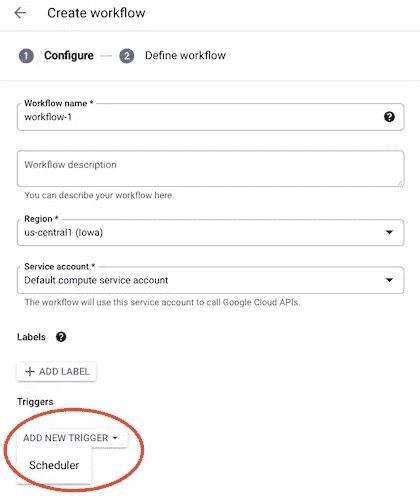
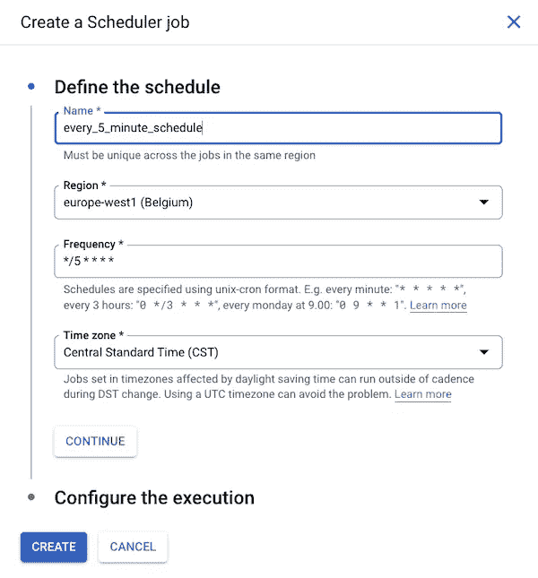

# 工作流提示#20:计划工作流执行

> 原文：<https://medium.com/google-cloud/workflows-tip-20-schedule-a-workflow-execution-7463782fa173?source=collection_archive---------5----------------------->

启动工作流的执行有[种不同的方式。在之前的文章中，我们提到过您可以](https://cloud.google.com/workflows/docs/executing-workflow)[使用 gcloud 命令行](https://cloud.google.com/workflows/docs/quickstart-gcloud)工具来创建执行，您也可以使用各种[客户端库](https://cloud.google.com/workflows/docs/quickstart-client-libraries)来调用工作流，或者使用 [REST API](https://cloud.google.com/workflows/docs/reference/executions/rest) 。一个工作流本身也可以调用其他工作流！

但是今天，我想告诉你如何安排一个工作流程的执行。为此，我们将利用[云调度器](https://cloud.google.com/scheduler)。[文档](https://cloud.google.com/workflows/docs/schedule-workflow)实际上详细介绍了这个主题，所以一定要在那里获取所有信息。但是，我将快速浏览这些步骤，并告诉您云控制台中一个很好的新功能，它可以简化工作流的调度！

首先，您需要启用工作流和云调度程序:

```
gcloud services enable \ 
    cloudscheduler.googleapis.com \
    workflows.googleapis.com
```

云调度程序需要一个具有 workflows.invoker 角色的服务帐户，才能调用工作流:

```
gcloud iam service-accounts create workflows_caller_sa gcloud projects add-iam-policy-binding MY_PROJECT_ID \
    — member serviceAccount:workflows_caller_sa@MY_PROJECT_ID.iam.gserviceaccount.com \
    — role roles/workflows.invoker
```

现在是时候创建 cron 作业了:

```
gcloud scheduler jobs create http every_5_minute_schedule \ 
    — schedule= "*/5 * * * *" \ 
    — uri= "https://workflowexecutions.googleapis.com/v1/projects/MY_PROJECT_ID/locations/REGION_NAME/workflows/WORKFLOW_NAME/executions" \
    — message-body= "{\"argument\": \”DOUBLE_ESCAPED_JSON_STRING\"}" \
    — time-zone= "America/New_York" \
    — oauth-service-account-email= "workflows_caller_sa@MY_PROJECT_ID.iam.gserviceaccount.com"
```

在这里，您可以看到 Scheduler 将每 5 分钟运行一次(使用 cron 表示法)，并且它将调用 Workflows REST API 来创建一个新的执行。您还可以为工作流输入传递一个参数。

我今天急于提到的很酷的新功能是在云控制台中直接集成调度，作为工作流创建流程的一部分。

现在，当您创建新的工作流时，您可以选择一个触发器:



点击“添加新触发器”按钮，并选择“调度程序”。右侧将显示一个侧面板，您将能够指定要创建的计划，直接集成，而不必前往云调度程序产品部分:



在那里，您可以指定日程安排的各种细节！很高兴看到这两个产品很好地集成在一起，简化了创建预定工作流的流程。

*原载于*[*https://glaforge.appspot.com*](https://glaforge.appspot.com/article/schedule-a-workflow-execution)*。*