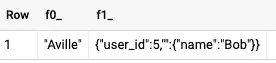
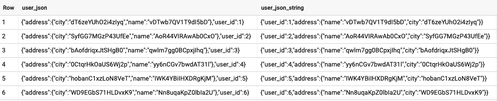
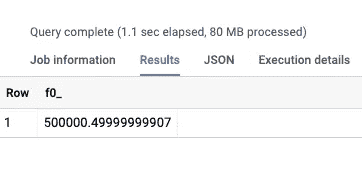
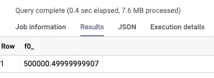

# 在 BigQuery 中使用 JSON 数据

> 原文：<https://medium.com/google-cloud/working-with-json-data-in-bigquery-24ca8fd6e90c?source=collection_archive---------0----------------------->

## 使用新的 JSON 数据类型

BigQuery 最近宣布将支持 [JSON 作为数据类型](https://cloud.google.com/bigquery/docs/reference/standard-sql/json-data)。让我们探讨一下这意味着什么，以及这对我们意味着什么。


照片由[贾瓦德·埃斯马埃利](https://unsplash.com/@javad_esmaeili?utm_source=unsplash&utm_medium=referral&utm_content=creditCopyText)在 [Unsplash](https://unsplash.com/?utm_source=unsplash&utm_medium=referral&utm_content=creditCopyText) 上拍摄

## BigQuery 中的 JSON 支持并不新鲜

首先，BigQuery 中的 JSON 支持并不新鲜。比如 BigQuery 早就有 JSON 查询和 JSON 生成功能了。您可以:

```
SELECT 
   **JSON_QUERY**('{"user_id": 3, "name": "Alice","address": {"street": "A Ave","city": "Aville"}}',
              **"$.address.city"**),
   **TO_JSON_STRING**(STRUCT(5 AS user_id, STRUCT('Bob' AS name)))
```

这将返回:



新的是 JSON 是一种*数据类型*(加上一组处理该数据类型的函数)——想想地理是如何成为一种类型的，以及它如何打开了 ST_*函数的整个世界，而不是让我们自己去计算纬度和经度。

## JSON 数据类型

有两种方法可以创建 JSON 类型的字段:*

*   通过对 JSON 格式的字符串调用 PARSE_JSON。安全。如果 JSON 字符串中有语法错误，PARSE_JSON 告诉 BigQuery 对对象使用 null。
*   通过在结构上调用 TO_JSON

这说明了两种方法:

```
WITH input_table AS (
   SELECT **SAFE.PARSE_JSON**('{"user_id": 3, "name": "Alice","address": {"street": "A Ave","city": "Aville"}}') AS user
   UNION ALL
   SELECT **TO_JSON**(STRUCT(5 AS user_id, 'Bob' as name,
                         STRUCT('B Blvd' AS street, 'Bville' AS city) AS address)) AS user
)SELECT 
   user, 
   user['name'], 
   INT64(user.user_id),
   user.address.street
FROM input_table
```

上面的代码还说明了如何使用 JSON 数据类型:

*   用户是一个列。所以你可以选择它，得到整个物体。
*   您可以使用 user['name']这样的语法提取 JSON 的各个部分
*   您也可以使用点语法提取数据。这将返回一个 JSON 对象。您可以将它转换成您想要的类型:INT64(user.user_id)
*   您可以使用多个点进入嵌套结构。深达 500。

如果有数组，可以使用[0]、[1]等来访问元素。

*还有第三种创建 JSON 数据类型的方法——如果您有一个包含定义为 JSON 类型的列的表，您可以在该列中插入一个字符串，然后进行自动转换:

```
INSERT INTO NEW_TABLE_WITH_JSON_TYPE
SELECT * FROM OLD_TABLE_WITH_STRINGS;
```

## JSON 数据类型更具性能

那么，如果我们已经能够查询和生成 JSON，那么 JSON 数据类型还有什么意义呢？

性能(以及隐含的成本)。

当创建 JSON 类型的列时，数据以解析的形式存储。因此，您可以获得列数据库的所有好处。

为了验证这一点，让我们创建一个新的 BigQuery 数据集，并用 JSON 值模拟一个表。在一列中，我们将 JSON 存储为字符串，在另一列中，我们将它存储为 JSON 类型:

```
-- START Random generation function
CREATE TEMP FUNCTION MapChar(c INT64) AS (
  CASE
    WHEN c BETWEEN 0 AND 9 THEN 48 + c -- 0 to 9
    WHEN c BETWEEN 10 AND 35 THEN 55 + c -- A to Z
    ELSE 61 + c -- a to z
  END
);CREATE TEMP FUNCTION random_string(id INTEGER) AS ((
  SELECT CODE_POINTS_TO_STRING(ARRAY_AGG(MapChar(MOD(c, 62))))
  FROM UNNEST(TO_CODE_POINTS(MD5(CAST(RAND() + id AS STRING)))) AS c
));
-- END Random generation function**CREATE OR REPLACE TABLE advdata.simulated_json AS**WITH input_data AS (
  SELECT STRUCT(id AS user_id,
                 STRUCT(random_string(id) AS name, random_string(id) AS city) AS address) AS user
  FROM UNNEST(GENERATE_ARRAY(1, 1000*1000)) AS id
)
SELECT 
  **TO_JSON(user) AS user_json,
  TO_JSON_STRING(user) AS user_json_string**
```

上面的查询生成了一百万个用随机值填充的名为 user 的结构。这些看起来像这样:



让我们用“老”的方式写一个查询:

```
CREATE TEMPORARY FUNCTION INT64(x STRING) AS
(
  CAST(JSON_VALUE(x) AS INT64)
);SELECT AVG(INT64(**JSON_QUERY(user_json_string, "$.user_id"))**)
FROM advdata.simulated_json
```

如您所料，结果是 500，000.5，但更有趣的是处理的数据量:80 MB。



这是整个 JSON 字符串的大小。

现在，让我们以新的方式编写查询，利用 JSON 数据类型和点语法来解析它:

```
SELECT AVG(INT64(**user_json.user_id**))
FROM advdata.simulated_json
```

这一次，查询将只提取 user_id“子列”,最终只处理 7.6 MB 的数据！



因此，如果将日志或其他以 JSON 字符串形式出现的数据存储为类型为 JSON(而不是 string)的列，查询会更有效。

它也更便宜，因为您处理的数据更少(如果您是按需付费)。如果您支付统一费率，您可以在较短的时间内使用您的老虎机，因此您可以使用您的老虎机做更多的事情。

尽情享受吧！

感谢 Chris Crosbie 对这篇文章的有益评论和建议。