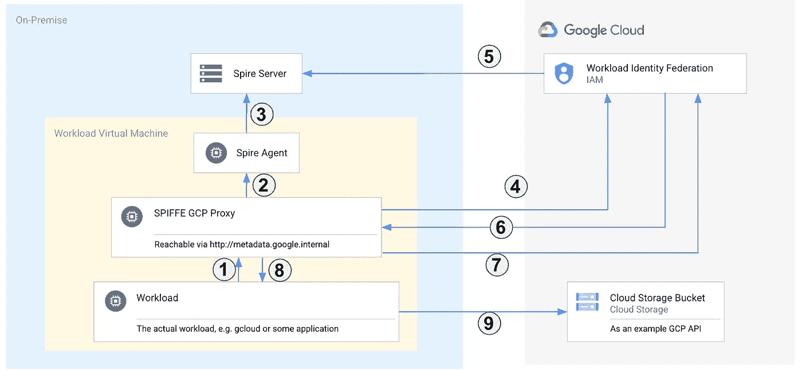

# 使用 SPIFFE 实现本地工作负载的工作负载身份联合

> 原文：<https://medium.com/google-cloud/workload-identity-federation-for-on-premise-workloads-with-spiffe-24a861b3cf6c?source=collection_archive---------0----------------------->

今天我想和大家分享一个来自 CNCF 的非常酷的项目:面向所有人的安全生产身份框架(SPIFFE)是一个用于分布式系统的通用身份控制平台。我强烈推荐你观看两年前凯尔西·海托华在 KubeCon 上的精彩[主题演讲](https://www.youtube.com/watch?v=6e4snGCTLOk)，它对 SPIFFE 及其用途做了很好的概述。

但是由于你可能还不想看视频，这里有一个快速的 TL；斯皮夫博士想做的是。假设您有一个运行在虚拟机上的应用程序。应用程序如何访问数据库服务器？很简单，您可以配置用户名和密码，也许是作为一个环境变量。我们都知道以这种方式处理秘密是一个很大的痛点。轮换它们并实际上保持它们的秘密可能是一项乏味的任务。所有这些通常是因为我们没有考虑一个简单的问题:我们的应用程序的身份是什么？

在云中，通常有一个[服务帐户](https://cloud.google.com/iam/docs/service-accounts)的概念，将身份直接或间接地绑定到工作负载。在传统的数据中心架构中，虚拟机没有明确的身份。当然，他们有一个名字，但他们没有一个身份来验证和授权其他服务。一些组织为此使用 MTLS，并在每台机器上放置证书。当使用 Kubernetes 时，有一些像 [Istio](https://istio.io/) 这样的便捷工具可以让这个过程变得更容易。但是拥有一个可互操作的方法仍然是难以捉摸的。例如，Google Cloud APIs 不接受 AuthN 和 AuthZ 的 MTLS。SPIFFE 试图填补这一空白，CNCF Spire 为此提供了一个生产就绪的实施方案。如果您的数据中心正在运行工作负载，您真的应该看看 SPIFFE 和 Spire。

许多开发人员发现管理与 GCP API 通信的本地工作负载非常具有挑战性。我想向您展示 SPIFFE 如何通过结合 SPIFFE 和 Google Workload Identity 来解决互操作性问题。在这些领域中，您可以找到不同的方法来解决这一挑战，其中包含各种陷阱:

*   有些人会导出 GCP IAM 服务帐户密钥，并将其放在机器上。这是你能做的最糟糕的事情！不要那样做。
*   您可以使用 Workload Identity Federation 和基于 OIDC 的身份提供者。工作负载使用客户端凭据授权进行身份验证。这要好得多，但仍然意味着您有一个 clientID 和 clientSecret，您希望对它们进行轮换并保密。
*   您可以查看 SPIFFE 并设置 Spire，然后将其与工作负载身份联邦集成。

# SPIFFE 和工作负载身份联盟

你可以按照伟大的[入门指南](https://spiffe.io/docs/latest/try/getting-started-linux-macos-x/)在你自己的本地机器上安装 Spire，很容易地尝试这一点。不过，您需要做一点小小的更改，因为我们需要创建一个可发现的 OIDC 配置。我发现运行这个小型 POC 最简单的方法如下:

1.  创建一个 GCS 存储桶。在`conf/server/server.conf`文件中添加一个条目:`jwt_issuer = “https://<bucket_name>.storage.googleapis.com`。
2.  在`.well-known/openid-configuration`下添加下面的 openid-configuration(确保替换占位符)。
3.  通过调用`bin/spire-agent api fetch jwt -audience test`从 Spire 服务器获取 JWKS。输出包含一个带有密钥的 JSON 对象。只需将带有 keys 关键字的整个 key 对象放在一个名为`keys`的文件中，并将其放在 bucket 的根文件夹中。
4.  在 Google Cloud 控制台中，创建一个新的工作负载身份池和提供者，并将发布者设置为`https://<bucket_name>.storage.googleapis.com`。
5.  添加一个您希望在本地工作负载中使用的新服务帐户。您需要授予测试工作负载的 SPIFFE ID 对服务帐户的访问权限:

```
gcloud iam service-accounts add-iam-policy-binding SERVICE_ACCOUNT_EMAIL \
    --role=roles/iam.workloadIdentityUser \
    --member="principal://iam.googleapis.com/projects/<project_number>/locations/global/workloadIdentityPools/<workload_pool_id>/subject/<SPIFFE_ID>"
```

OpenID 示例发现文档:

```
{
  "issuer": "https://<bucket_name>.storage.googleapis.com",
  "jwks_uri": "https://<bucket_name>.storage.googleapis.com/keys",
  "authorization_endpoint": "",
  "response_types_supported": [
    "id_token",
    "access_token"
  ],
  "subject_types_supported": [],
  "id_token_signing_alg_values_supported": [
    "RS256",
    "ES256",
    "ES384"
  ]
}
```

现在，您可以请求一个 SPIFFE JWT 令牌，根据安全令牌服务 API 交换它，并使用新令牌来模拟服务帐户(如果您想手动运行这些步骤，这里的[是如何操作的)。](https://cloud.google.com/iam/docs/using-workload-identity-federation#oidc_2)

# 斯皮夫·GCP 代理

为了使整个过程更加用户友好，并与 gcloud SDK 和 Google 云库更好地集成，我创建了一个小型代理工具，您可以在您的机器上与 spire-agent 和工作负载一起运行，以提供一种 GCP 元数据服务器兼容的方法来检索访问令牌:

[](https://github.com/GoogleCloudPlatform/professional-services/tree/main/tools/spiffe-gcp-proxy) [## 主 Google cloud platform/professional-services/sp iffe-GCP-proxy

### 这是一个简单的 GOLANG 应用程序，为希望使用 Google Cloud 的本地工作负载提供一个身份验证代理…

github.com](https://github.com/GoogleCloudPlatform/professional-services/tree/main/tools/spiffe-gcp-proxy) 

这里发生了什么

此代理实现的工作流执行以下步骤:

1.  工作负载通过[http://metadata . Google . internal/computeMetadata/v1/instance/service-accounts/](http://metadata.google.internal/computeMetadata/v1/instance/service-accounts/)<sa>/token 请求一个 GCP 身份验证令牌。
2.  代理从本地 Spire 代理请求一个 JSON Web 令牌(JWT)。
3.  Spire 代理向 Spire 服务器请求 JWT。
4.  代理获取 SPIFFE JWT，并从安全令牌服务(STS) API 请求新令牌。
5.  STS 通过检索`.well-known/openid-configuration`和 jwk 来验证发行者，从而验证传递的 SPIFFE JWT 是否有效。(在此 POC 中，openid 配置实际上是从 GCS 加载的)
6.  STS 创建并传回一个访问令牌。此令牌只能用于模拟服务帐户。
7.  代理使用“模拟令牌”请求服务帐户访问令牌。
8.  代理使用服务帐户的 GCP IAM 访问令牌来响应工作负载。
9.  工作负载可以使用访问令牌针对 Google Cloud APIs 进行认证和授权。

这将您需要在机器上做的步骤减少到简单地调用`gcloud compute instances list`。代理将负责检索和交换各种令牌，您可以只使用谷歌工具中现有的 automagic。

spiffe-gcp-proxy 方法适用于运行单一工作负载/需要单一身份的虚拟机。如果您考虑在本地 Kubernetes 集群上运行您的工作负载，您仍然可以使用基本的方法，但是可能会稍微扩展该机制，以处理在系统上运行具有潜在不同身份的多个工作负载。

在我看来，如果您在内部运行工作负载，SPIFFE 绝对是您应该了解的。这绝对是一项你应该关注的技术，因为我相信它在未来会变得更加普遍。