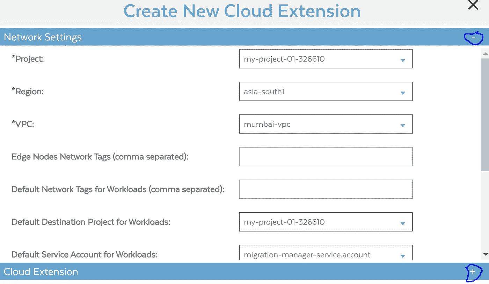
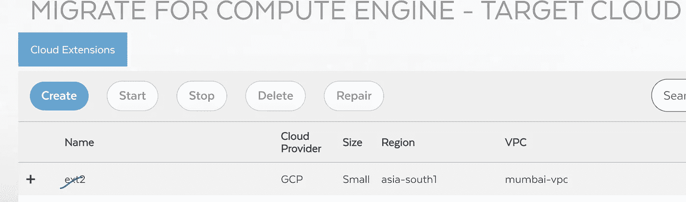
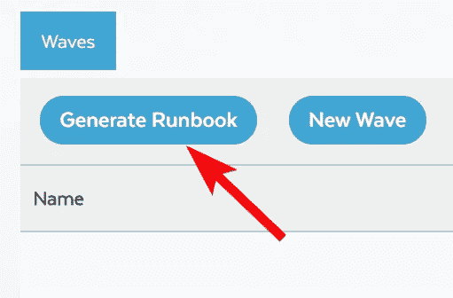
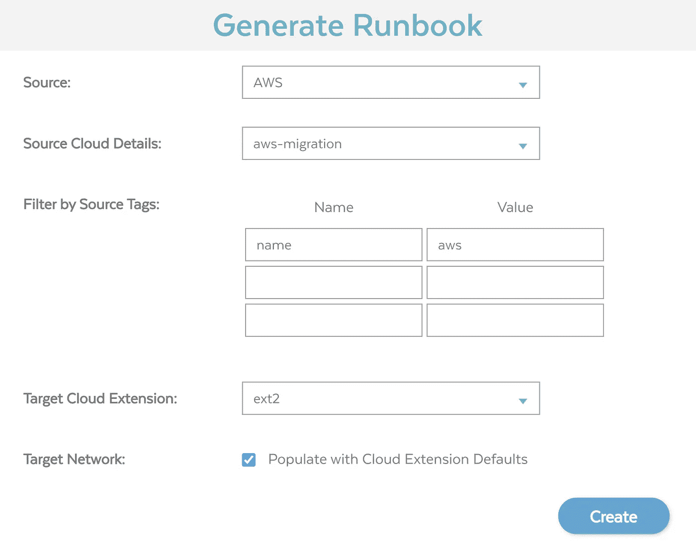
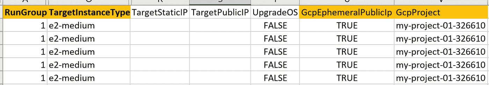

# 使用“针对计算引擎的迁移”将工作负载迁移到 GCP

> 原文：<https://medium.com/google-cloud/workloads-migration-to-gcp-using-migrate-for-compute-engine-6891893ea21c?source=collection_archive---------1----------------------->

如何将 AWS Ec2 机器迁移到 GCP 计算引擎

# 计算引擎迁移的高级架构(例如 AWS 到 GCP)

## 先决条件:在 AWS 和 GCP 之间建立站点到站点 VPN。AWS 路由和 GCP 防火墙规则允许网络之间的流量

# 正在创建 AWS IAM 组:

1.下载并解压 [AWS 云形成模板](https://storage.googleapis.com/velostrata-release/V4.2.0/Latest/CloudFormation.zip)。

2.登录自动气象站控制台，选择**云形成**。

3.点击**创建堆栈。**

4.点击**选择文件**，上传云形成文件，然后点击**下一步**。

5.为云形成堆栈输入一个**名称**。

6.选择包含要迁移的实例的 VPC。

7.从**选项**页面，点击**下一个**，然后点击**创建**。将创建名为{堆栈名称前缀}-VelosMgrGroup 的组。

# 为 Velostrata 创建 AWS IAM 用户帐户

在 AWS 控制台中，点击页面右上角的**帐户名**，然后选择**安全凭证**

1.  从左侧窗格中，选择**用户**，然后点击**创建新用户**。
2.  对于访问类型，选择**编程访问**。
3.  下载用户凭证(密钥)。创建迁移计算云扩展时将使用这些密钥

将 IAM 用户添加到由 CloudFormation 脚本创建的组中。

# 为迁移配置 AWS EC2 实例

登录到 Ec2 后，运行以下命令(例如 Ubuntu):

**Sudo apt-get 更新**

**注意:**当 Linux 映像在 Google Cloud 上运行时，它期望为计算引擎映射磁盘的迁移找到内核驱动程序。这些必须在迁移到 Google Cloud 之前下载并安装。驱动程序安装必须在 EC2 机器上执行:

***检查“管理器映像版本”*** *🡪转到 GCP 控制台🡪Compute 引擎🡪Migrate 计算引擎🡪您将看到选项🡪欢迎迁移计算引擎 V5.0。要使用 V4。X*

*切换按钮🡪 V4。x 并创建迁移管理器🡪配置站点到站点 VPN (AWS 到 GCP ),要求子网内的 GCP 防火墙规则，并选择“管理器映像版本”4.11.9(截至 2011 年 12 月 21 日)。*

**点击链接，搜索源操作系统，根据需要下载驱动程序并安装在源机器上。**

[https://cloud . Google . com/migrate/compute-engine/docs/4.11/resources/downloads](https://cloud.google.com/migrate/compute-engine/docs/4.11/resources/downloads)

**在这个例子中，** Ubuntu 是在 AWS 中运行的源机器(例如 Ec2 ),需要包&版本:

**“为计算引擎迁移。deb 包** " 🡪现在在源 Ubuntu 机器中运行以下命令:

**wget**[**https://storage . Google APIs . com/velostrata-release/4 . 11 . 9/migrate-for-GCE-prep-4 . 11 . 9-0 . deb**](https://storage.googleapis.com/velostrata-release/4.11.9/migrate-for-gce-prep-4.11.9-0.deb)

**sudo dpkg-I migrate-for-GCE-prep-4 . 11 . 9–0 . deb**

**sudo apt-get 更新&&sudo apt-get install-f–y**

现在，您已经完成了 EC2 实例的设置。通过键入 exit 注销 AWS VM 实例

**GCP 环境准备:**

1.  转到计算引擎🡪的 GCP 控制台🡪Compute 引擎🡪Migrate，您将看到选项🡪 **欢迎迁移计算引擎 V5.0。使用 V4。X** (根据适用于云的文档 V4.x(例如 AWS & Azure)和适用于 Vcenter/VMware 的 V5.0，但保持检查最新更新)
2.  切换按钮🡪 V4。x 并创建迁移管理器🡪配置站点到站点 VPN (AWS 到 GCP)并要求子网内的 GCP 防火墙规则(如果未配置为先决条件)并选择“管理器映像版本”— 4.11.9(截至 2011 年 12 月)
3.  选择地区、区域、机器类型、VPC、子网、标签等。部署迁移管理器实例
4.  服务帐户🡪为“**迁移管理器**”创建服务帐户(保留默认值)，并为“**云扩展**”创建另一个服务帐户(保留默认值)
5.  迁移管理器密码—用户名默认为 **apiuser** 并创建新的 passport(记下该密码，因为稍后需要)
6.  审查和创建
7.  在计算引擎下—您可以看到带有**外部 IP** 的虚拟机，并在浏览器中打开链接，接受证书的安全警告。用户名和密码。

8.点击源云->云凭据🡪创建

9 .点击源云->云详细信息🡪创建

注意:选择 AZ，而“**要迁移的 Ec2** ”正在运行&适当的细节在此步骤中。

单击目标云图标:

**在云扩展选项卡上，单击创建按钮:**

● **项目:**选择您的 GCP 项目(迁移将在那里进行)

● **地区:** GCP 地区

●**VPC:**GCP-网络

● **工作负载的默认目的项目:**默认项目名称

● **工作负载的默认服务账户:**迁移-云-扩展(*管理器创建时创建的*)

现在展开下面的部分来完成表格:

**云扩展**

● **云扩展名称:** ext1(或任何名称)

● **边缘节点服务账号:**迁移-云-扩展

● **云扩展规模:**小型/大型(参见迁移工作负载的定义)

**区域**

● **节点 A 区域:**美国-中央 1-a

● **节点 B 区域:**美国中央 1-b

● **节点 A 子网:**

● **节点 B 子网:**

● **默认工作负载子网:**

点击**确定**按钮。

你现在应该看到 **ext2** 处于**创建**状态。

等待创建完成，并处于**活动**状态，然后继续。这将需要几分钟时间。

**点击主页按钮:**

点击**迁移波**图标:

Name = aws *(该标签是为 aws 管理中的 Ec2 配置的。安慰..任何带有“aws”标签的机器将在 CSV 表中导出*)

**点击生成运行手册:**

**在本例-** 中，有 5 台 ec2 机器包含 aws 标签:

现在，更改并输入一些内容，然后保存表单:

运行组(*从-1 到 1，GCP 要求的实例类型，公共 IP &项目 ID 等。*)

**点击 New wave，上传 CSV:**

**点击 New wave，上传 CSV:**

**选择波🡪Action 🡪新工作和选择操作:**

- **测试克隆:**当想要在 GCP 上测试虚拟机时，该选项工作正常。这将在源位置创建一个导入器(例如 C4.large )(克隆源 Ec2 的副本),并让原始机器运行，而没有任何影响/停止。虚拟机将在 GCP 创建，您可以控制使用 SSH(源用户&密码)并测试应用程序。此外，在决定完全迁移之前，您可以从虚拟机创建一个映像，并创建一个新的虚拟机，以便在 GCP 进行进一步测试。

- **在云中运行:**选项将停止源机器，创建导入程序并在 GCP 创建一个新的虚拟机。根据文档，此选项从源卷传输存储。你可以从新创建的虚拟机登录/检查 GCP 的应用程序

- **离线迁移:**通常是迁移计算当前不支持的传统工作负载/操作系统。停止源计算机，在源计算机上创建导入程序，在目标计算机上创建导出程序，并使 GCP 虚拟机保持停止状态。一旦虚拟机完全缓存，导出器&导入器将被删除，新的虚拟机将在 GCP 启动并运行

- **完全迁移:**停止源机器，在源机器上创建导入程序，在目标机器上创建导出程序，并使 GCP 虚拟机保持开启状态。一旦虚拟机被完全缓存，导出器&导入器将被删除，新的虚拟机将在 GCP 运行&。在发动机罩下，执行以下步骤:

**-在云中运行—** 该步骤将计算资源从 AWS 移动到云&流存储。

**-存储迁移—** 这一步在后台将存储移动到云中

**-** **准备脱离**-从 AWS VM 断开。

**-**-**清理**-从计算引擎控制台的迁移中清理设置

**注意:**每台源机器(例如 ec2)都将在源环境中创建一个单独的导入器(例如，5 台 Ec2 将有另外 5 台导入器作为 C4.large 的 Ec2(按需定价适用)，直到复制停止。

在遵循上述虚拟机生命周期时，源/原始虚拟机将被**【停止】**，不会发生持续的数据复制(这意味着业务事务完全停止)。数据从源传输到目标的时间量将被视为迁移所用的时间。

***注意:*** *迁移流程会因 VMware/VCenter 工作负载而变化。本文仅适用于 AWS Ec2 机器。*