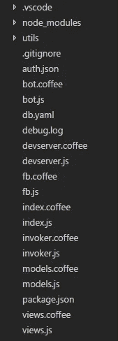

# 写、启动、忘记:在云功能上构建聊天机器人

> 原文：<https://medium.com/google-cloud/write-launch-forget-building-a-chatbot-on-cloud-functions-db69780dc398?source=collection_archive---------1----------------------->

函数的新家

## 我第一次接触无服务器架构

# 为什么是另一个聊天机器人？

聊天机器人是一个很好的编程练习，因为它们直接、开门见山。

对于我们这些在 MS-DOS 时代接触过聊天工具的人来说，聊天机器人很奇怪地让人想起了命令提示符。忘记样板 MFC 代码和 HTML 支架——用户的输入和业务逻辑再一次被一个简单的回车键分开。

这一次，您不是从 STDIN 中读取，而是从一个经过 92 层抽象、传输和代码转换协议的字符串参数中读取，它是从半个世界之外发送过来的。聊天机器人协议的承诺是你永远不需要担心那些细节；这是站台(信使、电报、线路等)的职责。)将其用户的移动应用连接到您的互联网服务器。

# 承诺

无服务器架构只是这一承诺的逻辑延伸。现在，您只需编写一个函数——代码执行的原子单位——并且不再需要担心它如何运行。

对于这个练习，我选择了谷歌云功能，因为我一直想尝试一下。它应该同样适用于 AWS Lambda。

Google Cloud Functions 负责提供底层机器、调度您的代码以及将您的请求发送给您。假设你的功能会在没有你参与的情况下无限放大和缩小，这是安全的。作为一个喜欢搞一些小项目，但又不愿意在三年后将它们从不可避免的平台腐烂中拯救出来的人来说，这简直好得令人难以置信。

# 问题是

如果您有一段时间没有运行它，或者您刚刚部署了一个新版本，它将会遭受缓慢的冷启动。这是可以理解的，因为应用程序包需要时间在整个服务器场中传播，并且实例需要加速运行。如果你的应用程序流量很大，这应该不是问题。

哦，还要用 Node.js 写。

对于无服务器编程来说，Node.js 是一个非常好的选择——我说的非常好是指非常糟糕的选择，因为该语言及其整个生态系统是为异步、无阻塞的世界而设计的。顺便提一下，这是你最不在乎的属性，**在一个没有任何东西相互阻塞的生产环境中，*线程*和*进程*是从词汇表**中完全缺失的概念。

JavaScript 开发人员已经花费了 137，285 个集体人工年来讨论如何使异步程序不那么令人呕吐，他们已经提出了差不多同样多的解决方案。因为到目前为止，他们中没有一个是明确一致的赢家，所以我可以自由选择我最不讨厌的。

我选择了 IcedCoffeeScript，它是普通 JavaScript 之上的两层宏。第一层(CoffeeScript)将我们从大括号和分号的地狱中拯救出来；第二层，回调地狱。

 [## IcedCoffeeScript

### 通过示例安装 ics ics 基础 ICS 控制流 ICS:教程结论 ICS:阅读更多用法概述语言…

maxtaco.github.io](http://maxtaco.github.io/coffee-script) 

# 设置它

开始使用谷歌云功能非常简单。界面是光滑的材料设计风格，并夹杂着大量的提示，所以你几乎可以不用参考他们做得很好的文档。

GCF 期望你的调度函数实现 Express API，仅此而已。它不会对您选择的模块或数据库引擎做出判断。因为开始使用 Facebook Messenger API 的最低要求是正确回答它的挑战，所以我用下面的代码让日志开始流动:

我切换回日志控制台，并开始滥发测试脸书页面。它开始被信息填满，但在我忘记这个小练习之后很久，它还会继续这样。

总之，我花了大约两个小时来设置这个，其中大部分时间都花在了研究上。

# 向外扩展

最终，我的一个文件片段变成了一个包含 node_modules、gitignore 和 whatnots 的合适的存储库。该存储库也位于 GCP。我特别喜欢的不是被迫从一开始就创建一个新的存储库，而是允许我按照自己的速度来做。

直到我第三次重构的时候，训练的车轮才慢慢磨损，我开始摸索我的代码组织。我是从一个存储库中运行许多功能，还是将它们分散开来？我是将*视图*保存在同一个文件中，还是作为单独的文件保存在一个文件夹中，或者它甚至是这里的一个东西？

这感觉就像是一个框架可以真正进来并提出一般最佳实践的地方。但是，当对大量应用程序应该如何构建达成共识时，框架就出现了，而且可能还没有那么多。有一个被称为[无服务器](https://serverless.com/)的既定框架，我计划下一步研究他们的方法，尽管他们似乎不重视文档。

# 思想

我认识的那些将[fire base](https://firebase.google.com/)引入他们的武器库的人似乎对此深信不疑。紧挨着他们的是一大群人，他们发誓永远不与它有任何关系，因为他们害怕创建一个其核心业务功能完全依赖于一家公司心血来潮的堆栈。

 [## 火焰基地的成本增加了 7000%！

### 更新(2017 年 5 月 17 日上午 8:50):

startupsventurecapital.com](https://startupsventurecapital.com/firebase-costs-increased-by-7-000-81dc0a27271d) 

对我来说，无服务器架构代表了两个世界之间非常明智的妥协。

我将定期分享我在担任一家灵活的初创公司的首席技术官期间遇到的方法和流程。如果您对此感兴趣，请关注和/或打招呼。