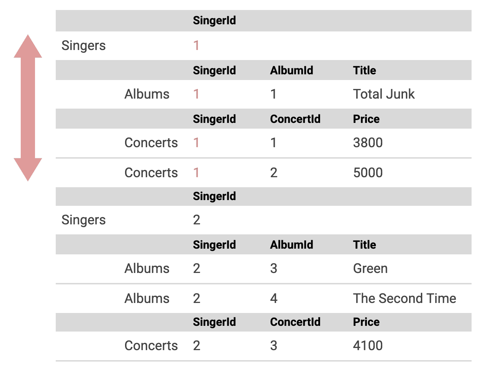
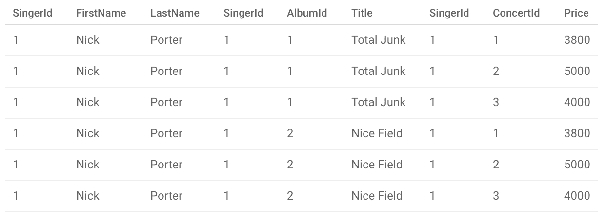
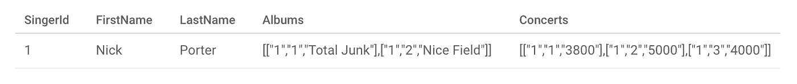
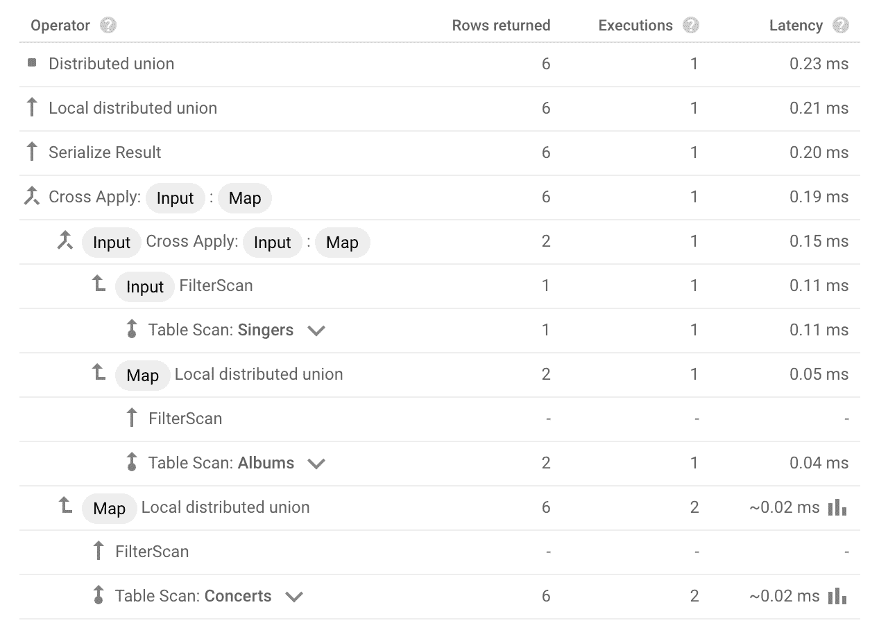
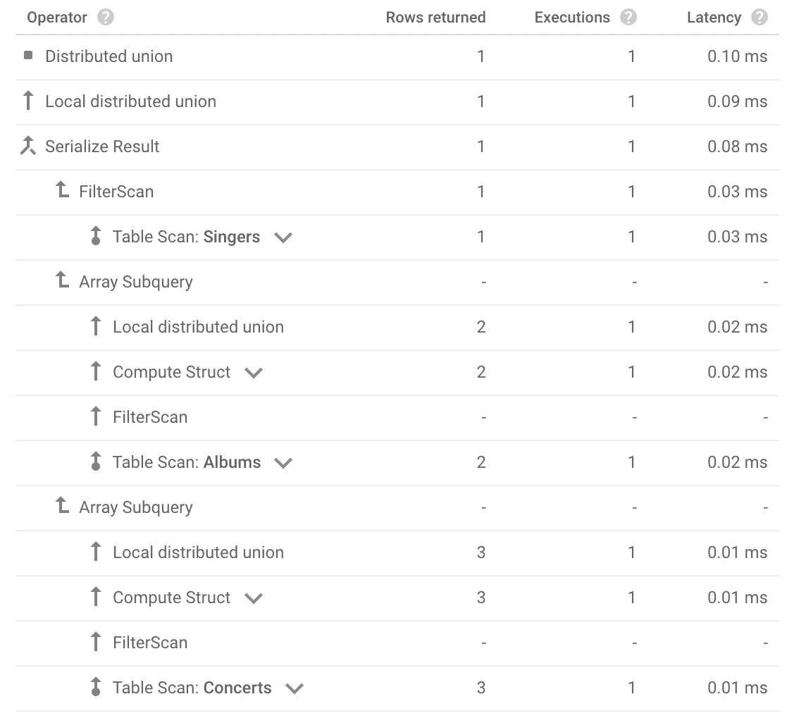
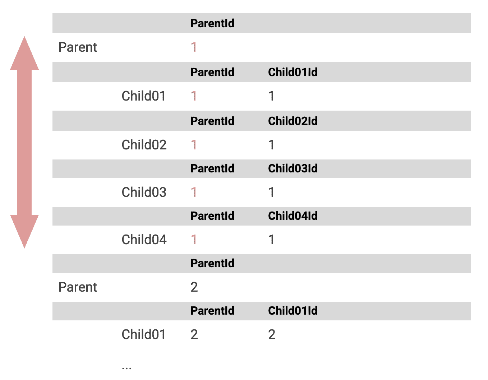
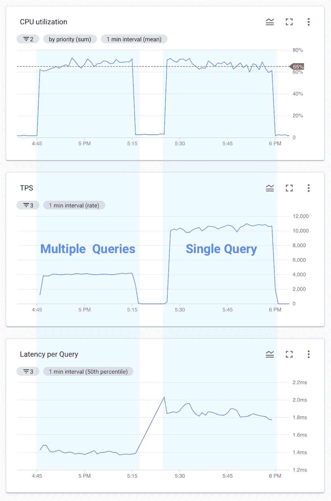

# 为云扳手交叉表编写高效查询

> 原文：<https://medium.com/google-cloud/writing-efficient-queries-for-cloud-spanner-interleaved-tables-44745e8f913e?source=collection_archive---------0----------------------->

在这篇博客中，我们讨论如何为云扳手交叉表编写高效的查询。

# TL；速度三角形定位法(dead reckoning)

您可以编写一个查询，用`SELECT AS STRUCT`子查询一次从父表和交叉表中选择行。这允许您高效地运行查询，同时在 Cloud Spanner 数据库上消耗较少的 CPU 资源。

# 介绍

Cloud Spanner 是 Google 提供的一个完全托管的、可水平扩展的关系数据库服务。Cloud Spanner 的独特功能之一是[表格交错](https://cloud.google.com/spanner/docs/schema-and-data-model#parent-child_table_relationships)，它允许您定义表格之间的父子关系。交叉存取表中的数据在物理上位于同一位置，这可以提高读写性能。关于表格交错的更多细节，请查看由 Christoph 和 Anand 撰写的博客文章。

当您设计具有表交叉的模式时，可能会遇到这样的情况:您希望同时从父表和子表中选择行。这是一个常见的用例，您的应用程序有一个 API，需要从多个云扳手表中聚合用户信息。

# 查询交叉表

为了进一步讨论这个话题，让我们用下面的表格和数据来思考:

```
CREATE TABLE Singers (
  SingerId INT64 NOT NULL,
  FirstName STRING(1024) NOT NULL,
  LastName STRING(1024) NOT NULL,
) PRIMARY KEY (SingerId);CREATE TABLE Albums (
  SingerId INT64 NOT NULL,
  AlbumId INT64 NOT NULL,
  Title STRING(1024) NOT NULL,
) PRIMARY KEY (SingerId, AlbumId),
  INTERLEAVE IN PARENT Singers ON DELETE CASCADE;CREATE TABLE Concerts (
  SingerId INT64 NOT NULL,
  ConcertId INT64 NOT NULL,
  Price INT64 NOT NULL,
) PRIMARY KEY (SingerId, ConcertId),
  INTERLEAVE IN PARENT Singers ON DELETE CASCADE;# Sample Data
INSERT INTO Singers (SingerId, FirstName, LastName) VALUES (1, "Nick", "Porter");
INSERT INTO Albums (SingerId, AlbumId, Title) VALUES (1, 1, "Total Junk"), (1, 2, "Nice Field");
INSERT INTO Concerts (SingerId, ConcertId, Price) VALUES (1, 1, 3800), (1, 2, 5000), (1, 3, 4000);
```

歌手是最顶层的父表。专辑和演唱会是歌手下面的子表。

假设我们有这些表，从 SingerId = 1 的表中选择所有行的最佳方法是什么？



图 1:选择 SingerId = 1 的所有行

简单的方法是分别从父表和子表中选择行。

```
SELECT * FROM Singers WHERE SingerId = 1;
SELECT * FROM Albums WHERE SingerId = 1;
SELECT * FROM Songs WHERE SingerId = 1;
```

这在某些情况下可能没问题，但是随着交叉表数量的增加，查询的数量也会相应增加，这可能会降低性能。

另一种方法是使用 JOIN 子句连接父表和子表。

```
SELECT * FROM Singers s
INNER JOIN Albums a ON s.SingerId = a.SingerId
INNER JOIN Concerts c ON s.SingerId = c.SingerId
WHERE s.SingerId = 1;
```

使用这种方法，您可以使用一个查询来选择所有行，但是请注意，上面的查询对多个表使用了相同的 SingerId 作为连接条件。这种类型的连接变成了一个[笛卡尔乘积](https://en.wikipedia.org/wiki/Cartesian_product)，它可能会产生一个很大的结果集。

例如，如果我们对存储 2 行专辑和 3 行音乐会的表运行前面的查询，结果集将变成 2 * 3 = 6 行，如下所示:



图 2:使用 JOIN 的查询结果集

因此，对几十个交叉表使用 JOIN 并不是一个好主意，因为它可能会产生一个很大的数据集，并可能降低查询性能。

# 解决方案:将子查询与 SELECT AS STRUCT 一起使用

一次从多个表中选择行的解决方案是使用带有 [SELECT AS STRUCT](https://cloud.google.com/spanner/docs/query-syntax#select_as_struct) 语句的子查询。使用这种方法的查询如下所示:

```
SELECT *,
  ARRAY(SELECT AS STRUCT * FROM Albums WHERE SingerId = 1) as Albums,
  ARRAY(SELECT AS STRUCT * FROM Concerts WHERE SingerId = 1) as Concerts,
FROM Singers WHERE SingerId = 1;
```

这个查询看起来有点复杂，所以让我们把它拆开来理解查询的每一部分。首先，看一下下面的子查询:

```
SELECT AS STRUCT * FROM Albums WHERE SingerId = 1
```

此 SELECT 语句从相册表中选择 SingerId 等于 1 的行。 [SELECT AS STRUCT](https://cloud.google.com/spanner/docs/query-syntax#select_as_struct) 语句是一种以 STRUCT 类型获取结果集的方式，它通过存储多个字段的单个列生成结果，如下所示:

```
+------------------------------------------------+
| Value                                          |
+------------------------------------------------+
| {SingerId: 1, AlbumId: 1, Title: "Total Junk"} |
| {SingerId: 1, AlbumId: 2, Title: "Nice Field"} |
+------------------------------------------------+
```

然后，一个歌手可以有零个或多个专辑，所以我们可以用`ARRAY()`包装上面的语句，以构成[数组子查询](https://cloud.google.com/spanner/docs/subqueries#array_subquery_concepts)。

```
ARRAY(SELECT AS STRUCT * FROM Albums WHERE SingerId = 1)
```

最后，您可以写下与交叉表数量一样多的`ARRAY(SELECT AS STRUCT ...)`子查询，并获得我们首先看到的查询。

```
SELECT *,
  ARRAY(SELECT AS STRUCT * FROM Albums WHERE SingerId = 1) as Albums,
  ARRAY(SELECT AS STRUCT * FROM Concerts WHERE SingerId = 1) as Concerts,
FROM Singers WHERE SingerId = 1;
```

当您在云控制台中运行这个查询时，您可以获得以下结果。



图 3:使用 SELECT AS STRUCT 子查询的查询结果

虽然这个结果似乎丢失了 Albums 和 Concerts 列的字段名，但实际上，当从编程语言访问 STRUCT 字段时，这两个列实际上都保留了它的名称和类型。

比如围棋的[排。ToStruct](https://godoc.org/cloud.google.com/go/spanner#Row.ToStruct) 可以用下面的方法把上面的结果转换成 Go 的 Struct。

```
type Singer struct {
  SingerID  int64      `spanner:"SingerId"`
  FirstName string     `spanner:"FirstName"`
  LastName  string     `spanner:"LastName"`
  Albums    []*Album   `spanner:"Albums"`
  Concerts  []*Concert `spanner:"Concerts"`
}type Album struct {
  SingerID int64  `spanner:"SingerId"`
  AlbumID  int64  `spanner:"AlbumId"`
  Title    string `spanner:"Title"`
}type Concert struct {
  SingerID  int64 `spanner:"SingerId"`
  ConcertID int64 `spanner:"ConcertId"`
  Price     int64 `spanner:"Price"`
}func decodeRow(row *spanner.Row) (*Singer, error) {
  var singer Singer
  err := row.ToStruct(&singer)
  return &singer, err
}
```

最后，让我们比较一下使用 JOIN 和使用子查询的查询执行计划。

下图显示了使用 JOIN 的查询的执行计划。



图 4:使用 JOIN 的查询的执行计划

该查询连接了 3 个表，因此您可以注意到, [Cross Apply](https://cloud.google.com/spanner/docs/query-execution-operators#cross-apply) 操作符被使用了两次来连接表。

相比之下，下图显示了带有子查询的查询的执行计划。



图 5:带有子查询的查询的执行计划

你可以看到`ARRAY(SELECT AS STRUCT)`是作为一个子查询执行的，带有[数组子查询](https://cloud.google.com/spanner/docs/query-execution-operators#array_subqueries)操作符。

# 基准

让我们运行一个基准测试来了解上述方法的效率。

在这个基准测试中，我们假设有 5 个表，一个父表和 4 个子表，并从这 5 个表中选择行。下图说明了这个基准测试场景:



图 6:从 5 个表中选择行的基准

为了简单起见，我们使用只包含主键的列的表。

```
CREATE TABLE `Parent` (
  ParentId INT64 NOT NULL,
) PRIMARY KEY (ParentId);CREATE TABLE Child01 (
  ParentId INT64 NOT NULL,
  Child01Id INT64 NOT NULL,
) PRIMARY KEY (ParentId, Child01Id),
  INTERLEAVE IN PARENT `Parent` ON DELETE CASCADE;CREATE TABLE Child02 (
  ParentId INT64 NOT NULL,
  Child02Id INT64 NOT NULL,
) PRIMARY KEY (ParentId, Child02Id),
  INTERLEAVE IN PARENT `Parent` ON DELETE CASCADE;CREATE TABLE Child03 (
  ParentId INT64 NOT NULL,
  Child03Id INT64 NOT NULL,
) PRIMARY KEY (ParentId, Child03Id),
  INTERLEAVE IN PARENT `Parent` ON DELETE CASCADE;CREATE TABLE Child04 (
  ParentId INT64 NOT NULL,
  Child04Id INT64 NOT NULL,
) PRIMARY KEY (ParentId, Child04Id),
  INTERLEAVE IN PARENT `Parent` ON DELETE CASCADE;
```

在这个基准测试中，我们将比较两个事务；第一个由多个查询组成，从表中逐个选择行。

```
SELECT * FROM Parent WHERE ParentId = [@id](http://twitter.com/id);
SELECT * FROM Child01 WHERE ParentId = [@id](http://twitter.com/id);
SELECT * FROM Child02 WHERE ParentId = [@id](http://twitter.com/id);
SELECT * FROM Child03 WHERE ParentId = [@id](http://twitter.com/id);
SELECT * FROM Child04 WHERE ParentId = [@id](http://twitter.com/id);
```

第二个由一个查询组成，该查询使用子查询一次从所有表中选择行。

```
SELECT 
  *,
  ARRAY(SELECT AS STRUCT * FROM Child01 WHERE ParentId = [@id](http://twitter.com/id)) as c01,
  ARRAY(SELECT AS STRUCT * FROM Child02 WHERE ParentId = [@id](http://twitter.com/id)) as c02,
  ARRAY(SELECT AS STRUCT * FROM Child03 WHERE ParentId = [@id](http://twitter.com/id)) as c03,
  ARRAY(SELECT AS STRUCT * FROM Child04 WHERE ParentId = [@id](http://twitter.com/id)) as c04,
FROM Parent p WHERE ParentId = [@id](http://twitter.com/id);
```

基准的其他条件如下:

*   云扳手的节点大小为 1。
*   每个表有 1M 行。
*   运行查询的事务是只读事务。
*   基准代码随机选择行键。
*   客户机是 32 vCPU GCE，运行在与云扳手实例相同的位置。

你可以在 [GitHub](https://github.com/GoogleCloudPlatform/professional-services/tree/main/examples/spanner-interleave-subquery) 中访问基准代码。

# 基准结果

以下是基准测试结果:



图 7:从 5 个表中选择的基准测试结果

这些图表从上到下显示了 Cloud Spanner 的 CPU 利用率、每秒事务(TPS)和每次查询的延迟。图表的左侧显示了使用多个查询的结果，而图表的右侧显示了使用单个查询的结果。

从图中可以看出，虽然两种方法的 CPU 利用率几乎相同，但使用单个查询处理的事务(10，000 TPS)是使用多个查询(4，000 TPS)的 2.5 倍。换句话说，使用建议的方法，Cloud Spanner 在服务相同数量的 TPS 时消耗更少的 CPU 资源。

从延迟来看，使用单个查询(1.8 毫秒)看起来比使用多个查询(1.4 毫秒)慢，但此图显示了每个查询*的延迟，因此当我们在事务级别了解延迟时，使用多个查询会更慢，因为单个事务中有 5 个查询，总延迟为 1.4 毫秒* 5 个查询= 7 毫秒

# 摘要

我们讨论了如何通过使用`ARRAY(SELECT AS STRUCT)`子查询为 Cloud Spanner 的交叉表编写高效的查询。请注意，基准测试结果可能会因各种条件(如模式、查询或交叉表的数量)而异，因此，如果您对这种方法的性能优势感兴趣，请在应用程序的模式和查询中尝试一下。

# 确认

我要感谢 Mourad El Azhari 的全面审查和有益的评论，使这篇文章更加准确和可读！