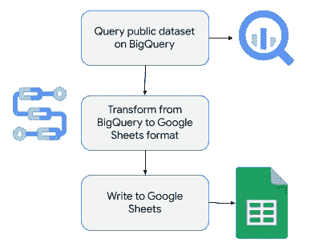
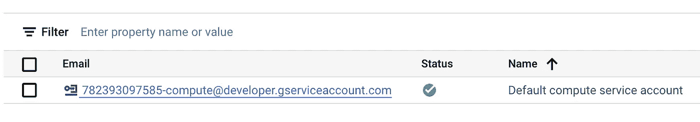
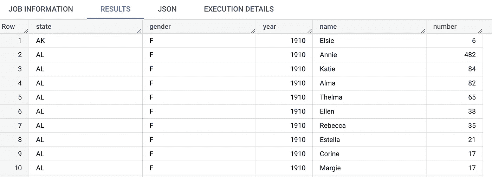
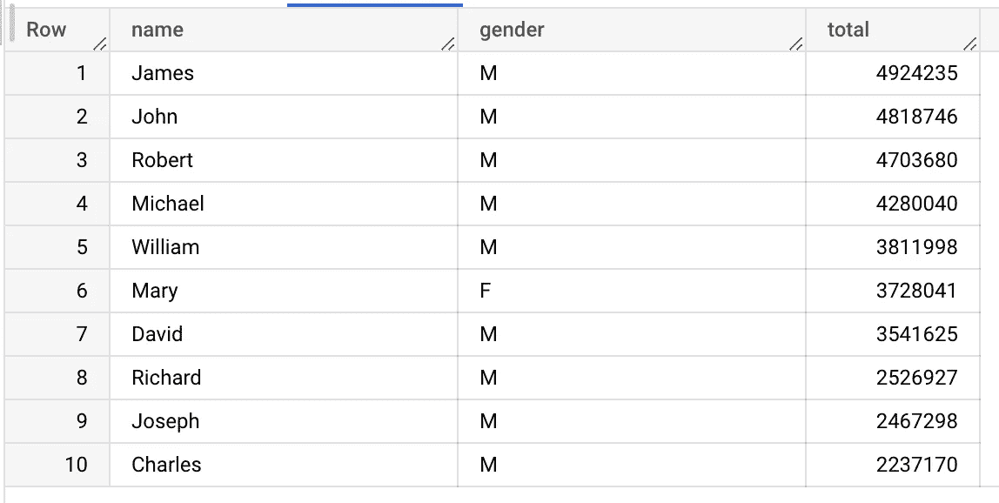
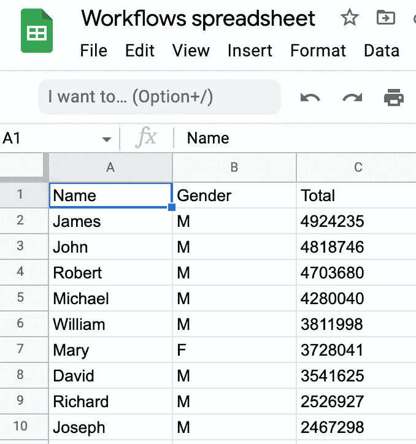

# 从工作流写入 Google 工作表

> 原文：<https://medium.com/google-cloud/writing-to-google-sheets-from-workflows-eb5876a7b6f9?source=collection_archive---------2----------------------->

在我之前的[帖子](https://atamel.dev/posts/2022/09-09_trigger_workflows_from_sheets/)中，我展示了如何使用 Apps 脚本从 Google Sheets 电子表格触发 Google Cloud 中的工作流。在这篇文章中，我展示了如何反向操作:从 Google Cloud 中的一个工作流写入 Google Sheets。

# 用例

假设您在 BigQuery 中有一些数据集。您希望定期查询和提取数据集的子集，并将其保存到 Google Sheets 电子表格中。您可以很容易地用工作流实现这样的过程。



下面我们来详细看一下步骤。

# 在 Google Sheets 中创建电子表格

首先，在 Google Sheets 中创建一个电子表格，工作流会将结果写入其中。

创建工作表后，记下电子表格 id；稍后您将在工作流中需要它。您可以在电子表格的 url 中找到工作表 id:


为简单起见，您将使用默认的计算服务帐户部署工作流。在 Google Cloud Console 的`IAM & Admin`->-`Service Accounts`部分找到这个服务账号的邮箱地址:



确定此服务帐户拥有电子表格的写入权限:


# 探索公共 BigQuery 数据集

对于此示例，您将使用`usa_names.usa_1910_2013`公共 BigQuery 数据集，其中包含 1910 年至 2013 年美国个人的信息。

您可以看到该查询的前 100 行:

```
SELECT *
FROM `bigquery-public-data.usa_names.usa_1910_2013`
LIMIT 100
```



您可以通过以下查询找到 100 个最受欢迎的名字:

```
SELECT name, gender, SUM(number) AS total
FROM `bigquery-public-data.usa_names.usa_1910_2013`
GROUP BY name, gender
ORDER BY total DESC
LIMIT 100
```



这是您将在示例工作流中使用的查询。

# 创建工作流

创建一个 [workflow.yaml](https://github.com/GoogleCloudPlatform/workflows-demos/blob/master/workspace-integration/workflows-to-sheets/workflow.yaml) 从 BigQuery 公共数据集中找到最流行的名字，并写入 Google Sheets 中的电子表格。

首先，定义您的工作表 id 和限制:

```
main:
    steps:
    - init:
        assign:
        # Replace with your sheetId and make sure the service account
        # for the workflow has write permissions to the sheet
        - sheetId: "1D8n7uoU8kGwQvR4rcLkF10CdAfnUKE2o0yl6P-Z7nfM"
        - limit: 100
```

对 BigQuery 公共数据集运行查询:

```
- runQuery:
        call: googleapis.bigquery.v2.jobs.query
        args:
            projectId: ${sys.get_env("GOOGLE_CLOUD_PROJECT_ID")}
            body:
                useLegacySql: false
                # Query name and gender of most popular names
                query: ${"SELECT name, gender, SUM(number) AS total
                    FROM `bigquery-public-data.usa_names.usa_1910_2013`
                    GROUP BY name, gender
                    ORDER BY total DESC
                    LIMIT " + limit}
        result: queryResult
```

初始化行列表，解析查询结果，并将每一行插入行列表:

```
- init_header_row:
        assign:
        - rows:
            - ["Name", "Gender", "Total"]
    - process_query_result:
        for:
            value: row
            in: ${queryResult.rows}
            steps:
            - process_each_row:
                assign:
                - name: ${row.f[0].v}
                - gender: ${row.f[1].v}
                - total: ${row.f[2].v}
                - row: ["${name}", "${gender}", "${total}"]
                - rows: ${list.concat(rows, row)}
```

最后，清除电子表格中的任何现有值，并使用工作流的 [Google Sheets API 连接器](https://cloud.google.com/workflows/docs/reference/googleapis/sheets/Overview)插入行:

```
- clear_existing_values:
        call: googleapis.sheets.v4.spreadsheets.values.clear
        args:
            range: "Sheet1"
            spreadsheetId: ${sheetId}
        result: clearResult
    - update_sheet:
        call: googleapis.sheets.v4.spreadsheets.values.update
        args:
            range: ${"Sheet1!A1:C" + (limit + 1)}
            spreadsheetId: ${sheetId}
            valueInputOption: RAW
            body:
                majorDimension: "ROWS"
                values: ${rows}
        result: updateResult
    - returnResult:
        return: ${updateResult}
```

# 部署工作流

确保您有一个 Google Cloud 项目，并且项目 id 在`gcloud`中设置:

```
PROJECT_ID =your-project-id
gcloud config set project $PROJECT_ID
```

运行一个 [setup.sh](https://github.com/GoogleCloudPlatform/workflows-demos/blob/master/workspace-integration/workflows-to-sheets/setup.sh) 脚本来启用所需的服务，并使用默认的计算服务帐户部署 [workflow.yaml](https://github.com/GoogleCloudPlatform/workflows-demos/blob/master/workspace-integration/workflows-to-sheets/workflow.yaml) 中定义的工作流。

# 运行工作流程

您现在已经准备好测试工作流了。

从谷歌云控制台或`gcloud`运行工作流:

```
gcloud workflows run read-bigquery-write-sheets
```

几秒钟后，您应该会看到工作流执行已经完成，并且电子表格中有来自 BigQuery 数据集的查询结果:



这只是如何使用 [Google Sheets API 连接器](https://cloud.google.com/workflows/docs/reference/googleapis/sheets/Overview)从工作流写入 Google Sheets 的一个例子。您还可以使用 [Google Forms API 连接器](https://cloud.google.com/workflows/docs/reference/googleapis/forms/Overview)，它提供了工作流和 Google Forms 之间简单有趣的集成机会，以及一整套[Google Workspace REST API](https://developers.google.com/workspace/products#toc)，即使没有连接器，您也可以相对容易地从工作流中调用它们。

如有任何问题或反馈，请随时在 Twitter [@meteatamel](https://twitter.com/meteatamel) 上联系我。

*最初发布于*[*https://atamel . dev*](https://atamel.dev/posts/2022/09-26_writing_google_sheets_from_workflows/)*。*