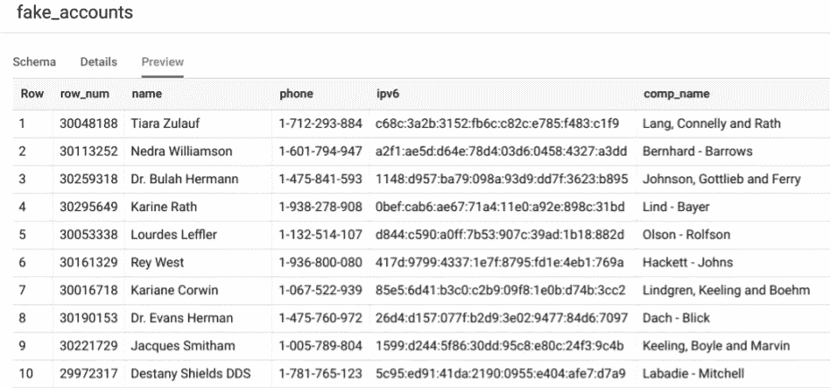

# 在 BigQuery 中生成假数据集的另一种方法是

> 原文：<https://medium.com/google-cloud/yet-another-way-to-generate-fake-datasets-in-bigquery-93ee87c1008f?source=collection_archive---------0----------------------->

## 用 Javascript UDF 包装 faker.js

(2020 年 11 月 20 日更新:示例现在使用生成的序列表，而不是使用 wise_all_sky 公共数据集作为基表)

在创建演示和概念证明时，我经常遇到这样的问题:如何找到合适的样本数据来开始。BigQuery 的[公共数据集](https://cloud.google.com/bigquery/public-data)是一个很好的资源，但很少拥有构建一个合适环境所需的一切。

对于许多项目来说，创建初始样本数据已经成为一个必要而繁琐的过程。因此，近年来，像 [faker.js](https://github.com/marak/Faker.js/) 或 [python](https://github.com/joke2k/faker) 这样的假数据库变得流行起来。在使用这些库时，我发现自己在验证 BigQuery 中生成的数据和调整用于导入数据的代码之间的上下文切换会降低速度。

这里有一个快速教程，介绍如何使用一个 [Javascript UDF](https://cloud.google.com/bigquery/docs/reference/standard-sql/user-defined-functions#javascript-udf-structure) 和 faker.js 库在几分钟内生成数十亿行虚假数据，而无需离开 BigQuery 控制台。

## 生成第一条记录

下面的例子通过使用返回一个[结构类型](https://cloud.google.com/bigquery/docs/reference/standard-sql/data-types#declaring_a_struct_type)的临时 UDF 来最大化灵活性。在 select 语句末尾使用的通配符“*”将函数返回的结构类型转换为普通的表行。可以快速重新定义临时 UDF，以返回 faker.js 库范围内的任何数据。

单记录输出

*BigQuery 与大型 Javacript 库的兼容性可能很挑剔；一个为 UDF 库手工打包的 webpack 输出可以在 GitHub* *上找到* [*。*](https://github.com/pdunn/bq_fake_data/tree/master/udf_lib)

## **生成任意数量的唯一行**

为了创建许多行，SQL select 语句需要一个表来进行选择；结果集的行数将与所选表中的行数相匹配。

为了促进这一功能，您将生成一个包含增量值序列的表，它可以作为 faker 产生唯一值的随机种子。

创建和使用包含数十亿条记录的表会产生明显的费用。查看我的[早先的帖子，关于使用弹性槽](/google-cloud/optimize-bigquery-costs-with-flex-slots-e06ec5e4aa90)在处理大桌子时大幅减少你的账单。

在大约 2 分钟内生成 10 亿个顺序编号的行

`row_seq`表可以有选择地播种数十亿条记录，足以满足任何用例。此外，通过使用行号，生成的结果既可重复又是唯一的。

在大约 4 分钟内生成 1 亿个实体

dataset.fake_accounts 表的预览显示了与生成它的种子配对的每个实体。任何一行都可以通过重新调用`entity()`函数来重现，即`select entity(30048188).*`将重现 Tiara Zulauf。

可由 row_num 复制的伪实体

## 额外资源

这里有一些额外的资源可以帮助你。

*   Google PSO 团队的全功能数据生成器
*   我的同事 Salmaan Rashid 关于用 webpack 打包 UDF 的一篇文章
*   BigQuery [社区 UDF](https://github.com/GoogleCloudPlatform/bigquery-utils/tree/master/udfs/community)