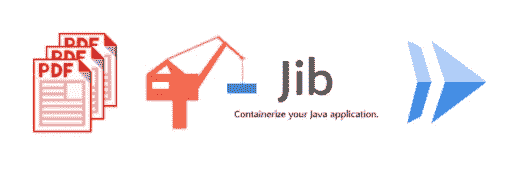
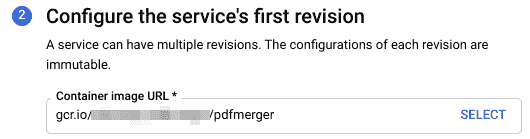

# 您的私人 PDF 合并服务

> 原文：<https://medium.com/google-cloud/your-private-pdf-merge-service-d4d1caa44a9b?source=collection_archive---------0----------------------->

(几分钟后)

您是否曾经不得不从单个文件创建多页 PDF 文档？

这篇文章将带您了解如何打包一个高效的 Linux 命令，将 PDF 文件合并到一个 web 应用程序中，并在 Cloud Run 上托管它。这使得您的朋友和家人，甚至您的企业内部都可以通过简单的浏览器或作为内部 API 来合并 pdf。完整代码在[这个 GitHub repo](https://github.com/alexismp/pdf-merger) 里，现场服务在[这里](https://pdf-merger-unite-nmv4siw5tq-ew.a.run.app/)。

**合并 PDF 文件的神奇 Linux 命令**

关于 StackOverflow 有一个很好的讨论，比较不同的方法和结果(速度、文档大小等等)。我最终使用了[***pdfunite***](https://manpages.debian.org/jessie/poppler-utils/pdfunite.1)但是在这里可以随意使用其他东西。

**从命令行工具创建(web)应用**

使其成为 web 应用程序的第一步是能够从您选择的语言(在我的例子中是 Java)中调用命令行工具。我[用了](https://github.com/alexismp/pdf-merger/blob/master/src/main/java/org/alexismp/pdfmerger/LocalStorageService.java#L132) `[ProcessBuilder](https://github.com/alexismp/pdf-merger/blob/master/src/main/java/org/alexismp/pdfmerger/LocalStorageService.java#L132)`，以`inheritIO()`和`Process.waitFor()`完成开始。

这显然要求`pdfunite`安装在底层操作系统上，但当我们将应用程序打包到一个容器中时，这一点更重要。

流行的 Java web 框架有 SpringBoot、Micronaut、Spark 等。或者甚至是原始的 HTTP Servlets。我使用 SpringBoot，使用一个[单控制器](https://github.com/alexismp/pdf-merger/blob/master/src/main/java/org/alexismp/pdfmerger/PDFMergerController.java)来管理`MultipartFile`上传，并将所有 PDF 文件的存储和操作委托给一个[专用服务](https://github.com/alexismp/pdf-merger/blob/master/src/main/java/org/alexismp/pdfmerger/LocalStorageService.java)，该服务负责从文件系统中删除它使用或生成的每个文件。

前端非常简单；它支持四个文件上传，并保持文件被合并的顺序。(四的限制是任意选择的；后端没有施加这样的限制)。正如本`[README](https://github.com/alexismp/pdf-merger/blob/master/README.md)`中所讨论的，还有巨大的改进空间。

请注意，您真的不需要使用 Java 甚至 spring boot——因为在下一步我们将把它打包成一个容器，我们真的可以在这里使用任何语言和框架的组合。

**将此包装在一个容器中(没有 Dockerfile)**

Java 的一个好处是它充满活力的生态系统，对我来说，这意味着使用一个开源工具 [Jib](https://github.com/GoogleContainerTools/jib) 来构建和推送一个优化的容器映像，而无需编写 docker 文件，甚至无需安装 docker。在我的例子中，我使用了 Maven 插件并执行了`mvn compile jib:build` (gradle 也受支持)。通过 [Buildpacks](https://github.com/GoogleCloudPlatform/buildpacks) ，这种构建容器的无 docker 文件方法可用于许多编程语言。

这里的关键是要确保容器化的应用程序确实能够调用 gs 二进制文件。Jib 无法添加 linux 包，所以我用一个基于`openjdk:11-jre-slim`的简单映像替换了我的`pom.xml`中默认的 Jib 基础映像，并添加了`pdfunite`二进制文件(`apt-get install poppler-utils`)。你实际上不需要建立这个图像，而是使用我提供的一个。

一旦你的应用程序被打包到一个容器中，图像就会被推送到 Google Cloud Registry 中(作为 Jib 构建过程的一部分),这样部署起来就更容易、更快，标签如下:`gcr.io/PROJECT-ID/pdfmerger`

**遇见云跑**

[Cloud Run](https://cloud.run) 是 Google 完全托管的解决方案，通过按使用付费的模式自动扩展无状态容器。它使用起来非常简单，非常适合将这个小型 Java web 应用程序公开给外界或您的组织内部。

由于我们的映像已经可以从云注册表中获得，我们可以简单地用`[gcloud](https://cloud.google.com/sdk/gcloud)` :
`$ gcloud run deploy — image gcr.io/PROJECT-ID/pdfmerger`部署一个新服务

您可以提供选项来指定服务名、使用*托管的*平台(相对于在 Kubernetes 集群上托管)、部署区域。如果您希望将此网站作为公共网站进行访问或限制其通过 Cloud IAM 进行访问(如果这是一项可供您组织中的其他应用程序访问的服务)，您可以允许未经身份验证的请求。以下是使用`[console.cloud.google.com](http://console.cloud.google.com)`时的相关选项:

因为 [Cloud Run 是建立在 Knative](https://ahmet.im/blog/cloud-run-is-a-knative/) 之上的，所以你也可以在 Anthos GKE 上部署同样的应用，而 [Cloud Run for Anthos](https://cloud.google.com/run/choosing-a-platform) ，这对于一些企业设置来说是一个很好的选择。

部署完成后(应该很快)，Cloud Run 会提供一个 URL:

40 MB 的文件大小限制似乎是合理的，并使用 SpringBoot 的`application.properties`强制执行。我还将 Cloud Run 的内存设置提升到了 2 GB。

**关于并发的一句话**

Cloud Run 内置了并发性，这意味着多个请求可以命中同一个容器实例。这是更好地利用资源和限制冷启动的好方法。然而，这意味着您需要在构建服务时考虑到并发性；或者总是使用并发的 API 和服务。

在我们的例子中，这意味着并发用户(所有使用给定容器实例的用户)共享同一个文件系统，记住这一点以避免以任何方式混合用户文件是很重要的。对于这个应用程序，我通过用一个共同的前缀将文件按用户分组并在列表中保留它们的顺序来解决这个问题。

**只是一个起点**

您可以使用[云运行按钮](https://github.com/GoogleCloudPlatform/cloud-run-button)(与回购的`[README](https://github.com/alexismp/pdf-merger)`链接)部署您自己的副本。这将封装到目前为止讨论的所有步骤，并为您提供一个包含已部署服务的 URL。

就其现状而言，这个 web 应用程序仍然有一些限制，但是希望它已经向您展示了一种方法，您可以通过无服务器托管的 web 服务来提供一个流行的命令行工具。

所有讨论过的代码都可以在[这个 GitHub repo](https://github.com/alexismp/pdf-merger) 中找到，这个应用的一个实例是[在这里运行](https://pdf-merger-unite-nmv4siw5tq-ew.a.run.app/)。

**前途无量**

不仅仅是 PDF！您可以使用 *ImageMagick* (用于转换图像)、 *ffmpeg* (例如用于[修剪视频](https://bernd.dev/2020/04/trim-videos-instantly/))、 *Inkscape* 或任何其他可以容器化的操作系统程序。如果你想从 productivity suite 格式生成 PDF，那么考虑使用[这个类似的例子](https://github.com/as-a-service/pdf)，它使用 LibreOffice。