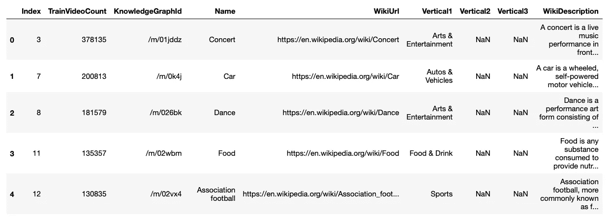
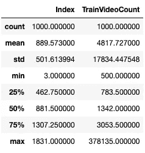

# YouTube-8M 数据集

> 原文：<https://medium.com/google-cloud/youtube-8m-dataset-c2ee9c79d136?source=collection_archive---------1----------------------->

计算机视觉|视频理解


[YouTube-8M](https://research.google.com/youtube8m/) 是谷歌 AI/Research 于 2016 年开发的一个项目，旨在大规模推动计算机视觉、表征学习和视频建模架构的创新和进步。

我已经研究这个数据集和示例代码好几个星期了，这篇文章总结了数据集的来源、结构以及在哪里可以找到它。我还分享了在 Kaggle 上许多地方发布的初步探索步骤。

# **数据集|项目历史**

研究团队最初在 2016 年为该数据集策划了 800 万个 YouTube 视频(50 万小时)和 4.8K(平均 3.4 个标签/视频)的视觉标题。他们启动这个项目的部分原因是为了帮助解决缺乏大规模、带标签的数据集的问题，方法是向公众提供对这种精选数据集和预计算要素的访问权限。

这个项目的一个关键目标是消除存储和计算障碍，以帮助加速对大规模视频理解的研究。类似于 ImageNet 如何通过创建大规模图像数据集和允许研究人员访问来实现机器学习特别是计算机视觉的持续突破。YouTube-8M 团队在 2016 年 9 月 27 日发表了他们的初步研究成果， [YouTube-8M:大规模视频分类基准](https://arxiv.org/pdf/1609.08675.pdf)。

在过去的四年里，研究团队已经在数据集上运行了 3 次 Kaggle 挑战，并举行了 3 次研讨会。如下所述，每个 Kaggle 挑战都有不同的侧重点。

*   [第一场比赛](https://www.kaggle.com/c/youtube8m) |开发分类算法，精确分配视频级别标签。目标是用无约束模型推进视频级注释。
*   [第二场比赛](https://www.kaggle.com/c/youtube8m-2018) |通过创建模型大小低于 1GB 的紧凑视频分类模型，学习预算限制下的视频表示。目标是用受约束的模型推进视频级注释。
*   [第三届竞赛](https://www.kaggle.com/c/youtube8m-2019) |寻找并分享被称为时间概念本地化的特定视频瞬间。将视频级别的标签定位到标签实际出现的视频中的精确时间，并以前所未有的规模做到这一点。

# 数据集结构

YouTube-8M 数据经历了几次不同的迭代。该数据集是根据 YouTube 上公开的视频和标签构建的。该数据集在过去四年中已经过调整和变形，最初的 800 万视频数据集已被废弃。当前可用的数据集有:

*   视频= 610 万个视频，3862 个类别，3.0 个标签/视频，2.6 亿个视听功能
*   视频片段= 23 万个人工验证的片段标签，1000 个类别，平均每个视频 5 个片段

YouTube-8M 网站上引用的数据集是最新的，侧重于视频片段。因此，它使用视频数据集的一部分，并将焦点缩小到这些视频片段的 1000 个类别。

## 特征压缩

数据存储的实际结构是在压缩的 protobuf 文件中，这些文件使用 TensorFlow 中这些类型的文件结构的 tensorflow 版本。Example 和 tensorflow.SequenceExample。每个视频都存储在这些类型的对象之一中，然后分组到 TFRecords 中。

考虑到原始的 800 万个超过 50 万小时的视频，因为原始数据集是数百 TB，所以需要压缩以使开发模型更容易。对于帧级特征，整个视频帧图像(每秒一帧，每个视频的前 360 秒)通过最初在 ImageNet 上训练的公开可用的 Inception 网络进行预处理。这将维数降低到每帧 2048 个特征，并从视频中提取运动，本质上使其成为静止视频。研究表明，随着视频数据的大小和多样性的增加，运动特征的回报逐渐减少。还应用了带白化的 PCA 以减少到每帧 1024 个特征。最后，数据从 32 位数据类型压缩到 8 位数据类型。更多信息可以在论文 [YT-8m:大规模视频分类基准](https://arxiv.org/pdf/1609.08675.pdf)中找到。

## 张量流。例| tensorflow。序列示例

张量流。示例结构是一种包含键值存储特性的紧凑数据格式，其中每个键(字符串)映射到一个值。这是一个压缩字节、浮点或 int64 列表。这是一种标准化开放数据格式的方法，可以灵活地定义写入和读取数据时的配置。这基本上是 TensorFlow 的协议缓冲区(protobuf)方法，使其易于存储和共享非结构化数据。所以你定义了什么是键和它的相关值。视觉效果是非结构化数据，需要这种类型的存储机制。

张量流。SequenceExample 表示一个或多个序列以及适用于整个示例的一些上下文。两者之间的真正区别在于 SequenceExample 有一个 FeatureList，它表示一个特性在一段时间内的值，相当于整个帧。

由于视频的维度缩减转换，您无法转换回其原始形式，但标签的存在有助于验证结果。

## TFRecord

TFRecord 是一种存储二进制记录的简单格式，或者换句话说，它是 TensorFlow 项目创建的一种数据类型，用于序列化数据并允许线性读取数据。的。tfrecord 文件存储了几百个张量流。例子或者张量流。sequence 每个都是 100-200 MB 的示例对象。

## 特征类型

有 2 个版本的功能:帧级和视频级。视频级特征是每视频的平均音频和 rgb 特征，其少于每帧的特定音频和 rgb 特征。

该数据集带有从每秒视频中预先提取的音频和视觉特征(总共 3.2B 个特征向量)。如果你想提取你自己的特征，你可以使用 [MediaPipe GitHub](https://github.com/google/mediapipe/tree/master/mediapipe/examples/desktop/youtube8m) repo 来帮助或创建你自己的特征提取器。当您想要将此应用于新数据集或探索尚未使用的要素时，这是很有价值的。

## 帧级训练数据

帧级数据集存储为 tensorflow。SequenceExample 对象并分组为总共 3，844 个 TFRecords。每张唱片可以容纳大约 287 个视频。这是用于分段相关分析的内容。总大小约为 1.53TB(估计约 110 万个视频)，结构如下:

*   **id** :唯一的 YouTube 视频 id。训练包括唯一实际值，测试/验证是匿名的
*   **标签**:该视频的标签列表
*   **rgb** : 1024 个 8 位量化视频 rgb 特征
*   **音频**:来自视频的 128 个 8 位量化音频特征

注意，量化是一种将输入从一大组值限制到一个较小/离散组的技术，8 位量化是一种与神经网络一起使用的流行方法，因为它对本质上压缩的数据范围施加了限制。这继续使得训练网络更快，同时保持模型在压缩信息中发现有价值信息的能力。

注意在所有压缩数据和特征的工作之后，帧级训练数据仍然是总计 **1.5TB** 。如果你决定下载它在你的机器上工作，确保你有足够的磁盘空间。

## 视频级训练数据

提供视频级要素的视频级数据集存储为张量流。示例对象总共分为 7，689 个 TFRecords。总大小在 **31GB** 左右。它具有以下结构:

*   **id** :唯一的 YouTube 视频 id。训练包括唯一实际值，测试/验证是匿名的
*   **标签**:该视频的标签列表
*   **mean_rgb** :视频 rgb 特征的平均值，长度为 1024 的浮点数组
*   **mean_audio** :长度为 128 的浮点数组的音频特征的平均值

在生成段级别标签和预测的起始代码示例中，没有引用该数据集。你仍然可以看看你是否想在其他方面探索和利用。

## 验证和测试数据

早期视频验证集的子集现在提供了片段级标签。下面列出的数据集是最新的，用于分段相关分析。有 3，845 个包含 tensorflow 的 TF record 用于验证和测试(总共 7，690 个 TF record)。SequenceExample 对象数据的总大小大约是 **24GB** 。

除了上面的帧级结构( *id，标签，rgb，音频*，对象还包括以下结构:

*   **分段开始时间**:分段开始时间列表
*   **分段结束时间**:分段结束时间列表
*   **段标签**:段标签列表
*   **segment_scores** :表示段标签对应的正或负的二进制值列表

注意，每个段级数据点的长度为 5 秒。

## 词汇

*vocabulary.csv* 是一个数据字典，用于将标签 id 映射到标签名称和视频分类的其他相关细节。基本上，数据示例和模型预测输出中的所有实际标签都是数字，这是您解读这些数字含义的解码环。在以段为中心的词汇文件中有 1000 个分类，并且它具有以下结构:

*   **索引**:标签 id
*   **TrainVideoCount** :该名称的训练视频数量
*   **知识图形 Id** :标签位置的知识图形 Id
*   **名称**:分类名称，如演唱会、汽车、美食
*   WikiUrl :关于这个名字的更多信息的 Wiki 链接
*   **垂直 1** :分类
*   **垂直 2** :附加分类
*   **垂直 3** :附加分类
*   **WikiDescription** :名称的 Wiki 描述(如其所述)

# 哪里可以找到数据

对于上面列出的每个数据组，截至本文发布之日，您可以访问这些数据的相应位置如下:

## 帧级训练数据

*   [YouTube-8M 网站](http://us.data.yt8m.org/2/frame/train/index.html)
*   *或*使用下载脚本下载数据集

```
curl [**data.yt8m.org/download.py**](http://data.yt8m.org/download.py) | partition=2/frame/train mirror=us python
```

*   谷歌云存储上的*或*链接

```
gs://us.data.yt8m.org/2/frame/train 
```

## 视频级训练数据

*   [YouTube-8M 网站](http://us.data.yt8m.org/2/video/train/index.html)
*   *或*使用下载脚本下载数据集

```
curl [**data.yt8m.org/download.py**](http://data.yt8m.org/download.py) | partition=2/frame/train mirror=us python
```

*   *或谷歌云存储上的*链接

```
gs://us.data.yt8m.org/2/video/train
```

*   *注:以上 GCS 链接包含列车及验证数据*

## **验证&试验数据**

*   在谷歌云存储上链接到它

```
validate files at gs://us.data.yt8m.org/3/frame/validate 
test files at gs://us.data.yt8m.org/3/frame/test
```

*   *或*使用 YouTube-8M 提供的 Python 脚本下载

```
curl [**data.yt8m.org/download.py**](http://data.yt8m.org/download.py) | partition=3/frame/validate mirror=us pythoncurl [**data.yt8m.org/download.py**](http://data.yt8m.org/download.py) | partition=3/frame/test mirror=us python
```

## 词汇

*   [YouTube 8M 网站](https://research.google.com/youtube8m/csv/segments/vocabulary.csv)
*   *或* [卡格尔](https://www.kaggle.com/c/youtube8m-2019/download/A5PWITvGRXAkSWO7YW1l%2Fversions%2FcuFZst73DwRXbhUzu4nZ%2Ffiles%2Fvocabulary.csv)

在此[链接](https://research.google.com/youtube8m/csv/2/vocabulary.csv)可以找到全部 3862 个分类 的 ***原始词汇。如果您探索功能并找到没有匹配名称的标签，这将很有帮助。***

# 探索数据

尽管网站和 Kaggle 描述了数据结构，但我喜欢看数据，通常使用类似 Jupyter 笔记本的东西来加载和浏览。以下是我在笔记本中探索数据的一些片段。

首先加载您需要的库

```
import tensorflow as tf
import pandas as pd
from IPython.display import YouTubeVideo
from google.cloud import storage, exceptions
```

注意，我在这个例子中使用了 TensorFlow 1.14，因为下面的代码是基于这个版本的。运行 TensorFlow 时，您会收到许多警告。下一个目标是将这段代码升级到 TF 的最新版本。

## 可见文件

创建一个指向要加载的文件的变量。

```
record = "[*PATH TO FILE*]/train00.tfrecord"
```

请注意，您需要将[ *文件路径* ]替换为您文件的位置

创建变量来保存 TFRecord 数据的不同部分。

```
vid_ids = []
labels = []
rgb = []
audio = []
```

要加载 TFRecord 文件中的所有示例，请使用以下迭代器。

```
for example in tf.compat.v1.python_io.tf_record_iterator(record):
    seq_example = tf.train.Example.FromString(example)
    vid_ids.append(seq_example.features.feature['id']
                   .bytes_list.value[0].decode(encoding='UTF-8'))
    labels.append(seq_example.features.feature['labels'] 
                   .int64_list.value)
    rgb.append(seq_example.features.feature['mean_rgb']
                   .float_list.value)
    audio.append(seq_example.features.feature['mean_audio']
                   .float_list.value)
```

查看记录中有多少视频，并选择一个视频 id。

```
print('Number of videos in this tfrecord: ',len(vid_ids))
print ('Number of labels in this tfrecord: ', len (labels))
print('Picking a youtube video id:',vid_ids[15])
```

返回以下结果:

```
Number of videos in this tfrecord:  287
Number of labels in this tfrecord:  287
Picking a youtube video id: 54hQ
```

如前所述，有 287 个视频或张量流。每个 TFRecord 的 SequenceExamples。

你会注意到视频 id 的含义并不清楚，因为它们已经被匿名化了。

```
print(vid_ids)['op00',
 'O900',
 'Oq00',
 'Li00',
 '1300',
 'gG00',
 'xI00'
....
```

我发现有一个地方可以为一些例子翻译这个 id，你可以使用以下内容。

```
curl [http://data.yt8m.org/2/j/i/op/op00.js](http://data.yt8m.org/2/j/i/op/op00.js)
```

它返回了一个页面，将文件中的视频 id 映射到 YouTube 视频 id。

```
i("op00","FBQ00Vk7Obs");
```

这显示了示例对象中的 id 如何映射回 YouTube 视频。我已经做了一些探索，并使 url 请求与一些文件视频 id 一起工作，但不是大多数。它肯定适用于 train00.tfrecord 或 train0000.tfrecord 文件。

将上面的 id 翻译成实际的 YouTube id 后，您可以直接在 YouTube 上查找该 YouTube 视频 id。您也可以在代码中输入以下 Python 命令，让它将视频加载到笔记本中。

```
YouTubeVideo(‘FBQ00Vk7Obs’)
```

瞧……

这是我发现的查看原始视频内容的唯一方法，并且只适用于非常小的文件分组。对大多数人来说，你必须相信分配给视频的实际类别，才能理解其中的内容。

## 词汇文件

vocabulary.csv 文件包含视频类别和其他详细信息，因此您可以看到模型结果转化为什么。要查看该文件的内容，请下载并使用 Pandas 将该文件加载到 DataFrame 对象中。

```
vocabulary = pd.read_csv(‘[*PATH TO FILE*]/vocabulary.csv’)
```

注意，将文件的[ *路径]替换为该文件的存储位置*

看一下列和前几行，了解一下数据。

```
vocabulary.head()
```



还可以获得数据帧信息的摘要。

```
vocabulary.info()
```

它给出了 1000 个尺寸类别的以下信息。

```
<class 'pandas.core.frame.DataFrame'>
RangeIndex: 1000 entries, 0 to 999
Data columns (total 9 columns):
 #   Column            Non-Null Count  Dtype 
---  ------            --------------  ----- 
 0   Index             1000 non-null   int64 
 1   TrainVideoCount   1000 non-null   int64 
 2   KnowledgeGraphId  1000 non-null   object
 3   Name              988 non-null    object
 4   WikiUrl           988 non-null    object
 5   Vertical1         1000 non-null   object
 6   Vertical2         153 non-null    object
 7   Vertical3         12 non-null     object
 8   WikiDescription   988 non-null    object
dtypes: int64(2), object(7)
memory usage: 70.4+ KB
```

您将看到*名称*有一些奇怪的空值，但是*垂直 1* 仍然有所有行的数据。考虑用 *Vertical1* 填充 *Name* 列。另外 *Vertical2* 和 *Vertical3* 有太多的空值，它们可能没多大关系。看看有什么，看看是否有任何价值，将有助于理解视频文件。如果这些列不能添加更多信息，请考虑删除它们。

并描述文件。

```
vocabulary.describe()
```

这给出了每个数字列的计数和一般统计信息。



作为处理数据的准备工作的一部分，加载数据、摆弄数据并提出问题是很好的，这样您就可以更好地理解您正在处理的内容。这只是探索数据的皮毛，还有许多其他的例子。

# 包裹

这篇文章提供了 YouTube-8M 数据集的概述。这是一个视频数据集，由谷歌研究团队建立，以大规模推进计算机视觉，它使用公开可用的 YouTube 视频。这篇文章讲述了数据集的来源、结构细节以及在哪里可以找到它。此外，我们对数据本身进行了一些初步探索，以便您可以更好地理解您必须处理的内容。

接下来的步骤是使用该数据集中已经生成的现有数据要素训练一些模型，并运行一些预测。