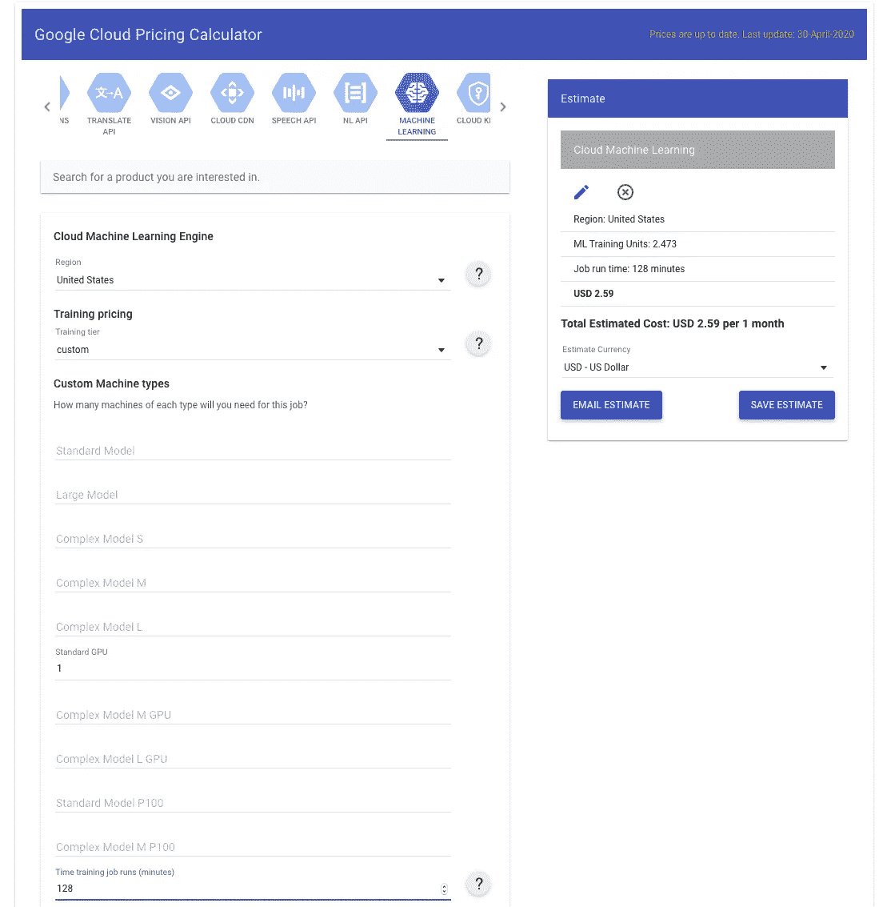

# 人工智能平台上的 YouTube-8M

> 原文：<https://medium.com/google-cloud/youtube-8m-on-ai-platform-f0a0f8688ce9?source=collection_archive---------2----------------------->


作为 YouTube-8M 探索和博客系列的继续，这篇文章介绍了如何使用人工智能平台来训练、评估和运行该数据集的预测。毫不奇怪，它设置服务器的速度比我手动配置的服务器要快。

在此之前的帖子提供了 YouTube-8M 项目、数据和计算机视觉建模的概述。在过去的几年里，这项研究已经被用于推进与视频数据集相关的计算机视觉。

下面，逐步介绍如何在云人工智能平台上设置和运行项目提供的示例代码，以及如何对其进行监控。有时间比较，我以前的设置，我也包括每项工作的成本。

# 人工智能平台

人工智能平台是一种托管服务，它可以轻松地在云上启动已配置的服务器和训练机器学习模型。你用 TensorFlow Keras 或者 TensorFlow Estimator 把你要运行的东西编码，选择机器类型，然后在 AI 平台上运行。该平台将处理配置，并根据需要上下旋转服务器来运行您的代码。您可以在平台外训练和运行预测。

# 入门指南

在 YouTube-8M 上使用人工智能平台需要几个设置步骤。您必须启用 API，在计算机/服务器上安装软件，在那里您将运行命令来使用平台，下载代码库并使数据可访问。

## 应用程序接口

在 GC 控制台中启用 Google AI 平台 API。


设置将要运行的作业所需的本地环境变量。

```
BUCKET_NAME=[*Name of the bucket for data*]JOB_NAME=[*Name for the job that will run in AI Platform*]
```

## 软件

无论您计划在哪里运行命令来启动您的云人工智能平台作业，请确保安装以下软件:

*   [谷歌云平台账号设置和配置](https://nyghtowl.com/here-we-go-again-gcp-setup-cli-access-ff37fb539a6a)
*   [Python 3.6+已安装](https://nyghtowl.com/first-contact-cloud-compute-engine-virtual-machine-setup-8d17ec55cfdf)
*   [TensorFlow 1.14 已安装](https://nyghtowl.com/first-contact-cloud-compute-engine-virtual-machine-setup-8d17ec55cfdf)

检查安装的版本。

```
python --version
python -c 'import tensorflow as tf; print(tf.__version__)'Data
```

## 代码库

将 YouTube-8M 代码库下载到您的计算机上。

```
cd ~/yt8m/code && git clone [https://github.com/google/youtube-8m.git](https://github.com/google/youtube-8m.git)
```

从该目录级别运行命令。

```
~/yt8m/code
```

## 数据

您需要数据来做建模，幸运的是，这个项目已经将数据处理并压缩到 TFRecords 中。这篇[博文](https://nyghtowl.com/youtube-8m-dataset-c2ee9c79d136)提供了关于数据集的更多信息。为了在人工智能平台上使用这些数据，您的数据集需要能够在云存储或人工智能平台可以访问的等效设备中访问。

***输入数据***

幸运的是，数据集已经在云存储上公开可用，因此您可以使用 *gsutil* 访问不同的文件。您可以设置指向这些公共存储桶的环境变量。

```
TRAIN_BUCKET='gs://us.data.yt8m.org/2/frame/train/train*.tfrecord'
VALIDATE_BUCKET='gs://us.data.yt8m.org/3/frame/validate/validate*.tfrecord'
TEST_BUCKET='gs://us.data.yt8m.org/3/frame/test/test*.tfrecord'
```

您还可以将数据放入项目的云存储中。该命令支持从本地文件到存储桶的推送。

```
gsutil -q -m cp -r [*LOCAL FOLDER PATH*] gs://[*TRAIN BUCKET NAME*]
```

然后，您可以将您的存储桶地址用于以下命令中的数据输入。注意，我用-q 表示 quiet，以防止它在加载时列出每个文件，用-m 表示 quiet，以使它并行并更快地上传。

***输出数据***

创建一个或多个存储桶来保存输出数据，如模型、日志和作业生成的任何其他文件。

可用于创建输出桶的命令。你可以做出改变。

```
OUTPUT_BUCKET=gs://${USER}_yt8m_train_bucketgsutil mb $OUTPUT_BUCKET
```

## 估计成本|定价

为了了解在人工智能平台上运行这样一个任务需要多少成本，人工智能产品资源链接有一个很好的定价概要。下面我一步一步介绍在人工智能平台上使用的机器配置，以及成本是如何计算的

**机器配置**

要了解 YouTube-8M 如何定义云设置，请查看 [cloudml-gpu.yaml](https://github.com/google/youtube-8m/blob/master/cloudml-gpu.yaml) 了解配置细节并进行更改。当前配置设置为*自定义 scaleTier* 和 *standard_gpu 主类型。*这个其实和 *BASIC_GPU scaleTier* 一样。

*standard_gpu* 类型是使用 n1-standard-8 计算引擎的标准机器类型(8 个 vCPUS、30GB 内存、最大总 PD 存储容量 257 TB)，包括 1 个 NVIDIA Tesla K80 GPU。在使用 AI 平台之前，我手动配置了一个不包含 GPU 的 n1-standard-8。手动配置服务器需要几天时间，而在 AI 平台上运行一个实例不到 10 分钟。

该[页面](https://cloud.google.com/ai-platform/training/docs/machine-types)提供了更多关于机器类型的详细信息。请注意，您可以更改 AI 平台中的配置，以使用多个 GPU，并在多个工作人员/服务器上分割和运行培训。当您有更复杂的模型(更多计算)和大型数据集要处理时，添加更多的 GPU 和工作人员可能会减少培训时间。然而，对于更简单的模型或更少的数据，它可能不会快很多。

**成本明细**

根据定价资源指南， *standard_gpu* 类型基于基本价格和培训单元数量，每小时价格为 0.8300 美元。对于这种机型，价格基于 1.6939 训练单位。一个培训单元的基本价格为每小时 0.49 美元(0.83 美元/1.6939 美元)或每分钟 0.0081 美元。

在 AI 平台上运行一个作业以 1 分钟为增量收费，每个作业最少需要 10 分钟，因此在当前配置下最少需要 0.08 美元。请注意，所有这些都是截至发帖之日，在美国的位置。

使用此等式，使用*消耗的 ML 单位*来计算培训成本。

```
Consumed ML units * base price
```

*消耗 ML 单位*可以在*作业详细信息*页面中找到，并显示在考虑作业持续时间的情况下使用了多少机器学习培训单位。


使用 3.44 毫升单位(128 分钟)的工作示例，基价为 0.49 美元。

```
3.44 * $0.49 = $1.69
```

这个[定价计算器](https://cloud.google.com/products/calculator)也可以帮助进行成本估算。我发现它运行得有点高，这可能是有帮助的，当实际成本较低时，会稍微令人满意。从产品列表中选择*机器学习*(找到本文顶部的标志)并填写与您的设置相关的表格。点击*添加评估*以获得右侧的结果。这就是我的例子。



我已经逐步介绍了上面的定价，因为在接下来的部分中，我在每个示例中都包括了运行该作业的成本。让我们面对它，这是一个关键问题时，决定你用什么。

# 火车

一旦有了本地终端和数据设置，就可以开始考虑训练模型了。训练包括找出你想要使用的算法，并对该模型进行编码，然后通过算法运行数据，以创建针对该问题的模型。

我使用了示例代码 YouTube-8M 项目，它包括帧级逻辑回归和帧模型选项的深层包。这篇[上一篇文章](/@nyghtowl/youtube-8m-training-inference-eb37ac5f708f)提供了模型的概述。

## 帧级

对于帧级模型，从终端运行以下命令。

```
JOB_NAME_FRAME_TRAIN=yt8m_train_frame_$(date +%Y%m%d_%H%M%S)gcloud --verbosity=debug ai-platform jobs submit training \
$JOB_NAME_FRAME_TRAIN --package-path=youtube-8m \
--module-name=youtube-8m.train \
--staging-bucket=$OUTPUT_BUCKET \
--config=youtube-8m/cloudml-gpu.yaml \
-- --train_data_pattern=$TRAIN_BUCKET \
--frame_features --model=FrameLevelLogisticModel \
--feature_names="rgb,audio" --feature_sizes="1024,128" \
--train_dir=$OUTPUT_BUCKET/$JOB_NAME_FRAME_TRAIN --start_new_model
```

注意，空的`--`标志标志着`gcloud and ai-platform`特定标志的结束和要传递给应用程序的`ARGS / flags`的开始。查看此[链接](https://cloud.google.com/sdk/gcloud/reference/beta/ai-platform/jobs/submit/training)以获取更多关于 ai 平台标志的信息。

上面的命令运行了大约 13 个小时，花费了大约 11 美元。这并不是对我的纯 CPU 服务器的改进。

## 框架的深袋

对于 DBoF 模型，运行以下命令进行训练。

```
JOB_NAME_DBOF_TRAIN=yt8m_train_dbof_$(date +%Y%m%d_%H%M%S)gcloud --verbosity=debug ai-platform jobs submit training \
$JOB_NAME_DBOF_TRAIN --package-path=youtube-8m \
--module-name=youtube-8m.train \
--staging-bucket=$OUTPUT_BUCKET \
--config=youtube-8m/cloudml-gpu.yaml \
-- --train_data_pattern=$TRAIN_BUCKET \
--frame_features --model=DbofModel --feature_names='rgb,audio' \
--feature_sizes='1024,128' \
--train_dir=$OUTPUT_BUCKET/$JOB_NAME_DBOF_TRAIN --start_new_model
```

上面的命令运行了大约 33 个小时，而我无法在 CPU 服务器上完成培训，因为它没有足够的处理能力。这项工作大约花费 28 美元。

# 评价

为了提高模型的性能，对模型进行测试是很重要的。这是一个验证模型如何推广并调整以改进它的机会。

## 帧级

使用这些命令评估帧级模型。

```
JOB_NAME_FRAME_EVAL=yt8m_eval_$(date +%Y%m%d_%H%M%S)gcloud --verbosity=debug ai-platform jobs \
submit training $JOB_NAME_FRAME_EVAL \
--package-path=youtube-8m --module-name=youtube-8m.eval \
--staging-bucket=$OUTPUT_BUCKET \
--config=youtube-8m/cloudml-gpu.yaml \
-- --eval_data_pattern=$VALIDATE_BUCKET \
--frame_features --model=FrameLevelLogisticModel \
--feature_names='rgb,audio' --feature_sizes='1024,128' \
--train_dir=$OUTPUT_BUCKET/$JOB_NAME_FRAME_TRAIN --segment_labels \
--run_once=True
```

上面的命令运行了 24 分 52 秒，花费了大约 0.27 美元。这实际上比只有 CPU 的服务器多花了几分钟。这是一个很好的例子，根据数据集的大小和模型的复杂程度，您可能不需要太多的计算能力来完成工作。此外，当你有更多的数据要处理时，使用 GPU 或 TPU 会变得更加有益。

## DBoF

使用此命令评估 DBoF 模型。

```
JOB_NAME_DBOF_EVAL=yt8m_eval_dbof_$(date +%Y%m%d_%H%M%S)gcloud --verbosity=debug ai-platform jobs \
submit training $JOB_NAME_DBOF_EVAL \
--package-path=youtube-8m --module-name=youtube-8m.eval \
--staging-bucket=$OUTPUT_BUCKET \
--config=youtube-8m/cloudml-gpu.yaml \
-- --eval_data_pattern=$VALIDATE_BUCKET \
--frame_features --model=DbofModel --feature_names='rgb,audio' \
--feature_sizes='1024,128' \
--train_dir=$OUTPUT_BUCKET/$JOB_NAME_DBOF_TRAIN --segment_labels \
--run_once=True
```

上面的命令运行了 1 小时 20 分钟，花费了大约 1.03 美元。没有什么可以和我的纯 CPU 服务器相比，因为我无法完成 DBoF 的培训。

# 预测|推理

一旦模型的性能达到您的阈值，就可以设置模型来运行推理。构建这个代码库是为了输出一个预测文件提交给 Kaggle。你可以将这个文件提交给 Kaggle 的比赛，以了解你的表现。

## 帧级

使用此命令在框架级模型上运行推理并获得预测。

```
JOB_NAME_FRAME_TEST=yt8m_inference_frame_$(date +%Y%m%d_%H%M%S);gcloud --verbosity=debug ai-platform jobs \
submit training $JOB_NAME_FRAME_TEST \
--package-path=youtube-8m --module-name=youtube-8m.inference \
--staging-bucket=$OUTPUT_BUCKET \
--config=youtube-8m/cloudml-gpu.yaml \
-- --input_data_pattern=$TEST_BUCKET \
--train_dir=$OUTPUT_BUCKET/$JOB_NAME_FRAME_TRAIN \
--segment_labels \
--output_file=$OUTPUT_BUCKET/$JOB_NAME_FRAME_TEST/predictions.csv
```

上面的命令运行了 35 分 5 秒，花费了大约 0.41 美元。这是我的纯 CPU 服务器示例时间的两倍。当然，我们运行的是一次性结果，通常您会将模型投入生产，并以批处理或流式方式运行数据。然而，预测所需的计算通常比训练所需的要少。

## DBoF

使用此命令对 DBoF 模型运行推理并获得预测。

```
JOB_NAME_DBOF_TEST=yt8m_inference_dbof_$(date +%Y%m%d_%H%M%S);gcloud --verbosity=debug ai-platform jobs \
submit training $JOB_NAME_DBOF_TEST \
--package-path=youtube-8m --module-name=youtube-8m.inference \
--staging-bucket=$OUTPUT_BUCKET \
--config=youtube-8m/cloudml-gpu.yaml \
-- --input_data_pattern=$TEST_BUCKET \
--train_dir=$OUTPUT_BUCKET/$JOB_NAME_DBOF_TRAIN --segment_labels \
--output_file=$OUTPUT_BUCKET/$JOB_NAME_DBOF_TEST/predictions.csv
```

上面的命令运行了大约 43 分 17 秒，花费了大约 0.51 美元。

## Kaggle 分析

一旦你得到了*预测. csv* 文件，你可以在*迟交*下提交到 [Kaggle 网站](https://www.kaggle.com/c/youtube8m-2019/submit)。


它会给你一个分数，并显示你在排行榜上的位置。


我提交给 Kaggle 的框架级和 DBoF 示例得分差不多。它输出上面的屏幕截图。考虑到这是公共代码，而且我想很多人都尝试过，这并不是一个令人惊讶的结果。

# 人工智能平台作业状态和日志

当你在 AI 平台上运行作业时，有几种不同的方法来观察作业的进展情况，以及在作业完成后获得洞察力。您可以在您的终端或谷歌云控制台中查看进度。

## 本地终端

运行这些命令后，您将获得作业正在加速的状态，以及查看有关状态的更多信息的命令和链接。

以下描述了您的终端中作业的当前状态:

```
gcloud ai-platform jobs describe $JOB_NAME
```

其中一个输出是 state。还有一个命令可以在您的终端中流式传输日志。

```
gcloud ai-platform jobs stream-logs $JOB_NAME
```

## 谷歌云控制台

在谷歌云控制台中，我能够观察到 *AI 平台*板块下*作业*中训练、评估和推理作业的表现。


您可以看到这些作业已经完成，并且可以看到它们运行了多长时间。*经过的时间*随着作业的运行而更新。

单击该作业，了解其性能的更多详细信息。


此外，您可以在*(操作)日志*和*日志查看器*下获得详细的日志信息。


我喜欢让 AI 平台作业的窗口和日志查看器保持打开，以跟踪进度和监控任何错误。

## 取消工作

如果您需要取消某个作业，那么您可以从控制台或终端进行取消。

```
gcloud ai-platform jobs cancel $JOB_NAME
```

作业完成后，它会将输出文件存储到您指定的路径，并终止服务器。

# 包裹

这是在人工智能平台上运行 YouTube-8M 计算机视觉数据集的概述。你可以看到如何设置运行人工智能平台，如何估计成本，以及这个数据集和示例模型的大致情况。它逐步介绍了如何在提供的样本 TensorFlow 代码基础上训练、评估和运行预测，以及如何将这些预测提交给之前的 Kaggle 竞赛。如果你想尝试人工智能平台和计算机视觉，这是一个你可以使用的例子。