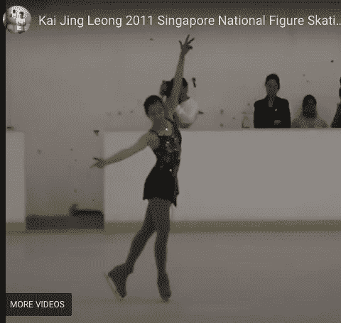

# YouTube-8M 训练和推理

> 原文：<https://medium.com/google-cloud/youtube-8m-training-inference-eb37ac5f708f?source=collection_archive---------4----------------------->

计算机视觉|视频理解



在之前的 [YouTube-8M 数据集帖子](https://nyghtowl.com/youtube-8m-dataset-c2ee9c79d136)的基础上，这篇帖子涵盖了使用 [GitHub repo](https://github.com/google/youtube-8m) 的入门部分提供的内容进行模型训练。所涉及的模型的目标是搜索视频中的特定时刻，这被称为时间概念定位。

过去，元数据用于搜索视频。这些较新的模型能够在这些主题出现的特定时间戳对视频中的特定片段进行分类。例如，模型可以帮助识别视频中所有有巧克力、有人睡觉或有人滑冰的点。

下面逐步介绍如何训练示例模型，使用 YouTube-8M 项目提供的代码评估和运行推理。示例代码是 Python，使用 TensorFlow。这是一个很好的例子，说明了如何使用该数据集。

# 文件结构设置

首先，在您对模型进行定型、评估和运行预测的服务器上设置以下文件结构。

*   ${HOME}/ yt8m/code/
*   $ { HOME }/yt8m/车型/车架/
*   $ { HOME }/yt8m/2/架/列/
*   ${HOME}/yt8m/3/frame/validate/
*   $ { HOME }/yt8m/3/帧/测试/

## 起始代码

从 GitHub repo 中提取启动代码。

```
cd ~/yt8m/code && git clone https://github.com/google/youtube-8m.git
```

## 数据

下载数据并将其放入正在训练的数据文件中，在谷歌云中验证、测试或引用它们。关于这些数据的更多信息以及在哪里可以找到这些数据都在这个[的帖子](https://nyghtowl.com/youtube-8m-dataset-c2ee9c79d136)中。

使用这些文件夹进行存储:

*   $ { HOME }/yt8m/2/架/列/
*   ${HOME}/yt8m/3/frame/validate/
*   $ { HOME }/yt8m/3/帧/测试/

## 启动器算法

一旦建立了结构并且数据就绪，您就可以开始使用初始的 starter 算法来创建模型了。代码库提供了一些算法供实验。

**框架级逻辑回归模型**

逻辑模型在“一对一”方法中接受训练，这意味着它有助于从多个类别中得出单个预测。在该算法中，1000 个类中的每一个都有一个模型，并且使用分段逻辑模型。为每一帧产生每一类的预测分数，最多 5 个分段，并且这些预测被平均(平均池)以获得分段级预测。这种类型的模型就像有一个评委小组给出预测，并对最终预测的结果进行平均。

**深度框架包(DBoF)池模型**

该模型最初是受用于视频分类的经典单词包表示的启发。从片段中随机选择的一组帧被用作输入，并且特征被提取。这是一个卷积神经网络，其中卷积层是对帧应用权重的上采样。这在帧级别上提供了输入要素的强表示，因为这是一种提供更多要素细节的技术(增加下一图层的输入大小)。第二层将前一层汇集成段级结果(减小大小)。因此，它将参数扩展到帧级别，然后将它们收缩到片段级别，以显示片段的概要预测。更多的输入和功能可以稍微改善结果。例如，包括像素和音频可以帮助提高分数。

# 火车

为了训练模型，移动到 *youtube-8m* 文件夹(如果你做了上面的设置，它应该在~/ yt8m/code/目录下)来运行命令或确保调整到有意义的位置。

## **框架层次的 Logistic 回归模型**

使用终端命令运行帧级逻辑回归模型。

```
python3 train.py --frame_features --model=FrameLevelLogisticModel \
--feature_names="rgb,audio" --feature_sizes="1024,128" \
--train_data_pattern=${HOME}/yt8m/2/frame/train/train*.tfrecord \
--train_dir="${HOME}/yt8m/models/frame/sample_model_logistic" \
--start_new_model
```

使用之前的 system I 设置(仅 n1-standard-8 CPU)，它训练了 12 个小时，每秒处理 400-500 个示例，循环 18，000 多个步骤。损失从 8-9 左右开始，下降到 5-6，并在 5 小时后保持不变。所以你可以少跑几步，但是要考虑调整超级参数。生成的模型存储在 ***sample_model_logistic 文件夹*** 中。运行所花的时间是一个很好的例子，说明为什么 GPU 是很好的用途。我将在以后的文章中对此进行更深入的探讨。

**深度框架包(DBoF)池模型**

使用以下命令运行 DBoF 模型的启动代码。

```
python3 train.py --frame_features --model=DbofModel \
--feature_names="rgb,audio" --feature_sizes="1024,128" \
--train_data_pattern=${HOME}/yt8m/2/frame/train/train*.tfrecord \
--train_dir="${HOME}/yt8m/models/frame/sample_model_dbof" \
--start_new_model
```

生成的模型将存储在 sample_model_dbof 文件夹中。注意，我的机器没有足够的计算机能力来完成这个模型的训练。所以你肯定需要一个 GPU 来运行这个。

## Train.py 标志和默认值

请注意，有许多标志可以传递到上述命令中，以调整 hyper 参数和训练设置。标志和标准设置可以在 GitHub repo *train.py* 文件中找到。以下是文件中的标志和默认值:

*   train_dir="/tmp/yt8m_model/"
*   train_data_pattern= " "
*   feature_names="mean_rgb "
*   feature _ sizes = " 1024 "
*   框架 _ 特征=假
*   段标签=假
*   model="LogisticModel "
*   start_new_model=False(你必须添加它来启动一个新模型，否则它不会)
*   num_gpu=1
*   batch_size=1024
*   正则化 _ 惩罚=1.0
*   基础学习率=0.01
*   学习率衰减=0.95
*   学习率衰减示例=4000000
*   次数=5
*   max_steps=None(训练循环的最大迭代次数)
*   导出模型步骤=1000
*   num_readers=8(多少个线程用于读取输入文件)
*   optimizer="AdamOptimizer "
*   剪辑 _ 渐变 _ 正常=1.0
*   日志设备位置=假

查看 *train.py* 文件以获得关于每一个的更多细节，并尝试使用它们和改变缺省值。

## 模型输出文件

训练完成后，模型文件存储在创建的文件夹中。文件夹中有几个文件，包括一个 *graph.pbtxt* 文件，该文件可以加载到 TensorBoard 中，以便在训练时可视化模型性能。

要关注的主要文件是 3 种类型，它们在文件夹中有许多版本。默认情况下，使用 TensorFlow 的检查点保存方法，该方法将模型的训练权重分割成一组检查点格式的二进制文件。有一个索引文件可以帮助导航哪个权重存储在哪个碎片中。这种保存方式的价值在于，您可以在多台机器上训练模型，并将数据分散到不同的机器上以加快训练速度。你也可以停止和重新开始训练，它会知道它离开了。

下面列出了文件夹中的文件类型:

*   **元文件**(。meta):存储在恢复检查点之前需要导入的已保存图形结构
*   **索引文件**(。index):它是一个字符串-字符串不可变表。每个键是一个张量的名称，它的值是一个序列化的 BundleEntryProto。每个 BundleEntryProto 描述了张量的元数据:哪个“数据”文件包含张量的内容、该文件中的偏移量、校验和、一些辅助数据等。
*   **数据文件**(。data-00000-of-00001):它是 TensorBundle 集合，保存所有变量的值

# 评价

一旦你有了一个工作模型，验证并评估它，看看它是否足够通用于新的例子。

使用以下命令评估模型:

```
# Frame-level
python3 eval.py \
--eval_data_pattern=${HOME}/yt8m/3/frame/validate/validate*.tfrecord
--train_dir ${HOME}/yt8m/models/frame/sample_model_logistic \
--segment_labels --run_onceOR #DBoF
python3 eval.py \
--eval_data_pattern=${HOME}/yt8m/3/frame/validate/validate*.tfrecord
--train_dir ${HOME}/yt8m/models/frame/sample_model_dbof \
--segment_labels --run_once
```

在*框架级模型*上运行评估需要 20 分钟。总共处理了 235，256 个示例。注意，这个文件中有特定的标志来帮助调整评估函数的工作方式。以下是最终的评估指标和详细信息。

*   处理的例子= 235 256
*   Avg_Hit(首次预测的准确率)= 0.558
*   Avg_PERR(等召回率下的精度)= 0.558
*   Avg_Loss(平均损失)= 19.756

常用于测量物体检测器的精度:

*   MAP(平均精确度/精确度-召回曲线下面积的平均值)= 0.752
*   GAP(基于每个示例的前 20 个预测的全局平均精度)= 0.778

这些结果已经足够了，你可以做得更好。调整网络、获取更多数据和尝试不同的模型结构是提高性能的方法。

# 推理

要使用该模型对从未见过的新数据进行预测，请使用以下命令。

```
#Frame-level
python3 inference.py \
--train_dir ${HOME}/yt8m/models/frame/sample_model_logistic \
--output_file=${HOME}/yt8m/models/frame/sample_model_logistic/ks.csv
--input_data_pattern=${HOME}/yt8m/3/frame/test/test*.tfrecord \
--segment_labels --batch_size=64OR # DBoF
python3 inference.py \
--train_dir ${HOME}/yt8m/models/frame/sample_model_logistic \
--output_file=${HOME}/yt8m/models/frame/sample_model_dbof/ks.csv \
--input_data_pattern=${HOME}/yt8m/3/frame/test/test*.tfrecord \
--segment_labels --batch_size=64
```

运行耗时 13 分钟，在*帧级模型上处理了 2062258 个示例。*

完成后，它将输出一个文件用于预测，并共享结果文件的位置， *ks.csv* (我将其缩短以适应上面的行，但您可以随意命名。)*，*在你的 */tmp/* 目录下。推理完成后会列出确切的目录。您可以使用 *vocabulary.csv* 文件来转换数字，以查看预测的类别。您无法通过查看原始文件来验证这是否正确，因为它是经过压缩的。关于压缩的更多信息在之前的关于数据集的[博客文章](https://nyghtowl.com/youtube-8m-dataset-c2ee9c79d136)中提供，学术论文在下面的参考资料部分列出。

为了评估您在推理结果上的表现，您仍然可以在竞赛结束后提交竞赛，以从 Kaggle 获得您的模型表现如何的分数。您还可以使用自己的数据集来运行该模型并查看结果。不，您需要做大量的工作来将数据集设置为模型。

如果要将预测与结果进行比较，可以对验证数据集运行预测，并在预测和标注之间进行数字比较。如果您已经使用如上所述的验证来评估和调整模型，这并不理想；然而，这是一种实际看到它看起来像什么的方法。

# 包裹

所涵盖的内容是如何为 YouTube-8M 数据集开发主题的时间本地化模型。这一步通过训练，评估和运行在完成的模型推理的例子。

还有许多其他模式可供探索，您可以从 Kaggle 竞赛的获胜者开始，看看在每个竞赛的讨论板上分享解决方案的其他人。对于最新的 Kaggle 竞赛，[这个](https://www.kaggle.com/c/youtube8m-2019/discussion/112869)是最近的解决方案。

大多数解决方案利用某种类型的集合模型。这些可以是有趣的和有趣的实验。最好的情况是从成功和简单的东西开始。进行调整和扩展。你的模型越复杂，你可能需要的计算能力就越强。

此外，还有其他视频数据集可以探索，如 DeepMind 的[动力学](https://deepmind.com/research/open-source/kinetics)数据集。这是用于人体动作分类的良好建立的视频数据集。这是在视频领域探索的一个很好的选择。有超过 65 万个视频剪辑，涵盖了 7K 个类别，包括像演奏乐器或拥抱这样的动作。每个剪辑是一个持续 10 秒钟的单个动作。越来越多的人使用像 ImageNet 这样的数据集，这是视频表示预训练视频的一个很好的选择。

现在你有了，继续探索计算机视觉模型。

# 资源

*   [YouTube-8M 视频分类](http://cs231n.stanford.edu/reports/2017/pdfs/705.pdf)
*   [逻辑回归仍然有效:IVUL-KAUST 团队的 3d YouTube 8M 挑战解决方案](https://static.googleusercontent.com/media/research.google.com/en//youtube8m/workshop2019/c_15.pdf)
*   [谷歌云平台中提高 YouTube-8M 分类准确率的有效方法](https://arxiv.org/pdf/1706.08217.pdf)