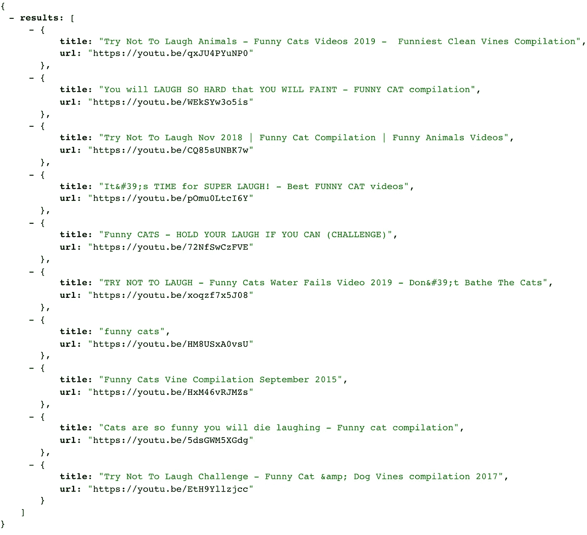

# YouTube API +云运行

> 原文：<https://medium.com/google-cloud/youtube-api-cloud-run-41109db98584?source=collection_archive---------0----------------------->


哥伦比亚[麦德林现代艺术博物馆](https://goo.gl/maps/BhJ9poh4r2m6aaa19)的云跑贴纸。YouTube + Python 标志。

YouTube 提供了一个免费、简单、强大的 API，用于以编程方式查询和与 YouTube 交互。在本文中，我们将讨论如何构建一个无服务器的应用程序来返回随机的猫视频🐱使用**云运行**和 **YouTube API** 中的 **Python** 。

## 我们将分三步构建我们的 web 应用程序:

1.  启用 YouTube API 并创建 API 密钥。
2.  用 Python 3 写一个 Flask 应用。
3.  将服务部署到云运行。

# 设置 YouTube API

YouTube 为查询视频、查看视频分析和直播等任务提供了各种 API。

YouTube[DataAPI](https://developers.google.com/youtube/v3)(v3)让我们可以像在搜索栏中一样轻松地查询 YouTube 的视频数据库。API 密钥可用于身份验证。

## 启用 YouTube 数据 API v3

启用 YouTube 数据 API (v3):

1.  去 console.cloud.google.com/flows/enableapi?apid = YouTube . Google APIs . com。
2.  选择您的项目并按下`Continue`。

## 下载 API 密钥

1.  去 console.cloud.google.com/apis/credentials。
2.  点击`Create Credentials`，然后点击`API key`。
3.  复制这把钥匙。你以后会需要它的。

# 安装 Python 依赖项

*确保使用虚拟环境*`*venv*`*`source env/bin/activate`。*

*在这个演示中，我们将创建一个简单的 Python web 服务器。用`pip`安装 Flask、Google API 客户端和 Google Auth helper:*

```
*pip install --upgrade flask google-api-python-client google-auth-httplib2*
```

# *编写一个 Python Web 服务器程序*

*创建一个向 YouTube 数据 API (v3)发出请求的 Flask 应用程序:*

# *本地运行 Flask 应用程序*

*我们将使用 Flask CLI 在本地测试我们的 web 服务器:*

```
*export FLASK_APP=app.py
export KEY=AIzaSyCA-fe_wGJpUthisQgisl25fakeXqUNzk # Your API key
flask run*
```

> *用之前创建的 API 键替换`KEY`的值。*

**

*加载终端打印出来的 URL，如`[http://127.0.0.1:5000/](http://127.0.0.1:5000/)`。*

*您可以使用查询参数`q`来搜索除默认查询`cats`之外的不同视频。*

*左边是来自我们的 API 的示例响应*

**注意:*我使用[这个扩展](https://chrome.google.com/webstore/detail/json-formatter/bcjindcccaagfpapjjmafapmmgkkhgoa?hl=en)来创建带有可点击链接的漂亮 JSON。*

# *将服务部署到云运行*

*为了部署到 Google Cloud Run，我们需要确保我们的本地环境与使用 Cloud Run 的环境相同。为此，让我们创建一个`.env`文件来存储我们的 API 密钥:*

```
*KEY=AIzaSyCA-fe_wGJpUthisQgisl25fakeXqUNzk # Your API key*
```

*我们还需要一个`Dockerfile`。`Dockerfile`声明我们需要一个包含 Python 3.7、我们的应用程序文件和我们的包的容器:*

*运行这个 shell 脚本来构建您的容器并部署到云运行:*

> *太棒了。*

*您刚刚在 Cloud Run 上部署了一个使用 YouTube API 的 Flask 应用程序！*

**

*太棒了。*

# *后续步骤*

*感谢阅读！如果你对这篇博客感兴趣，这里有一些相关的学习资源:*

*   *🎥[文档:YouTube 数据 API](https://developers.google.com/youtube/v3/getting-started)*
*   *⬢ [博客发布:在云上部署节点 12 功能](/google-cloud/node-12-functions-on-cloud-run-d891dd93c7c8)*