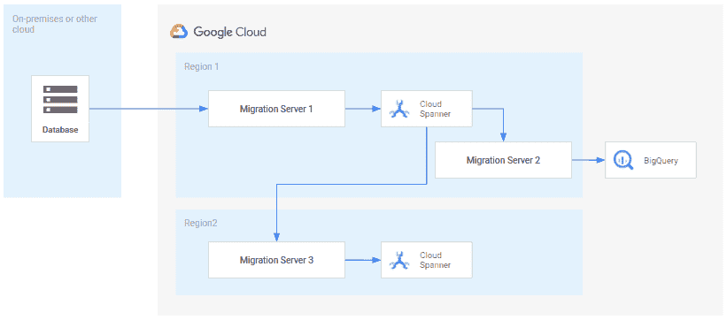

# 与 Cloud Spanner 之间的零停机数据库迁移和复制

> 原文：<https://medium.com/google-cloud/zero-downtime-database-migration-and-replication-to-and-from-cloud-spanner-99ad0c654d12?source=collection_archive---------1----------------------->

## 作者:Christoph Bussler

# 什么是零停机数据库迁移和复制？

零停机数据库迁移和复制([数据库迁移—概念和原理(第 1 部分)](https://cloud.google.com/solutions/database-migration-concepts-principles-part-1)、[数据库迁移—概念和原理(第 2 部分)](https://cloud.google.com/solutions/database-migration-concepts-principles-part-2))是指将数据从源数据库迁移或复制到目标数据库，而不影响客户对源数据库的可用性或可伸缩性访问。在数据库迁移或复制过程中，客户端可以继续对源数据库进行操作。

在一般情况下，数据库迁移将所有数据从源数据库迁移到目标数据库，目的是淘汰源数据库，使目标数据库成为主要系统和事实的来源。典型的用例是从内部环境中的自我管理数据库迁移到云管理的关系数据库，如 Google Cloud 中的 [Cloud Spanner](https://cloud.google.com/spanner) 。

数据库复制解决了连续复制数据而不打算淘汰源数据库的用例。相反，源数据库的数据可用于下游处理，例如 [BigQuery](https://cloud.google.com/bigquery) 中的分析。

对于迁移情况，零停机时间更好地称为接近零停机时间，因为在迁移完成后，客户端必须重新连接到目标数据库，这将导致一个断开连接的窗口。

下图显示了一个通用的迁移架构，涵盖了本博客中讨论的三个用例:

云扳手数据库迁移架构概述

*   [迁移到云扳手数据库](#746c):从内部环境或其他云环境进行迁移和复制
*   [从云扳手数据库迁移](#d06b):复制到分析系统 BigQuery
*   [两个云扳手数据库之间的迁移](#edda):两个不同地区的云扳手数据库之间的迁移和复制

该图显示了在迁移服务器上运行的迁移技术，用于执行迁移或复制的三个用例中的每一个。根据使用案例，可能是相同或不同的迁移技术，因为并非所有迁移技术都支持相同的源和目标数据库。

在您的具体环境中，您可能同时拥有所有这三个用例，或者只是其中的一个子集。

# 数据库迁移设计的关键领域

无论可用的迁移技术如何，都有一些迁移/复制设计的关键领域需要解决。这些是

*   [模式差异](#ff93):源数据库和目标数据库可能有不同的模式
*   [数据差异](#b85a):并非所有数据都必须迁移，相关子集也可以迁移
*   [缺少源数据库功能](#9f6b):源数据库提供了目标数据库中没有的功能
*   [可用的目标数据库功能](#45de):目标数据库具有源数据库中未使用或不可用的功能

# 图式差异

在 Cloud Spanner 的上下文中，源数据库和目标数据库模式是不同的，因为 Cloud Spanner 是云管理的，并且有自己的关系模式结构，如数据类型和可用的模式设计选项。唯一的例外是在具有相同模式的两个 Cloud Spanner 数据库之间迁移的用例——当然，在这种情况下，模式也可能不同。

目标数据库的模式设计必须确保它表示与源数据库模式相同的数据语义。表必须能够以结构(表、列)和数据类型存储来自源数据库的所有数据。后者可能需要将源数据库中的数据类型映射到目标数据库中的数据类型。如果一种类型没有直接的等价类型，那么必须选择替代类型，这可能需要在迁移运行时对正在迁移的实际数据进行转换。

虽然自动模式转换工具是一项有趣的技术，但它们只能提供第一近似值作为起点，因为一些模式设计决策还依赖于针对模式执行的事务组合。 [HarbourBridge](https://github.com/cloudspannerecosystem/harbourbridge) 就是这样一个例子，它能够生成云扳手模式，并从 PostgreSQL pg_dump 中填充云扳手数据库。然而，它的主要目标是引导云扳手评估过程，因为它忽略了许多 PostgreSQL 功能(例如，索引、存储过程、约束)或映射与 STRING(MAX)没有直接对应关系的数据类型。之后的迭代是手动的，以便优化模式设计。此外，模式定义是(配置)代码，因此需要通过 GitHub 这样的软件管理系统来控制。

# 数据差异

由于迁移到 Cloud Spanner 是两个不同系统之间的迁移或复制，对于没有直接匹配的数据类型，可能需要进行数据类型转换。

在许多情况下，所有来自源数据库的数据都会毫无例外地迁移到目标数据库。然而，情况并非总是如此。数据库迁移提供了一个清理数据的机会，只将数据迁移到实际需要的目标数据库。过滤可以确保只迁移符合特定标准的数据；不符合标准的数据可能会在迁移(或复制)过程中被丢弃。

# 缺少源数据库功能

每个数据库引擎在设计和构建时都有不同的设计重点和设计目标，从而产生一组不同的可用数据库功能。并非每个数据库引擎的每个功能在其他数据库引擎中都可用。

当迁移到 Cloud Spanner 时，源数据库中可能会使用一些 Cloud Spanner 目前无法直接使用的功能。在这种情况下，功能(如果在迁移后仍然需要)可能必须在应用层实现。例如，源数据库可能会利用存储过程、(物化)视图、分区、触发器、函数、序列或 Cloud Spanner 目前不提供的某些约束。

然而，在某些情况下，这是一种积极的情况，因为它迫使一个工程组织计划了很长时间的重构。随着时间的推移，与在应用层之外的存储过程中封装业务和事务逻辑的缺点相比，利用存储过程带来的性能提升是微不足道的。存储过程增加了额外的维护和开发开销，降低了可测试性(例如单元和集成测试)，增加了供应商锁定，增加了 CI/CD 管道的复杂性，特别是在推出场景(开发/测试/生产)和版本控制方面。例如，在源数据库中，可能使用了自治事务，这导致了数据库行为的不确定性，尤其是在失败的情况下。Cloud Spanner 不提供自治事务的概念，因此强制将自治事务重新实现为常规事务。这提高了实现的清晰度以及系统行为。

# 可用的目标数据库功能

在许多情况下，目标数据库具有源数据库中没有的特性。在 Cloud Spanner 的例子中，一个例子是[交叉表](https://cloud.google.com/spanner/docs/schema-and-data-model#parent-child_table_relationships)，也就是父子关系的表。作为模式设计的一部分，这些可用于模型 1:n 部分关系。因为父行的子行在存储上是并置的，所以交叉表提供了增加的吞吐量和减少的延迟。当联接父行及其子行时，执行将只有一个存储访问。但是，如果独立查询子表，性能将会受到负面影响。

交叉表可用于在将多对多关系迁移到 Cloud Spanner 的环境中进行优化。多对多关系至少需要三个表，两个包含数据，一个关系表。优化关系表的模式设计选项取决于应用程序的查询访问模式(即查询方向)。如果 n:m 关系主要是单向解析的，则三个表可以交错，从而形成两个或仅一个表，然而，这将需要数据复制。

在某些情况下，在 n:m 关系的情况下，需要提供双向低延迟查询。这可以通过以交错方式创建两个服务于两个查询方向的关系表来实现。缺点是应用程序需要将数据复制到两个中间表中来解析关系，并且生成的表没有按照合理的关系模型进行规范化。

另一个支持高吞吐量的特性是使用[存储子句](https://cloud.google.com/spanner/docs/secondary-indexes#storing-clause)的索引，该子句将索引表中的数据存储到索引本身，从而减少了往返次数。

迁移表键时，需要使用云扳手进行额外的设计选择。虽然来自源的键数据类型可以映射到 Cloud Spanner 支持的对等项，但是需要检查和调整键范围和查询以避免热点(参见更多关于[模式设计最佳实践](https://cloud.google.com/spanner/docs/schema-design#primary-key-prevent-hotspots))。

在应用程序方面，可能需要调整和重新设计事务的使用。源数据库可能会提供一组不同的隔离级别和事务特性，需要对其进行调整和重新设计，以便从 Cloud Spanner 中获得最大收益或复制相同的行为。云扳手支持[强一致性](https://cloud.google.com/blog/products/gcp/why-you-should-pick-strong-consistency-whenever-possible)。

Cloud Spanner 支持[不同类型的事务](https://cloud.google.com/spanner/docs/transactions)，如只读(有时间限制的过时以及高度一致的读取)和读/写事务，而后者依赖于悲观锁定，这可能会中止事务，需要应用程序端重试。这些通常由官方支持的[云扳手客户端库](https://cloud.google.com/spanner/docs/reference/libraries)负责，但尽管如此，在一个事务范围内，只允许幂等操作，因为在出现错误的情况下，它们不能回滚，并且可能有副作用。

另一个例子是[突变](https://cloud.google.com/spanner/docs/modify-mutation-api) (API)和 [DML 和突变中的讨论——云扳手](/google-cloud/dml-and-mutations-a-tale-of-two-data-altering-techniques-in-cloud-spanner-df13c49f2617)中两种数据更改技术的故事。Mutations 是一个接口，它允许将查询作为事务的一部分来收集，因此这些查询的执行仅在发出事务提交时才开始。这意味着无论事务中包含多少查询，都只需要一次数据库往返。从应用程序的角度来看，这显著增加了吞吐量。

在构建或迁移应用程序以充分利用 Cloud Spanner 及其功能时，需要考虑这些 Cloud Spanner 特定的设计特性(以及此处未讨论的其他特性，如[分区读取](https://cloud.google.com/spanner/docs/reads#read_data_in_parallel)和[分区 DML 语句](https://cloud.google.com/spanner/docs/dml-tasks#partitioned-dml))。

# 数据库迁移技术

有几种不同的迁移技术可以为不同类型的用例提供数据库迁移和复制支持。

*   **迁移和复制系统**。迁移和复制系统是可以从多个来源获取数据并将这些来源迁移或复制到 Cloud Spanner 的技术。比如 [Striim](http://www.striim.com) 就是这样一种迁移技术。它可以使用变更数据捕获技术或批处理读取器连接到许多源，并将接收到的数据迁移/复制到 Cloud Spanner。Qwiklabs 动手实验展示了零停机迁移到 Cloud Spanner 的工作原理:[使用 Striim](https://www.qwiklabs.com/focuses/10779?catalog_rank=%7B%22rank%22%3A1%2C%22num_filters%22%3A0%2C%22has_search%22%3Atrue%7D&parent=catalog&search_id=6054947) 将在线数据迁移到 Cloud Spanner。
*   **出口/进口**。如果在从源到目标的数据迁移期间可以选择数据库停机，则可以使用导出/导入。如果您正在使用导出/导入从另一个 Google 云数据库(或另一个 Cloud Spanner 实例——从一个区域实例迁移到一个多区域实例)迁移，我们建议您使用数据流来完成此操作。按照此处的说明进行[导出](https://cloud.google.com/spanner/docs/export)和[导入](https://cloud.google.com/spanner/docs/import)。从源导出的数据必须进行转换，以匹配 Cloud Spanner 目标数据库中的模式(除非源是 Cloud Spanner [本身](#edda)并且模式相同)。
*   **增量批量读取**。另一种可用的技术是增量批量读取。这种方法基于源模式中的一列，该列指示行是否被更改。批处理读取器过滤尚未读取的行，提取这些行，并将其写入目标系统。例子有[扳手批阅读器](https://www.striim.com/docs/en/spanner-batch-reader.html)、[云扳手生态系统/扳手变化观察者](https://github.com/cloudspannerecosystem/spanner-change-watcher)或[用云扳手部署事件源系统](https://cloud.google.com/solutions/deploying-event-sourced-systems-with-cloud-spanner)。
*   **评估工装**。一些技术提供了简化迁移到 Cloud Spanner 的评估的能力。PostgreSQL 的一个工具是 [HarbourBridge](https://github.com/cloudspannerecosystem/harbourbridge) 。
*   **双写**。双写是一种经常被引用的零停机迁移或复制方法，但是，它充满了问题，不推荐使用，除非是非常狭窄的特殊用例:[通过双写进行在线数据库迁移:这并不适合所有人](/@chbussler/online-database-migration-by-dual-write-this-is-not-for-everyone-cb4307118f4b)。

上面提到的迁移技术是对当前可用技术的概述，久而久之将会有更多可用的和正在开发的技术。

# 迁移到云扳手数据库

概括地说，将源数据库迁移或复制到云扳手数据库有几个阶段:

*   **迁移/复制设置**。这个阶段处理[数据库迁移和复制](#8579)的关键领域。必须强调的一个方面是，Cloud Spanner 提供了源数据库系统中没有的功能，这些功能可能会在性能、吞吐量和可伸缩性方面产生巨大的差异，如[交叉表](https://cloud.google.com/spanner/docs/schema-and-data-model#parent-child_table_relationships)、[分布式查询处理](https://cloud.google.com/spanner/docs/query-execution-operators#distributed_operators)和[动态伸缩](https://cloud.google.com/spanner/docs/instances#nodes_versus_replicas)。
*   **测试**。测试迁移的功能以及可伸缩性是关键，也是一项重要的活动。
*   **迁移/复制执行**。执行是一个多步骤的过程，包括初始加载和持续迁移(对于迁移和复制)。在迁移的情况下，附加步骤如下:排空、切换和源数据库删除。这些步骤在[数据库迁移:概念和原则(第 2 部分)](https://cloud.google.com/solutions/database-migration-concepts-principles-part-2)中有详细描述。
*   **可能的退路**。问题可能不是在切换后立即出现，而是在迁移完成几天或几周后出现。对于这些情况，准备一个回退计划可能很重要:这需要一个反向迁移设置，如这里的[所述](https://cloud.google.com/solutions/database-migration-concepts-principles-part-2#phase_6_fallback)。

具体的源数据库系统环境中的讨论是[从 Oracle OLTP 系统迁移到 Cloud Spanner](https://cloud.google.com/solutions/migrating-oracle-to-cloud-spanner) 。

# 从云扳手数据库迁移

Cloud Spanner 不仅是要迁移到的目标数据库，它也可以是源数据库。由于 Cloud Spanner 不提供事务日志或变更数据捕获接口，因此选择的迁移工具是增量批处理读取器，如上文在[数据库迁移技术](#c878)中所述。

如上所述，这需要一个额外的列来记录行何时发生了更改，以便增量批处理读取器可以检测自上次读取以来的新更改。

如上面的架构图所示，一个例子是将数据从 Cloud Spanner 复制到 BigQuery，以进行持续的业务数据分析。所使用的迁移系统不仅必须能够从 Cloud Spanner 读取数据，还必须能够将数据转换为已配置的 BigQuery 模式，使用 BigQuery 接口来插入或合并数据，以及了解 BigQuery 集在数据加载活动方面的限制。

像迁移到 Cloud Spanner 一样，从 Cloud Spanner 到 BigQuery 的复制是一个数据库迁移/复制设计和执行项目。

# 两个云扳手数据库之间的迁移

一个特例是两个云 Spanner 数据库之间的迁移或复制。在这种情况下，源数据库和目标数据库是同一个数据库系统，并且很可能模式是相同的。

云扳手到云扳手迁移或复制的用例有

*   **从单区域部署迁移到多区域部署**。最初，单区域部署就足够了，但是，随着需求的变化，多区域部署是必要的。这需要从单区域云扳手部署迁移到多区域部署。
*   **异步复制**。出于同步复制的原因，Cloud Spanner 数据库被复制到一个或几个额外的区域。在这种用例中，数据一旦创建，就必须能够在独立的地理区域进行读取访问。
*   **多租户数据管理。**在多租户部署中，租户的数据可能存储在单独的数据库中，因此每个租户独立于任何其他租户。出于法律或技术原因(例如，噪音邻居、不对称增长)，可能需要将租户的数据库从一个云扳手实例移动到另一个云扳手实例。
*   **云扳手实例合并**。随着时间的推移，可能已经创建了几个 Cloud Spanner 实例，并且原始的架构和技术需求发生了变化，因此数据库可以整合到更少的 Cloud Spanner 实例中。在这种情况下，数据库在云 Spanner 实例之间迁移。

上述用例只是一个子集，其他用例可能存在于客户项目中，这取决于环境和需求。

# 摘要

总之，关系数据库管理系统 Cloud Spanner 可以作为数据库迁移和复制的源和目标数据库系统。有几种迁移技术可以部署来实现所需的用例，因此使 Cloud Spanner 成为在零停机时间内迁移到可扩展且一致的关系数据库管理系统的绝佳选择。

# 下一步是什么

*   回顾数据库迁移的复杂性和危险以及使其可重复的迁移工具:[数据库迁移:概念和原则(第 1 部分)](https://cloud.google.com/solutions/database-migration-concepts-principles-part-1)，[数据库迁移:概念和原则(第 2 部分)](https://cloud.google.com/solutions/database-migration-concepts-principles-part-2)，[通过双写进行在线数据库迁移:这并不适合所有人](/@chbussler/online-database-migration-by-dual-write-this-is-not-for-everyone-cb4307118f4b)。
*   在这个动手实验中自己设置数据库迁移:[使用 Striim](https://www.qwiklabs.com/focuses/10779?catalog_rank=%7B%22rank%22%3A1%2C%22num_filters%22%3A0%2C%22has_search%22%3Atrue%7D&parent=catalog&search_id=6054947) 将在线数据迁移到 Cloud Spanner。
*   了解更多关于[云扳手](https://cloud.google.com/spanner)和[谷歌云](https://cloud.google.com/)的信息。

# 放弃

Christoph Bussler 是解决方案架构师，Szabolcs Rozsnyai 是谷歌公司(Google Cloud)的数据管理专家。这里陈述的观点是我们自己的，而不是谷歌公司的。