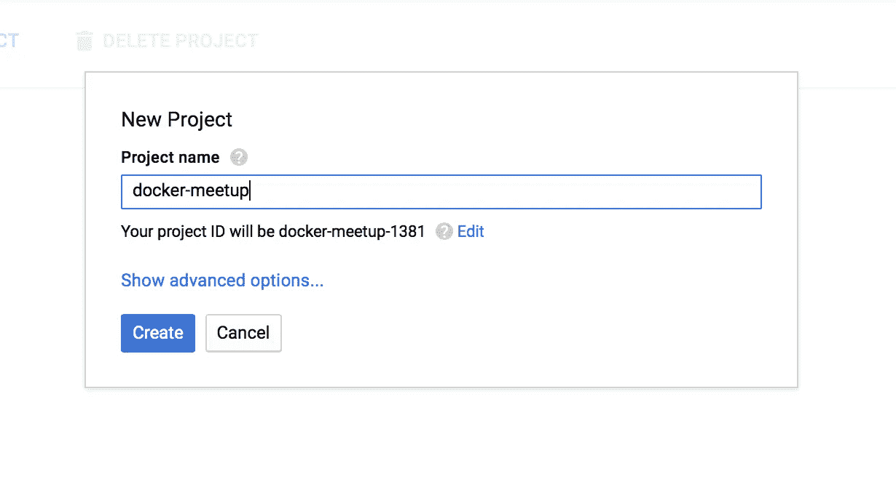
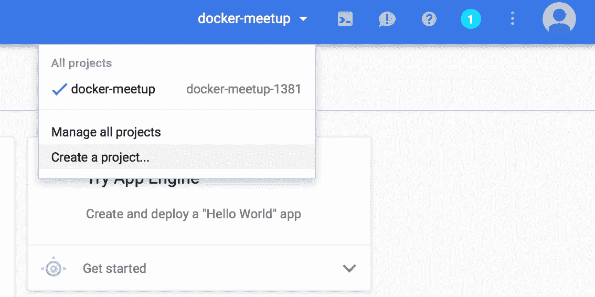
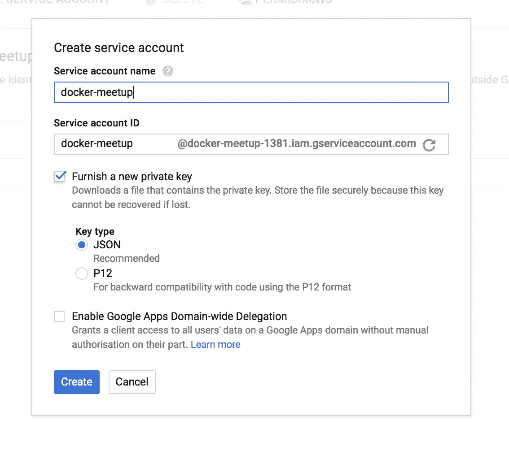
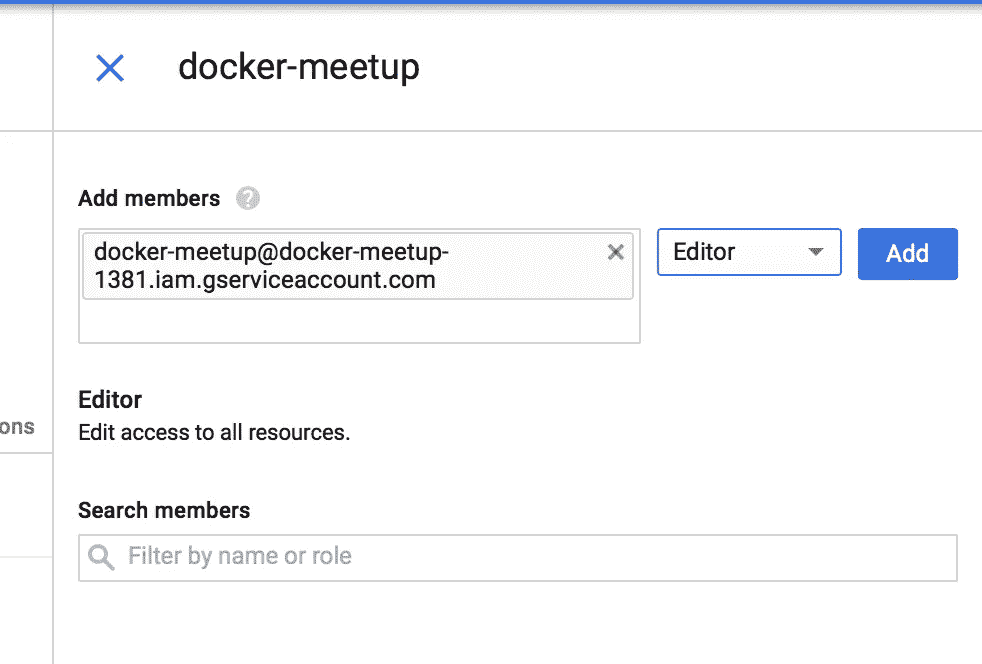
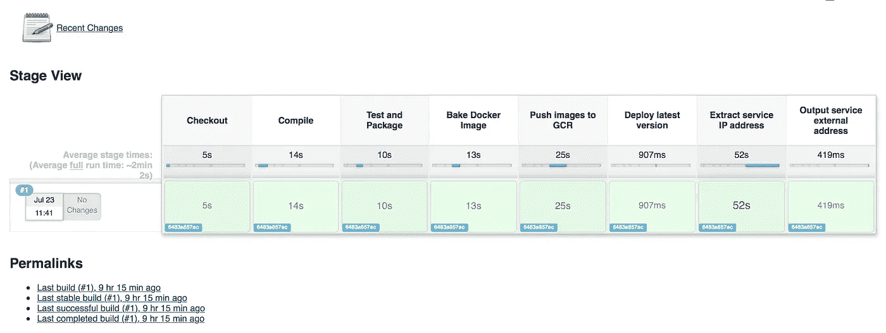

# 借助谷歌云平台实现零到持续交付

> 原文：<https://medium.com/google-cloud/zero-to-continuous-delivery-with-google-cloud-platform-8e3bf1312fb5?source=collection_archive---------1----------------------->

## 介绍

我最近在英国曼彻斯特的一个当地码头工人聚会上做了一个演讲。这篇博客伴随着那次谈话。在这篇文章的过程中，我希望给读者一些指导，让他们利用[谷歌云平台](https://cloud.google.com) (GCP)，特别是[谷歌容器引擎](https://cloud.google.com/container-engine/) (GKE)，创建一个持续的交付管道。

本教程将提供创建 GKE 集群的详细信息，利用 [Kubernetes](http://kubernetes.io) (k8s)和 [Docker](https://www.docker.com) 来启动 [Jenkins](https://jenkins.io) 容器，使用 k8s 来启动 Jenkins 构建代理，将[构建管道定义为代码](https://jenkins.io/solutions/pipeline/)，创建 [spring boot app](http://projects.spring.io/spring-boot/) 作为 Docker 容器，最后使用 k8s 部署应用程序。唷，还有很多事情要做…所以系好安全带，我们要做长期的努力。为了帮助采用和帮助人们玩 GCP，教程还概述了 GCP 项目的创建和用户的创建。我唯一的假设是，你已经注册了 GCP，可以访问 GCP 控制台。

**TL；博士**

本教程的所有代码都是开源的，可以在[我的 github 账户](https://github.com/search?q=user%3Aeggsy84+gcp)上找到，演示文稿可以在的 slideshare 上找到[。](http://www.slideshare.net/JamesHeggs/zero-to-continuous-delivery-on-google-cloud)

## GCP 项目创建

注册谷歌云平台后(在撰写本文时，他们提供 300 美元/60 天的免费试用)，导航到[云控制台](https://console.cloud.google.com)。

1.  导航至 [**项目管理屏幕**](https://console.cloud.google.com/iam-admin/projects)
2.  点击**创建项目**按钮(图 1)
3.  输入**项目名称，**记下**项目 ID** 。这对以后很重要。图 1 显示了一个项目 ID 为“docker-meetup-1381”的示例项目
4.  点击**创建**来创建你的 GCP 项目



图 1 : GCP 项目创建

这就是创建的项目。现在我们可以配置一个 [GCP 服务帐户](https://cloud.google.com/docs/authentication)来管理项目。

## GCP 服务帐户创建

为了管理我们即将创建的资源，GCP 提出了[服务账户](https://cloud.google.com/docs/authentication)的概念。接下来的步骤将讨论创建服务帐户和下载相关的密钥文件。

1.  确保您的**项目在 GCP 控制台的右上角被选中**(如图 2 所示)
2.  点击左上角的汉堡菜单并选择' **IAM & Admin** '
3.  点击左侧菜单中的**服务账户**
4.  点击“**创建服务账户**按钮
5.  提供您想要的**服务帐户名**并勾选“**提供新的私钥**”(示例如图 3 所示)
6.  单击“**创建**”后，还会触发浏览器下载您的新服务帐户密钥文件。
7.  记下**密钥文件**的**位置和文件名**，因为稍后会用到。
8.  回到“**服务帐户**”屏幕，确保您的新服务帐户“**已勾选**，并点击屏幕顶部的“**权限**”按钮。
9.  为了简单起见，但以牺牲安全性为代价，我们将授予服务帐户' **Editor** '访问我们的 GCP 资源的权限。然而，我建议审查长期项目的许可。在右侧权限面板的**【添加成员】**字段中键入您的**服务帐户名称**，并在出现提示时点击相应的服务帐户。从角色下拉菜单中选择“**编辑**，点击“**添加**”。(示例如图 4 所示)

我们现在已经准备好了我们的 GCP 项目和证书。

**注**

在 Safari 上，由于某种原因，密钥有时会被下载为一个名为“ **Unknown** 的文件。虽然不是必需的，但我建议将该文件移出下载目录，并将其重命名，以清楚地表明它是一个 JSON 文件。例如:

```
mkdir ~/keysmv ~/Downloads/Unknown ~/keys/gcp-service-account.json
```



图 2:选择您的 GCP 项目



图 3 —服务帐户创建



图 4 —服务帐户的权限

## GKE 集群创建

是时候创建我们的 GKE (K8S)集群了。

1.  首先[将谷歌云 SDK](https://cloud.google.com/sdk/docs/quickstarts) 安装到你的命令行。
2.  一旦你安装了 GCloud SDK，你就可以继续安装 [kubernetes 扩展](https://cloud.google.com/sdk/docs/managing-components)

```
# gcloud components install kubectl
```

3.克隆引导数据库

```
# mkdir ~/gcp-continuous-delivery
# cd ~/gcp-continuous-delivery
# git clone [https://github.com/eggsy84/gcp-bootstrap-infrastructure.git](https://github.com/eggsy84/gcp-bootstrap-infrastructure.git)
```

4.转到引导目录

```
# cd ~/gcp-continuous-delivery/gcp-bootstrap-infrastructure/bootstrap/
```

5.现在可以执行引导脚本了。它需要 5 个参数:

**Google 项目 ID**
将包含您的 GKE 集群的项目。(取自您之前记录的 ID)

**GCP 区域**
取自 GCP 提供的“可用区域”列表

**GCP 机器型号**
取自 GCP 提供的“机器型号”。GKE 集群中的每个节点都将按照这种类型进行配置。

**为您的 k8s 集群的节点数量**
为要创建的节点数量输入数值。

**您的服务帐户文件的路径**
您之前在教程中下载的服务帐户 JSON 文件的路径。

```
# sh deploy.sh \
  docker-meetup-1381 \
  europe-west1-b \
  n1-standard-2 \
  1 \
  ~/keys/gcp-service-account.json
```

6.该脚本将打开您的浏览器，并要求您进行身份验证。输入您的 GCP 用户名和密码详细信息，然后单击“**允许**”。返回命令行终端，您应该会看到类似于以下内容的输出:

```
About to create a Container Cluster in the ‘docker-meetup-1381’ GCP project located in ‘europe-west1-b’ with 1 x ‘n1-standard-2’ node(s)Press any key to continue…or Ctrl+C to exit
```

确认它将采取的操作并请求确认。

**重要提示**:脚本现在将在 GCP 提供基础设施，这可能需要你承担费用。

7.提取詹金斯的 IP 地址

该脚本将输出其进展，并在接近结束时输出一个 IP 地址，您可以访问詹金斯。比如:

```
Jenkins service up and running on 104.155.36.72
```

您现在应该能够打开浏览器，导航到该 URL 并查看您的 Jenkins 服务器！基本上就是这样——您已经提供了一个 GKE 集群，使用 Kubernetes 在其上部署了一个[预配置的 Jenkins master](https://hub.docker.com/r/eggsy84/gcp-jenkins-master-k8s-seed/) docker 容器，并为该服务提供了一个外部 IP 地址以使其可访问。Jenkins 实例已经预先配置了一个 Jenkins 作业，该作业使用 [Jenkins JNLP 代理](https://hub.docker.com/r/eggsy84/gcp-jenkins-slave-k8s-seed/)和 [Jenkins 管道插件](https://jenkins.io/doc/pipeline/)生成一个[示例 spring boot 应用程序](https://github.com/eggsy84/gcp-spring-boot-app)的构建管道。

**重要说明:**让读者练习解决实例的安全性问题，因为它目前是不安全的，不需要任何用户凭证。

## 应用程序部署

大约 10 分钟后(您可能需要刷新屏幕)，您的 jenkins 实例将创建一个名为' **spring-boot-pipeline** 的作业，并执行一个构建。

1.  导航到 jenkins 职务。从这里你应该完全荣耀地建立管道。(示例如图 5 所示)



图 5 —构建管道

2.点击**建造 1 号**

3.点击**控制台输出**查看作业的输出。

4.向下滚动到输出的底部，您应该会看到类似以下内容的消息:

```
[spring-boot-pipeline] Running shell script
+ echo Application up and running on 130.211.78.33
Application up and running on 130.211.78.33
[Pipeline] }
[Pipeline] // node
[Pipeline] End of Pipeline
Finished: SUCCESS
```

5.显示 spring boot 应用程序已经成功构建并部署到我们的 Kubernetes 集群中。您可以导航到提供的 IP 地址来查看正在运行的应用程序。

## 刚刚发生了什么？

*   创造了一个 GCP·库伯内特集群
*   使用 k8s 和 docker 将预配置的 Jenkins 主服务器部署到该集群
*   让 Jenkins 执行我们的[示例 spring boot 应用程序](https://github.com/eggsy84/gcp-spring-boot-app)的构建
*   詹金斯构建旋转了一个 Docker 容器，其中包含一个用于执行构建的[JNLP·詹金斯从属服务器](https://hub.docker.com/r/eggsy84/gcp-jenkins-slave-k8s-seed/)
*   构建使用 Maven 编译代码
*   然后，它继续生成应用程序的 Docker 映像
*   将此推送到[谷歌的容器注册表](https://cloud.google.com/container-registry/)
*   使用 [k8s 部署](http://kubernetes.io/docs/user-guide/deployments/)将 docker 映像部署到我们的 k8s 集群中
*   使用 [k8s services](http://kubernetes.io/docs/user-guide/services/) 在 docker 容器前注册一个服务，并将其类型设置为 [LoadBalancer](http://kubernetes.io/docs/user-guide/services/#type-loadbalancer) 以确保应用程序可以通过互联网访问。

## 系列的下一个

后续文章将更详细地介绍使这个例子工作的每个元素，以便您可以复制它，并以类似的形式开始您自己的项目。

我也欢迎对涉及的[各种 Github 项目的任何改变的输入，所以请给我一个拉请求。](https://github.com/search?q=user%3Aeggsy84+gcp)