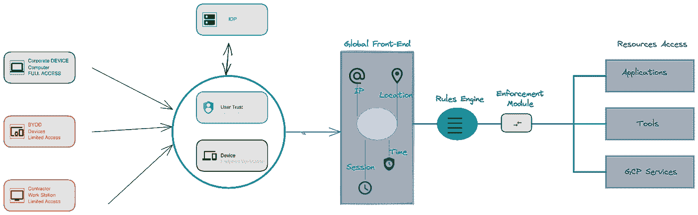

# 对 Beyondcorp 的零信任访问

> 原文：<https://medium.com/google-cloud/zero-trust-access-with-beyondcorp-d6ed11889e3c?source=collection_archive---------1----------------------->

# **零信任**

如今，大多数企业都在转向混合工作，很大一部分用户在 covid 之后远程工作。让这些员工能够安全地访问资源是任何企业的关键要求之一。零信任是解决这些挑战的行业解决方案。**零信任是一个安全的框架**，在提供资源访问&服务之前，用户和设备都要经过验证。每个用户和设备都被认为是不可信的，在提供对资源的访问之前，会对其进行**威胁、数据保护、用户&设备上下文信息**的检查。

# **零信任的主要特征**

**针对安全威胁的防护:**用户从家中和其他不受信任的网络进行连接。必须保护用户终端免受恶意软件和基于网络钓鱼的威胁。应该防止用户访问恶意的 URL

**替代传统 VPN:** 传统 VPN 解决方案增加了性能开销。零信任解决方案提供了基于安全加密隧道的通信，替代了传统的基于 VPN 的访问，提高了性能，从而改善了用户体验

**内置数据泄漏防护:**数据保护是一项关键功能，因为用户将从园区外部进行连接。该解决方案可防止有意和无意的数据泄露

**使用上下文感知& MFA 验证用户&设备:**用户和设备从不受信任的网络连接时，必须在访问资源之前进行身份验证。每个用户和设备的访问在每个会话中都要经过身份验证。提供多因素身份认证以确保用户通过密码和二次身份认证进行身份认证，二次身份认证可以是基于 USB 的身份认证或 OTP，以验证和防止基于凭据的攻击

**帮助维护跨设备的统一安全态势:**集中管理资产有助于维护跨设备的统一安全态势。零信任解决方案提供了一种集中监控和管理资产的方式，以确保基于设备上下文访问资源

**仅提供对用户需要的特定资源的访问:**零信任解决方案使管理员能够仅向用户提供对所需资源、应用程序的访问，以减少攻击面并提供细粒度的访问控制。

# 博扬公司

Beyondcorp 是谷歌企业安全的新方法。Beyondcorp 于 2011 年作为谷歌的一个内部项目启动，现已扩展到允许员工在任何地方工作，而无需使用 VPN。它在提供对公司资源的访问之前验证用户和设备信息

# **Beyondcorp 企业**

Beyondcorp Enterprise 是 Google 为企业提供的一个零信任模型，帮助他们的远程用户安全地访问资源。Beyondcorp 具有威胁保护、数据保护、DLP、设备验证和安全访问应用程序等关键功能。

Beyondcorp 企业架构(图 1)

让我们以上面的图 1 为例，这里有 3 个不同的用户从不同的设备连接到 Beyondcorp 解决方案。通过公司设备连接的员工、通过自带设备连接的员工以及通过办公系统连接的承包商。

*   从公司设备连接的用户将拥有完全访问权限
*   通过自带设备连接的用户将受到限制
*   从办公系统连接的承包商将只能有限地访问承包商应用程序

# **威胁&数据保护**

Beyondcorp Enterprise 具有重要的威胁和数据保护功能，可为用户和设备提供安全保护。它与 Chrome 集成以增强保护。这些包括防范基于 Web 的威胁、恶意软件防护、数据丢失防护。

管理员可以使用规则审核日志来查看日志，并可以使用安全仪表板来监控安全事件、威胁摘要、数据保护摘要，识别高风险用户和高风险域。

# **门禁保护**

Beyondcorp Enterprise 拥有细粒度的访问规则，可根据用户、设备、位置、访问时间等控制来定义和限制服务访问。Beyondcorp 利用四种谷歌云产品

1.  [身份和访问管理](https://cloud.google.com/beyondcorp-enterprise/docs/access-protection#applying-cloud-iam-conditions)
2.  [身份感知代理](https://cloud.google.com/iap/docs/concepts-overview)
3.  [访问上下文管理器](https://cloud.google.com/access-context-manager/docs/overview)
4.  [终点验证](https://cloud.google.com/endpoint-verification/docs/overview)

[**身份和权限管理**](https://cloud.google.com/iam/docs/conditions-overview)

[身份和访问管理](https://cloud.google.com/beyondcorp-enterprise/docs/access-protection#applying-cloud-iam-conditions)支持基于条件访问谷歌云资源。管理员可以使用 [IAM conditions](https://cloud.google.com/iam/docs/conditions-overview) 根据定义的属性定义对原则的访问控制

[**身份感知代理**](https://cloud.google.com/iap/docs/concepts-overview)

[身份感知代理](https://cloud.google.com/iap/docs/concepts-overview)帮助管理员定义基于 GCP 资源的 HTTPS、TCP & SSH。[身份感知代理](https://cloud.google.com/iap/docs/concepts-overview)利用[身份和访问管理](https://cloud.google.com/beyondcorp-enterprise/docs/access-protection#applying-cloud-iam-conditions)条件来基于用户限制对资源的访问。这有助于提供资源级访问，而不是提供基于 IP /端口的访问。

[**访问上下文管理器**](https://cloud.google.com/access-context-manager/docs/overview)

[访问上下文管理器](https://cloud.google.com/access-context-manager/docs/overview)帮助管理员定义基于 IP 地址、用户身份、设备类型&操作系统的访问控制。这有助于根据 BYOD 策略定义远程访问，并根据(公司或个人)用户连接的设备限制访问。

[**端点验证**](https://cloud.google.com/endpoint-verification/docs/overview)

端点验证是一个 Chrome 扩展，安装后可以获取设备信息，如操作系统、设备加密状态等..这有助于管理员维护设备清单并生成基于清单的报告

零信任是每个企业都希望实施的一个关键框架，而 Beyondcorp Enterprise 是一个关键解决方案，它使企业能够采用该框架，并使远程工作人员能够安全地访问资源。

它是一个非 VPN 解决方案，具有内置的威胁和数据丢失防护功能，可识别用户并使用 I [AM 条件](https://cloud.google.com/iam/docs/conditions-overview)、[身份感知代理](https://cloud.google.com/iap/docs/concepts-overview)和[访问上下文管理器](https://cloud.google.com/access-context-manager/docs/overview)提供基于用户/设备的访问，并支持 MFA

它有助于集中管理资产，并仅提供对用户需要的特定资源的访问。

有关 Beyondcorp 的更多信息，请查看[文档](https://cloud.google.com/beyondcorp-enterprise)