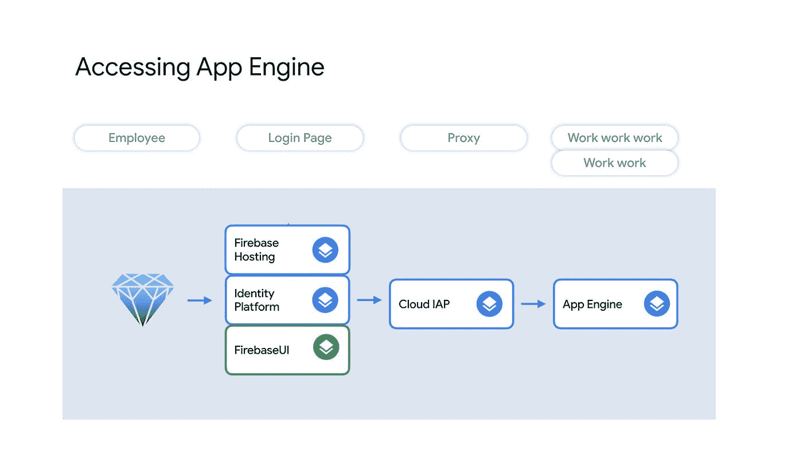
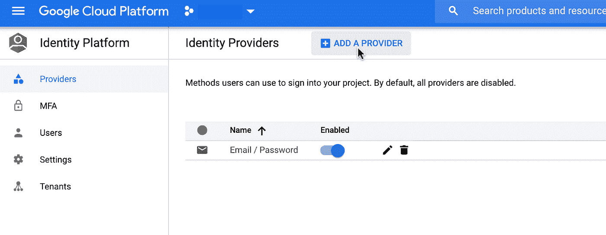
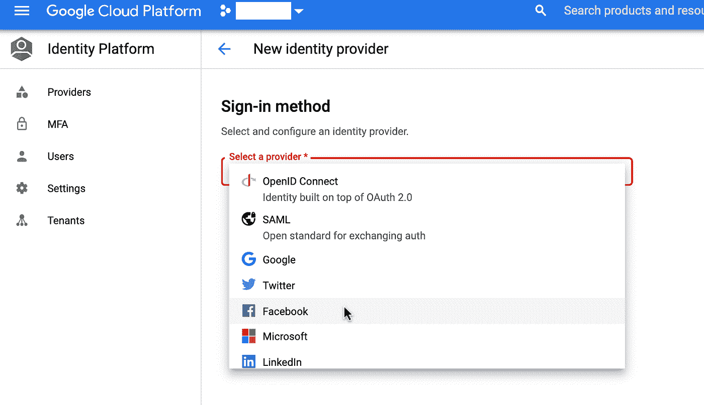
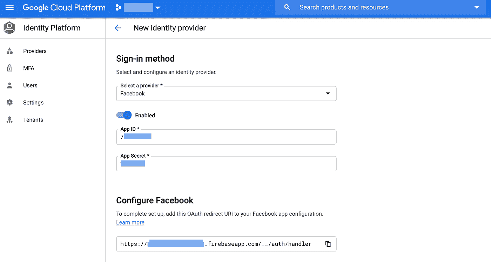
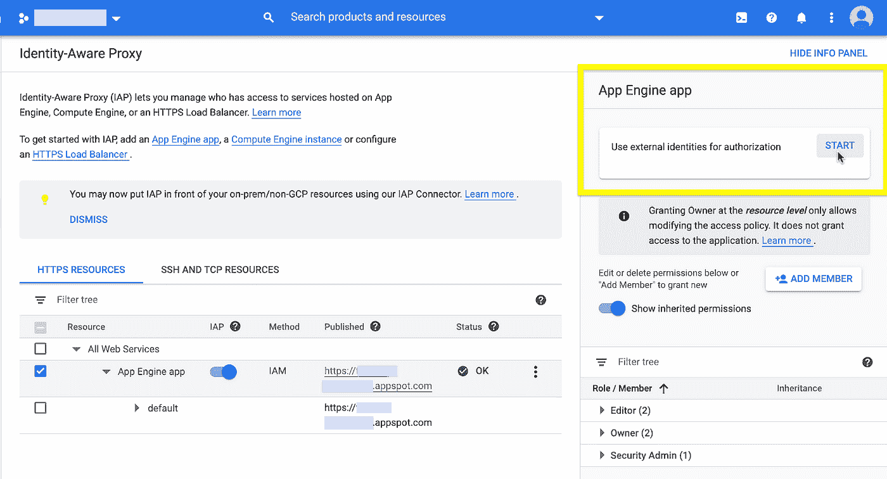
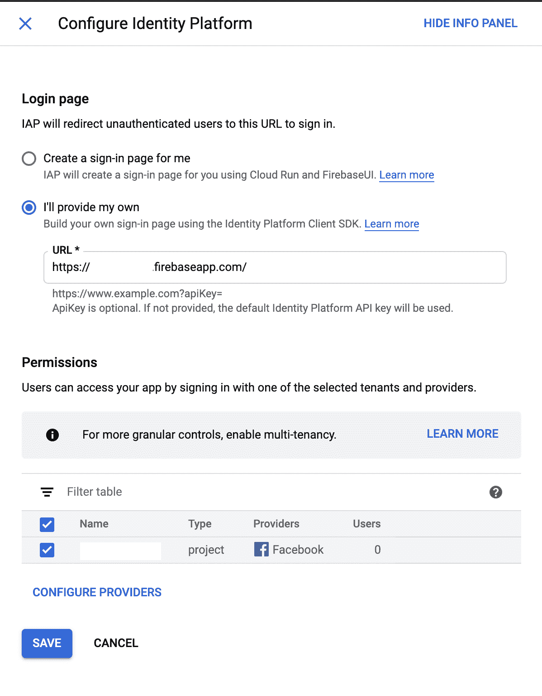

# 对企业访问控制的零信任

> 原文：<https://medium.com/google-cloud/zero-trust-for-enterprise-cooking-up-some-access-controls-cfd05ba54d12?source=collection_archive---------0----------------------->

*本博客由* [*马克斯·索尔顿斯托尔*](/@max.saltonstall) *和詹·珀*共同撰写


是时候拿出一个成功的解决方案了！ [*图像信用*](https://unsplash.com/photos/APDMfLHZiRA)

今天，我们正在创造一个新的食谱:使用第三方身份提供商来控制对你的云应用程序的访问。

您可能已经有了一个权威的身份源，无论是基于云的还是本地的，并且仍然希望利用 BeyondCorp 远程访问。请继续阅读，了解如何通过身份感知代理和外部身份提供商将零信任工作方法应用到云应用中。

> 您可以将 BeyondCorp 用于任何身份提供者和任何后端

在今天的示例中，我们使用 App Engine 和脸书，但任何后端和身份源都将类似地工作。如果你对如何使用身份感知代理和 BeyondCorp 的基本原理感到好奇，请阅读这些 [帖子](/google-cloud/beyond-corp-in-a-bottle-uncorked-5e8c7acce52)中的内容。

如果您已经有了一个基于云的或内部的身份提供商，并希望利用 BeyondCorp 远程访问和零信任工作方式，请开始吧，因为今天我们将介绍如何使用外部身份提供商，通过身份感知代理(IAP)保护 App Engine(或任何云应用)。如果你刚刚加入我们，你可以在我们的[上一篇文章](/google-cloud/beyond-corp-in-a-bottle-uncorked-5e8c7acce52)中看到我们如何使用 IAP 来控制谷歌身份的访问。

# 配料

为了烹饪，你需要从一开始就确保你有正确的原料。在今天的例子中，我们使用:

*   gcloud CLI
*   [App 引擎](https://cloud.google.com/appengine)
*   Firebase CLI
*   [Firebase 托管](https://firebase.google.com/docs/hosting/quickstart)
*   [身份平台](https://cloud.google.com/identity-platform)
*   [身份感知代理](https://cloud.google.com/iap)
*   [FirebaseUI](https://firebase.google.com/docs/auth/web/firebaseui)


[图片信用](https://pixabay.com/users/lukasbieri-4664461/)

我们包含了所有这些产品的文档链接，这样您就不必花五页纸来阅读我们对它们的抱怨。让我们进入正题吧！

> 首先把你所有的材料都准备好:应用程序、主机、身份和代理

# 建筑

这是我们的基本结构，展示了请求是如何从您的员工一直传递到后端应用程序的。



*在该架构图中，客户显示为菱形，因为您的员工非常有价值。并且至少部分由碳制成。*

要访问 App Engine 应用程序，客户端会被定向到 Firebase Hosting 上的登录页面。该页面使用 FirebaseUI 显示一个脸书登录按钮并处理登录结果。身份平台在后端验证凭据。让我们详细说明这是如何工作的。

1.  从用户处获取身份验证凭据。这可以是用户的电子邮件地址和密码、SAML 声明或来自联合身份提供者的 OAuth 令牌。
2.  对于像脸书这样的联合身份提供者，提供者将这些令牌返回给身份平台在`/__auth/handler`端点上的身份验证处理程序。这项服务由 Google 托管，因此您不必接收和验证身份验证工件。
3.  收到令牌后，Google Cloud 的后端服务将对其进行验证，并向客户端返回响应。
4.  一旦客户端的身份得到验证，Cloud IAP 将允许客户端访问应用程序。

> 对应用程序的访问取决于身份验证和授权

# 样本

就像你最喜欢的烹饪节目一样，我们有一个烹饪好的样品准备呈现！我们的示例代码包括以下成分:

*   一个 App Engine 应用程序，它读取客户端提供的 JSON Web 令牌，并显示关于该用户的信息。
*   一个登录页面，我们将部署到 Firebase 主机
*   使用 React 的示例。我们今天不会使用它，但是可以随意探索它！

通过这些组件，经过身份验证的用户将被定向到登录页面。登录后，身份识别代理将验证用户是否有权访问 App Engine 应用程序。如果是，则向客户端提供该应用程序。否则，客户端会看到一个拒绝权限页面。我们尽可能保持示例的通用性，以便您可以添加特定应用程序所需的口味。

> 这个菜谱使用了应用引擎、JSON Web 令牌、Firebase 托管和 React

还需要采取一些额外的步骤，以便您可以看到这个示例的运行。让我们穿过它们。

# 1.创建 App Engine 应用程序

创建新项目或从现有项目开始。然后创建一个 [App Engine app](https://bit.ly/3a2utY2) 。

# 2.安装 Firebase CLI

您将需要 Firebase CLI 来部署到 Firebase 主机。你可以用 npm 下载。

```
npm install -g firebase-tools
```

# 3.启用 API

通过云控制台启用[身份平台](https://bit.ly/31nByOF)和[身份感知代理](https://bit.ly/3icwvHL)API。

有了这些准备步骤，我们就可以开始编写代码了。

# 4.获取代码

GitHub 上提供了示例代码，所以继续克隆吧。

```
git clone [https://github.com/GoogleCloudPlatform/iap-gcip-web-toolkit.git](https://github.com/GoogleCloudPlatform/iap-gcip-web-toolkit.git)
```

转到 App Engine app 的目录。

```
cd iap-gcip-web-toolkit/sample/app
```

运行 npm install 安装所需的软件包。

```
npm install
```

现在，应用程序已经准备好部署了。运行以下命令进行部署:

```
npm run deploy
```

如果您打开 package.json 文件，您可以看到这个命令实际上做了什么。

```
// package.json"deploy": "gcloud app deploy",
```

没错，它所做的就是运行`gcloud app deploy`。因此，如果您愿意，也可以直接使用这个命令。

> 我们从一个最小的燕麦片应用程序开始:不那么令人印象深刻，但实现了基本功能

把这个应用程序想象成燕麦片:它完成了工作，它本身有点令人失望，但它是一个很好的垫脚石，因为你作为一名厨师学到了更多的技术。


[形象信用](https://www.pexels.com/@polina-zimmerman?utm_content=attributionCopyText&utm_medium=referral&utm_source=pexels)

部署完成后，您将看到已部署应用程序的 URL。你现在可以点击这个链接了，但是你会注意到你返回了一个权限错误。这正是我们想要的，因为我们还没有配置代理！在蛋糕做好之前，我们不希望其他厨师弄乱蛋糕的面糊，所以我们会把他们都挡在外面。


[形象信用](https://unsplash.com/@dimhou?utm_source=unsplash&utm_medium=referral&utm_content=creditCopyText)

> 作用不大，但能把人挡在外面。所有人！

这就像高级餐厅的厨房一样:只有你有正确的证件，你才能进去。所以让我们创造一种在门口检查 ID 的方法，这样我们就能确保只有合适的副厨师才能乱用我们的肉汤！

# 5.托管登录页面

无论你什么时候去 IAP 后面的一个我们的 app，第一步都是检查你的身份。就像高级俱乐部的保镖一样，在你被允许进门之前，你需要证明你自己。如果您未通过身份验证，我们需要获取您的凭据，以查看您是否被允许访问相关应用程序。看看你能否进入这个特定的俱乐部。


[形象信用](https://www.pexels.com/photo/people-dancing-inside-dim-room-2114365/)

使用云身份这带来了一个谷歌认证页面，已经做好准备供我们使用。但是，如果我们选择使用另一个身份提供者，那么我们需要一个在请求者尚未登录时收集凭证的解决方案。下面我们将使用 Firebase 托管来创建页面，幸运的是，我们需要的代码已经在示例 repo 中了。

> 你可以制作自己的登录页面或者使用谷歌的

首先输入包含登录屏幕代码的目录。

```
cd ../authui-firebaseui
```

我们需要一些包，所以继续运行`npm install`。

```
npm install
```

我们需要将 Firebase 添加到我们的云项目中。您可以使用以下命令来完成此操作:

```
firebase use project-id
```

然后，就像 App Engine 示例一样，我们运行以下命令:

```
npm run deploy
```

但与 App Engine 示例不同的是，该命令不是运行“gcloud app deploy ”,而是使用 Firebase CLI 将您的登录页面部署到 Firebase 主机。

```
// package.json"deploy": "firebase deploy",
```

# 6.启用脸书身份

在今天的例子中，让我们以脸书作为我们的外部身份提供者，作为人们登录我们的应用程序而无需 Google 帐户凭证的一种方式。开始使用脸书

作为身份提供者，前往[脸书开发者页面](https://developers.facebook.com/)创建一个应用程序。您将需要 GCP 项目的应用程序 ID 和密码。如果您想了解更多关于在您的应用中使用脸书的详细信息，请查看[使用外部身份管理访问快速入门](https://cloud.google.com/iap/docs/quickstart-external-identities#create-facebook-app)中概述的说明。

> 通过外部身份支持为您的用户提供灵活性

# 7.将脸书添加为谷歌云身份提供商

要配置身份平台从云控制台使用脸书进行身份验证，请转至**工具**、**身份平台**，然后单击**添加提供商**。



从提供商列表中选择脸书，



然后输入你从脸书应用获得的应用 ID 和应用密码。最后，点击**保存**。



# 8.配置重定向 URI

如果有人通过脸书完成登录，他们下一步会去哪里？我们需要告诉脸书，我们的身份提供者和认证凭证的来源，这样它就知道在完成登录后重定向到哪个 URI。回到脸书的应用页面，选择你的应用。在左侧菜单中，单击产品。找到脸书登录产品，然后单击设置。在左侧导航菜单中，选择设置，然后在有效 OAuth 重定向 URIs 框中，输入重定向 URI。该 URI 具有以下格式:

```
[https://project-id.firebaseapp.com/__/auth/handler](https://project-id.firebaseapp.com/__/auth/handler)
```

您也可以在身份平台提供者配置页面中找到此 URI。记得点击保存更改！现在您已经完成了身份平台的设置！随着我们隐喻的蛋糕烘烤和冷却，是时候添加糖霜了:配置 IAP 使用它进行授权。

好吃！


*蛋糕更适合基于身份的访问控制展示这个蛋糕并没有太大的意义…我们只是觉得它看起来很好吃。* [*形象功劳*](https://images.pexels.com/photos/291528/pexels-photo-291528.jpeg?auto=compress&cs=tinysrgb&dpr=3&h=750&w=1260)

# 9.为外部身份启用 IAP

我们知道谁会进我们餐厅的门，现在让我们确保只有合适的人才能进厨房。在我们的[上一篇文章](/google-cloud/beyond-corp-in-a-bottle-uncorked-5e8c7acce52)中，我们向您展示了如何使用 Google 认证为 App Engine 启用 IAP。使用外部身份实现 IAP 的过程是类似的，但是将 IAP 连接到我们刚刚配置的身份平台身份验证还需要几个步骤。

> 身份平台允许您从任意数量的身份认证选项中进行选择

首先，您需要启用 IAP。如果你不确定怎么做，那么看看这篇文章或者这个[关于启用 IAP 进行访问控制的快速入门](https://cloud.google.com/iap/docs/app-engine-quickstart#enabling_iap)。

在 IAP 页面的侧面板中，在**使用外部身份进行授权**下，点击**开始**。



在身份验证 URL 字段中，输入您部署到 Firebase Hosting 的身份验证应用程序的 URL。它看起来应该类似于`[https://<project-id>.firebaseapp.com/](https://project-id.firebaseapp.com/)`。选中带有您的项目名称的框。它会将脸书列为身份提供商，因为我们之前已经启用了它。点击**保存**，你就可以开始了！



# 把所有的放在一起

我们现在已经实现了这个食谱的所有成分，所以让我们把它扔进烤箱里试一试吧！开始在一个新的隐姓埋名的窗口，以确保您体验整个流程。


打开您的 App Engine 应用程序的 URL。您将被重定向到登录页面，该页面使用 FirebaseUI 作为前端，在后端使用身份平台向脸书进行身份验证。

> 我们有一个完整的从开始到结束的认证流程！

登录后，您将看到您的应用程序！开始烟火庆典


[图像信用](https://www.pexels.com/@anna-louise-210491?utm_content=attributionCopyText&utm_medium=referral&utm_source=pexels)

# 下一步是什么？

我们刚刚在谷歌云上部署了一个应用，使用脸书作为身份来授权人们查看该应用。现在，您可以了解到[身份平台允许认证](https://bit.ly/3gcm5q7)的多种方式，因此您可以确保只在正确的时间将访问权限授予正确的人。或者，尝试用[实现贵公司需要的提供商](https://bit.ly/2Q9l0Vr)。确保你总是知道谁要进去。