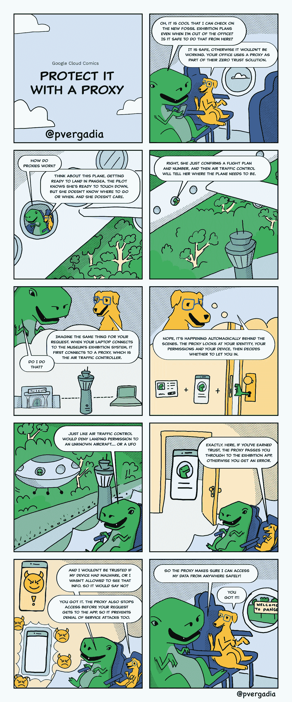

# 反向代理零信任

> 原文：<https://medium.com/google-cloud/zero-trust-with-reverse-proxy-c744d8956f21?source=collection_archive---------1----------------------->

## GCP 漫画#8 反向代理安全性

反向代理站在您的数据、服务或虚拟机前面，捕捉来自世界任何地方的请求，并仔细检查每一个请求，看它是否被允许。

> 为了做出决定(是或否)，代理将查看*谁*和*什么*。

*   你是谁(提出请求的人)？你有进入许可(授权)吗？
*   你用什么提出请求？你的设备现在有多健康？你在什么位置？你什么时候提出请求？

这一期的 [GCP 漫画](http://gcpcomics.com)展示了一个从飞机上访问一些相当机密的数据的例子，并用那架飞机作为隐喻来解释代理正在做什么。

反向代理零信任

当向 web 应用或服务发出请求时，反向代理作为负载平衡步骤的一部分工作，它们可以被视为网络基础设施的另一个元素，有助于将请求路由到正确的位置。如果请求是无效的，或者是因为它来自未授权的人或者是不安全的设备，那么代理可以拒绝该请求。

**为什么代理会拒绝我的请求？**

*   我是搞工程的，但是我想访问金融数据。
*   我甚至不是公司的一员。
*   我换了工作，失去了联系。

查看发起请求的设备，代理可能会由于以下原因而拒绝访问:

*   设备操作系统过期
*   检测到恶意软件
*   设备最近未签入
*   本地软件代理无法正常工作
*   缺少磁盘加密
*   设备没有屏幕锁定

**资源**

有关代理和零信任的更多信息，请查看以下资源:

*   [将零信任模型扩展到网络](https://blog.google/products/chrome/extending-enterprise-zero-trust-models-web/)
*   [身份感知代理概述](https://cloud.google.com/iap/docs/concepts-overview)
*   [如何为内部部署的应用程序设置代理](https://cloud.google.com/iap/docs/enabling-on-prem-howto)

想要更多的 GCP 漫画吗？访问[**gcpcomics.com**](https://gcpcomics.com/)&在 medium[pvergadia](/@pvergadia/)&[max-salton stall](https://max-saltonstall.medium.com/)上关注我们，并在 Twitter 上关注 [@pvergadia](https://twitter.com/pvergadia) 和 [@maxsaltonstall](https://twitter.com/maxsaltonstall) ，不要错过下一期！